# Oracle Database@Azure (OD@A) — Agentic AI & RAG Adoption Playbook

**Version:** 1.0 · **Date:** February 2026
**Audience:** Customers, Partners, Field sellers, CSA/SSP, Solution architects
**Purpose:** A concrete, end-to-end guide to building AI agents and RAG solutions on Oracle Database@Azure using every available integration path in the Microsoft AI ecosystem.

---

## Table of Contents

| # | Section | Audience |
|---|---------|----------|
| **PART I** | **FIELD PLAYBOOK** | |
| 1 | [How to Use This Playbook](#1-how-to-use-this-playbook) | All |
| 2 | [Customer Discovery Framework](#2-customer-discovery-framework) | Field / Sales |
| 3 | [Core Positioning Message](#3-core-positioning-message) | Field / Sales |
| 4 | [Six AI Paths on OD@A — Overview](#4-six-ai-paths-on-oda--overview) | Field / Sales |
| 5 | [Decision Matrix](#5-decision-matrix) | All |
| 6 | [Objection Handling](#6-objection-handling) | Field / Sales |
| 7 | [Field Motion & Engagement Model](#7-field-motion--engagement-model) | Field / Sales |
| **PART II** | **ARCHITECTURE & IMPLEMENTATION PLAYBOOK** | |
| 8 | [Reference Architecture Patterns](#8-reference-architecture-patterns) | Architects |
| 9 | [Path 1 — Copilot Studio + Oracle Gateway](#9-path-1--copilot-studio--oracle-gateway) | Architects / Devs |
| 10 | [Path 2 — Microsoft Foundry Agents](#10-path-2--microsoft-foundry-agents) | Architects / Devs |
| 11 | [Path 3 — Oracle MCP Server (Model Context Protocol)](#11-path-3--oracle-mcp-server-model-context-protocol) | Architects / Devs |
| 12 | [Path 4 — Microsoft Fabric + Data Agents](#12-path-4--microsoft-fabric--data-agents) | Architects / Devs |
| 13 | [Path 5 — Power Apps + Power Automate AI](#13-path-5--power-apps--power-automate-ai) | Architects / Devs |
| 14 | [Path 6 — Oracle 23ai Vector Search + Azure OpenAI RAG](#14-path-6--oracle-23ai-vector-search--azure-openai-rag) | Architects / Devs |
| 15 | [Combined Patterns — Multi-Path Architectures](#15-combined-patterns--multi-path-architectures) | Architects |
| 16 | [Security & Governance Guardrails](#16-security--governance-guardrails) | All |
| 17 | [Step-by-Step Implementation Guides](#17-step-by-step-implementation-guides) | Devs / Partners |
| 18 | [Oracle ORDS as an AI Tool Layer](#18-oracle-ords-as-an-ai-tool-layer) | Architects / Devs |
| 19 | [Monitoring, Observability & Cost](#19-monitoring-observability--cost) | Architects / Ops |
| 20 | [Appendix — Resources & References](#20-appendix--resources--references) | All |

---

# PART I — FIELD PLAYBOOK

---

## 1. How to Use This Playbook

This playbook has three layers:

| Layer | Sections | Use When |
|-------|----------|----------|
| **Field** | 1 – 7 | Customer meetings, executive briefings, partner enablement |
| **Architecture** | 8 – 16 | Solution architects are in the room; designing credible solutions |
| **Implementation** | 17 – 20 | Hands-on build phase; developer and partner workshops |

**Quick-start for common scenarios:**

| You need to… | Go to… |
|---------------|--------|
| Position AI on OD@A in 5 minutes | Section 3 + Section 4 |
| Help a customer decide which path | Section 5 (Decision Matrix) |
| Design an architecture | Section 8 (Reference Patterns) |
| Build something today | Section 17 (Step-by-Step Guides) |
| Implement RAG on Oracle 23ai vectors | Section 14 |
| Wire up MCP tools for agents | Section 11 |

---

## 2. Customer Discovery Framework

> **Rule #1:** Open with discovery, not slides.

### 2.1 Discovery Questions

| # | Question | Why It Matters |
|---|----------|----------------|
| 1 | What problem are you solving with AI? (Q&A, automation, insights, apps) | Maps to the right path |
| 2 | Who is the primary user? (business, ops, developers, DBAs) | Determines toolchain |
| 3 | Do you require live Oracle data or can you work with analytical copies? | Governs data movement |
| 4 | What Oracle database version and edition are you running on OD@A? | Oracle 23ai enables native vector search |
| 5 | Is there an existing Microsoft 365 / Power Platform footprint? | Opens Copilot Studio and Power Apps paths |
| 6 | Do you have Microsoft Foundry or Azure OpenAI provisioned? | Qualification for Microsoft Foundry agent path |
| 7 | Are you building for a single use case or a platform play? | Pilot vs platform architecture |
| 8 | What are your data residency and compliance requirements? | Drives network topology and data flow |

### 2.2 Signal Interpretation

| Signal | What It Tells You | Lead With |
|--------|-------------------|-----------|
| "No data movement allowed" | Trust, governance, speed are critical | Copilot Studio gateway / MCP / ORDS |
| "Business users need answers" | Low-code copilots | Copilot Studio |
| "We want insights and trends" | Analytics + AI | Microsoft Fabric |
| "We're building an app / product" | Pro-dev, APIs, orchestration | Microsoft Foundry |
| "DBAs need automation" | Schema exploration, SQL generation | Oracle MCP Server |
| "We have Oracle 23ai" | Native vector search | Oracle 23ai + Azure OpenAI RAG |
| "We want semantic search" | RAG / vector similarity | Path 6 (Vector Search) |
| "We need multi-step workflows" | Agentic AI with tool orchestration | Microsoft Foundry + MCP |

---

## 3. Core Positioning Message

> **Oracle Database@Azure allows customers to build secure, enterprise-grade Agentic AI and RAG solutions on Oracle data using Microsoft AI — without forcing a single architecture or data movement pattern.**

### Key Selling Points

1. **Start with live Oracle data** — no ETL prerequisite
2. **Choose your toolchain** — low-code (Copilot Studio, Power Apps) or pro-code (Microsoft Foundry, MCP, SDKs)
3. **Evolve incrementally** — from Q&A → Agents → Analytics → AI Applications
4. **Enterprise-grade security** — OD@A network isolation + Entra ID + Oracle DB security
5. **Six proven paths** — not a single architecture; customers choose based on need
6. **Oracle 23ai native vectors** — RAG without a separate vector database

### Elevator Pitch (30 seconds)

*"OD@A gives your Oracle data a direct line into Microsoft's AI ecosystem. Customers can build copilots, agents, and RAG applications on live Oracle data using Copilot Studio, Microsoft Foundry, Oracle MCP tools, Microsoft Fabric, Power Platform, or Oracle 23ai vector search — all without compromising security or forcing data migration. We've seen teams go from Oracle data to a working AI agent in under a day."*

---

## 4. Six AI Paths on OD@A — Overview

### Path 1: Copilot Studio — Fastest Path to Value

| | |
|--|--|
| **Best for** | Business teams, operational Q&A, first-line support |
| **Persona** | Business analyst, ops manager, citizen developer |
| **Time to value** | Hours to days |
| **Data movement** | None — direct Oracle connectivity via On-Premises Data Gateway or Copilot Connector |
| **Key capabilities** | Natural language Q&A over Oracle data; **Oracle as Knowledge source** (ground copilots on specific tables/data); **Oracle as a Tool** (call Oracle actions in copilot topics); no-code copilot builder; Microsoft 365 integration; Teams / web / mobile deployment |
| **Limitations** | Not suited for heavy analytics or complex multi-step orchestration |

### Path 2: Microsoft Foundry — Pro-Dev AI & Agents

| | |
|--|--|
| **Best for** | Engineering teams building custom AI apps |
| **Persona** | Software engineer, ML engineer, solution architect |
| **Time to value** | Days to weeks |
| **Data movement** | Optional — can use live ORDS/MCP or staged data |
| **Key capabilities** | Custom agents with tool-calling (MCP, OpenAPI, Functions); multi-agent orchestration; prompt flow; model selection (GPT-4.1, o3, o4-mini, etc.); grounding with Azure AI Search or Oracle vectors |
| **Limitations** | Requires Microsoft Foundry subscription; developer skill set |

### Path 3: Oracle MCP Server — Developer & DBA Automation

| | |
|--|--|
| **Best for** | Database developers, DBAs, automation engineers |
| **Persona** | DBA, database developer, DevOps engineer |
| **Time to value** | Minutes (local) to days (hosted) |
| **Data movement** | None — MCP operates inside Oracle DB security |
| **Key capabilities** | Natural language → SQL/PL-SQL; schema discovery and exploration; agent-driven DB workflows; works with VS Code, Microsoft Foundry, Copilot Studio |
| **Limitations** | Requires SQLcl; not a standalone user-facing product |

### Path 4: Microsoft Fabric — Analytics + AI at Scale

| | |
|--|--|
| **Best for** | Insights, trends, cross-data intelligence, data teams |
| **Persona** | Data engineer, BI analyst, data scientist |
| **Time to value** | Days to weeks |
| **Data movement** | Yes — mirrors Oracle data into OneLake |
| **Key capabilities** | Fabric mirroring from Oracle; Fabric Data Agents; cross-source joins; lakehouse analytics; Microsoft Foundry integration |
| **Limitations** | Requires Fabric capacity; data latency from mirroring |

### Path 5: Power Apps + Power Automate — Business Workflows First

| | |
|--|--|
| **Best for** | Workflow modernization, business process automation |
| **Persona** | Business analyst, ops manager, citizen developer |
| **Time to value** | Days |
| **Data movement** | None — Oracle connector via gateway |
| **Key capabilities** | Oracle-connected business apps; AI Builder for form processing, prediction; Power Automate flows with Copilot; incremental AI enablement on existing workflows |
| **Limitations** | Not for heavy data processing or complex AI pipelines |

### Path 6: Oracle 23ai Vector Search + Azure OpenAI — Native RAG

| | |
|--|--|
| **Best for** | Semantic search, RAG, knowledge-intensive applications |
| **Persona** | Software engineer, ML engineer, data architect |
| **Time to value** | Days to weeks |
| **Data movement** | None — vectors stored natively in Oracle 23ai |
| **Key capabilities** | Native `VECTOR` data type in Oracle 23ai; `VECTOR_DISTANCE` for similarity search; Azure OpenAI embeddings (text-embedding-3-small/large); ORDS REST endpoints for vector queries; no separate vector DB required |
| **Limitations** | Requires Oracle 23ai; embedding generation requires Azure OpenAI |

---

## 5. Decision Matrix

### 5.1 Quick Decision Guide

| Customer Need | Lead With | Why |
|--------------|-----------|-----|
| Live data Q&A, no movement | **Path 1:** Copilot Studio | Direct gateway, no-code, fastest |
| Custom AI apps / products | **Path 2:** Microsoft Foundry | Full control, multi-model, orchestration |
| DBA / developer automation | **Path 3:** Oracle MCP | SQL generation, schema exploration |
| Insights & analytics at scale | **Path 4:** Microsoft Fabric | Cross-source analytics, data agents |
| Business workflow first | **Path 5:** Power Apps | Low-code, incremental AI |
| Semantic search / RAG | **Path 6:** Oracle 23ai Vectors | Native vectors, no extra DB |

### 5.2 Detailed Comparison

| Dimension | Copilot Studio | Microsoft Foundry | Oracle MCP | Fabric | Power Apps | Oracle 23ai Vectors |
|-----------|---------------|------------|------------|--------|------------|---------------------|
| **Skill level** | Low-code | Pro-dev | DBA/Dev | Data eng | Low-code | Pro-dev |
| **Data movement** | None | Optional | None | Mirror | None | None |
| **Real-time data** | ✅ Yes | ✅ Yes | ✅ Yes | ⚠️ Near-RT | ✅ Yes | ✅ Yes |
| **Knowledge grounding** | ✅ Oracle as Knowledge | ✅ Via AI Search/tools | ⚠️ Schema context | ✅ Semantic model | ❌ No | ✅ Via embeddings |
| **Tool calling** | ✅ Oracle as Tool (ORDS) | ✅ Yes (MCP/OpenAPI/Funcs) | ✅ Native | ⚠️ Via Microsoft Foundry | ❌ No | ⚠️ Via Microsoft Foundry |
| **Multi-agent** | ❌ No | ✅ Yes | ⚠️ Via Microsoft Foundry | ⚠️ Via Microsoft Foundry | ❌ No | ⚠️ Via Microsoft Foundry |
| **Vector search** | ❌ No | ✅ Via tools | ✅ Via SQL | ❌ No | ❌ No | ✅ Native |
| **Analytics** | ❌ Limited | ⚠️ Limited | ❌ No | ✅ Full | ❌ Limited | ❌ No |
| **Cost model** | Per-message | Per-compute | Free (local) / Functions | Fabric CU | Per-user | Azure OpenAI tokens |
| **Auth integration** | Entra ID | Entra ID | DB users | Entra ID | Entra ID | DB users + Entra |
| **Deployment** | SaaS | Azure | VS Code / Azure Functions | SaaS | SaaS | Azure / OCI |

### 5.3 Combination Patterns (Most Common)

| Pattern | Paths Combined | Use Case |
|---------|---------------|----------|
| **Conversational Agent + Live Data** | 2 + 3 | Microsoft Foundry agent using MCP tools for live Oracle queries |
| **RAG Agent** | 2 + 6 | Microsoft Foundry agent with 23ai vector search for semantic answers |
| **Analytics + Agent** | 4 + 2 | Fabric analytics feeding Microsoft Foundry agents for insight delivery |
| **Full Stack** | 1 + 2 + 3 + 6 | Copilot for business; Microsoft Foundry for dev; MCP for DBA; Vectors for RAG |
| **Business Process AI** | 5 + 1 | Power Apps workflow with Copilot Studio Q&A |

---

## 6. Objection Handling

| Objection | Response |
|-----------|----------|
| *"We can't move our Oracle data"* | You don't have to. Paths 1, 2, 3, 5, and 6 work on live Oracle data with zero data movement. Fabric (Path 4) uses managed mirroring if analytics require it. |
| *"We're worried about security and governance"* | OD@A runs in Azure with full network isolation (Private Endpoints, VNETs). Oracle MCP operates inside Oracle DB security — it doesn't bypass it. All paths support Entra ID. See Section 16 for full guardrails. |
| *"We don't know where to start"* | Start with a single-scenario pilot. Most customers begin with Copilot Studio (48-hour proof of value) or an MCP demo (2-hour setup in VS Code). |
| *"We already have a vector database"* | Oracle 23ai has native vector support — one fewer service to manage. But Microsoft Foundry agents can also call external vector DBs via tools. Your choice. |
| *"Is MCP production-ready?"* | MCP is an open standard (Anthropic-initiated, now broadly adopted). Oracle's SQLcl MCP server is GA. For production, host on Azure Functions with Entra ID auth and API Management. See Section 11. |
| *"What about cost?"* | Start with free/low-cost paths: MCP local is free; Copilot Studio has per-message pricing; Azure OpenAI is pay-per-token. No upfront platform investment required. |
| *"We need multi-agent orchestration"* | Microsoft Foundry supports multi-agent patterns natively. Combine with MCP tools for Oracle access and 23ai vectors for RAG. See Section 15. |

---

## 7. Field Motion & Engagement Model

### 7.1 Engagement Lifecycle

```
┌──────────┐    ┌──────────┐    ┌──────────┐    ┌──────────┐    ┌──────────┐
│  Discover │───►│   Map    │───►│  Pilot   │───►│  Prove   │───►│  Scale   │
│           │    │ to Path  │    │          │    │          │    │          │
│ Discovery │    │ Decision │    │ 2-4 week │    │ Metrics  │    │ Prod     │
│ questions │    │ matrix   │    │ POC      │    │ & ROI    │    │ rollout  │
└──────────┘    └──────────┘    └──────────┘    └──────────┘    └──────────┘
```

### 7.2 Pilot Playbook

| Path | Pilot Scope | Duration | Success Metric |
|------|-------------|----------|----------------|
| Copilot Studio | 1 business Q&A scenario on live Oracle data | 1 – 2 days | Users get accurate answers without writing SQL |
| Microsoft Foundry | 1 agent with 2-3 Oracle tools (MCP + ORDS) | 1 – 2 weeks | Agent completes a multi-step task end-to-end |
| Oracle MCP | Developer workspace with MCP in VS Code | 2 hours | Developer generates and runs SQL via natural language |
| Fabric | Mirror 1 Oracle schema into OneLake | 1 week | Cross-source dashboard with AI insights |
| Power Apps | 1 Oracle-connected workflow with AI Builder | 3 – 5 days | Business process automated with AI assistance |
| Oracle 23ai Vectors | Vector search on 1 table with Azure OpenAI embeddings | 2 – 3 days | Semantic search returns relevant results |

---

# PART II — ARCHITECTURE & IMPLEMENTATION PLAYBOOK

---

## 8. Reference Architecture Patterns

### Pattern A: Live Oracle Data → Conversational AI (No Data Movement)

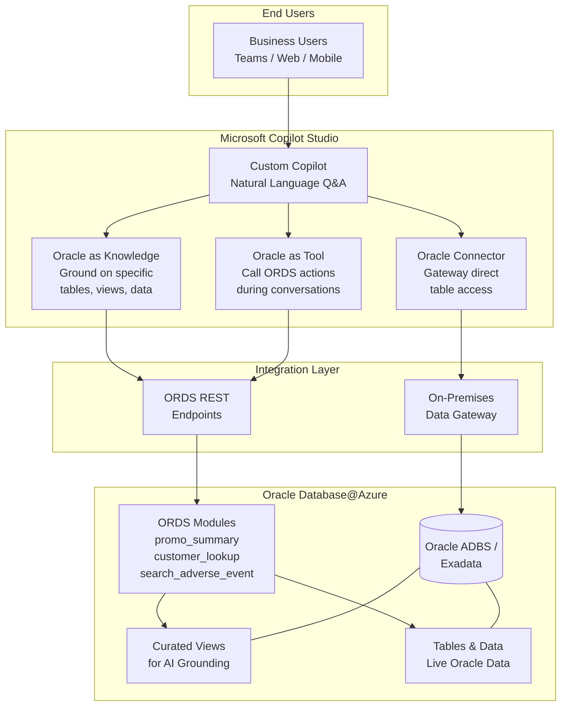

**Use when:** Real-time answers required · No data replication allowed · Business user audience
**Integration modes:** Connector (direct table access) · Knowledge (ground copilot on Oracle data) · Tool (call Oracle actions)

---

### Pattern B: Microsoft Foundry Agent + MCP + ORDS Tools (Pro-Dev Agentic AI)

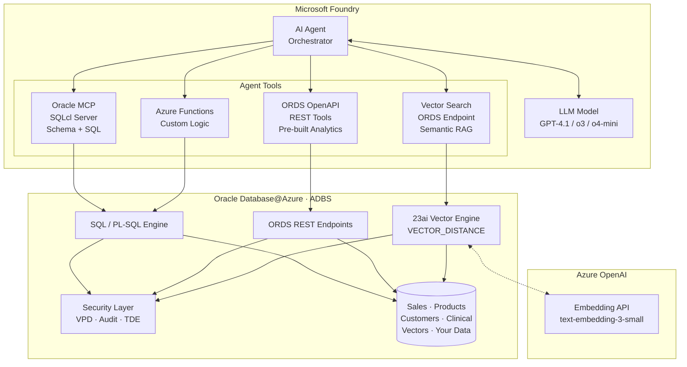

**Use when:** Custom AI applications · Multi-agent orchestration · Full control over model, tools, and prompts

---

### Pattern C: Oracle Data → Fabric Analytics → AI Agents

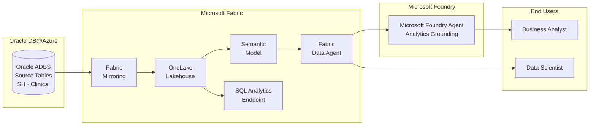

**Use when:** Trends, KPIs, forecasting · Cross-source analytics · Data science workflows

---

### Pattern D: Oracle 23ai Vector Search + Azure OpenAI RAG

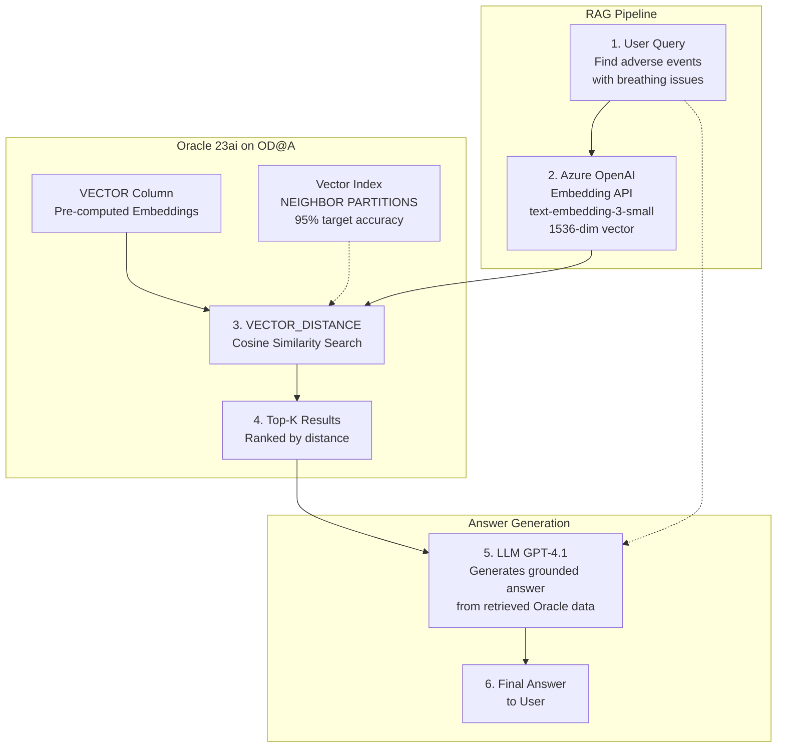

**Use when:** Semantic search on Oracle data · RAG without a separate vector DB · Oracle 23ai available

---

### Pattern E: Oracle MCP → Multi-Client Agent Access

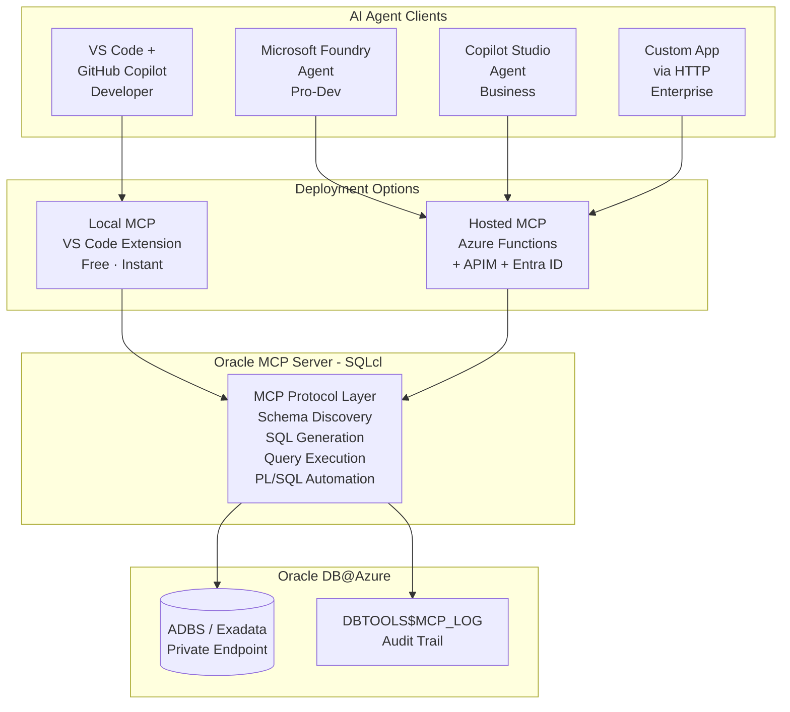

**Use when:** Central MCP server shared across teams · Multiple AI clients need Oracle access

---

## 9. Path 1 — Copilot Studio + Oracle (Gateway, Knowledge, Tool)

### 9.1 Architecture

Copilot Studio connects to Oracle Database@Azure through multiple integration modes:

1. **Oracle as a Connector (via Gateway)** — Direct read/write access to Oracle tables through the On-Premises Data Gateway
2. **Oracle as Knowledge** — Ground your custom copilot on specific Oracle tables or data so the LLM uses Oracle data as context to answer questions
3. **Oracle as a Tool** — Register Oracle queries or ORDS endpoints as copilot actions/tools that the copilot can call during conversations

These modes can be combined in a single copilot for maximum flexibility.

### 9.2 Three Integration Modes (Detailed)

#### Mode A: Oracle via Gateway Connector (Direct Data Access)

The On-Premises Data Gateway provides a direct, secure channel to Oracle data. The copilot executes actions that read/write Oracle tables.

**Use when:** You need the copilot to fetch specific rows, run parameterized queries, or update records.

#### Mode B: Oracle as Knowledge Source (Grounding)

Copilot Studio allows you to add **Knowledge sources** that ground the copilot's responses. You can point Knowledge at Oracle tables or views so the copilot uses that data as context when answering questions — the LLM retrieves relevant Oracle data before generating a response.

**Use when:** You want the copilot to "know" about Oracle data (e.g., product catalogs, policies, FAQs stored in Oracle) and answer questions conversationally without the user needing to specify exact queries.

**How it works:**
1. Create Oracle views that expose the data you want to ground on (e.g., `V_PRODUCT_FAQ`, `V_POLICY_DOCS`)
2. Expose those views via ORDS REST endpoints or the Oracle connector
3. In Copilot Studio → **Knowledge** → Add the Oracle data source
4. Select the specific tables, views, or data you want the copilot to use
5. The copilot automatically retrieves relevant rows when answering questions

#### Mode C: Oracle as a Tool (Action-Based)

Register Oracle-backed actions as **Tools** in Copilot Studio. The copilot decides when to call these tools based on the conversation.

**Use when:** You want the copilot to perform specific Oracle operations (lookup a customer, check order status, run a report) as part of a conversation flow.

**How it works:**
1. Create ORDS REST endpoints for each action (e.g., `/customer_lookup/`, `/order_status/`)
2. In Copilot Studio → **Tools** → Add an **OpenAPI** or **Connector** tool
3. Point to your ORDS endpoint or Oracle connector action
4. Define when the tool should be called (trigger phrases or AI-driven)

### 9.3 Prerequisites

- Microsoft 365 license with Copilot Studio entitlement
- On-Premises Data Gateway installed on an Azure VM or hybrid machine with network access to OD@A (for Gateway mode)
- Oracle Database@Azure instance (ADBS or Exadata)
- Oracle client libraries (Oracle Instant Client) on the gateway machine
- ORDS endpoints configured (for Knowledge and Tool modes)

### 9.4 Setup Steps

**For Gateway Connector:**
1. **Install the On-Premises Data Gateway** on an Azure VM within the same VNET (or peered VNET) as OD@A
2. **Install Oracle Instant Client** on the gateway VM
3. **Configure the Oracle connection** in Power Platform Admin Center:
   - Connection type: Oracle Database
   - Server: `<OD@A hostname>:<port>/<service_name>`
   - Authentication: Basic (Oracle DB user) or Entra ID pass-through

**For Oracle as Knowledge:**
4. **Create curated Oracle views** for the data you want to ground on
5. **Expose via ORDS** or connector
6. In Copilot Studio → **Knowledge** → **+ Add data source** → Select Oracle tables/views
7. Choose specific tables or columns to include (don't expose entire schemas)

**For Oracle as Tool:**
8. **Create ORDS REST endpoints** for specific actions
9. **Generate OpenAPI spec** for the endpoints
10. In Copilot Studio → **Tools** → **+ Add tool** → Upload OpenAPI spec or select connector action
11. Configure tool descriptions (the LLM uses these to decide when to call the tool)

**Deploy:**
12. **Test in the embedded chat** → Deploy to Teams / Web / Mobile

### 9.5 Design Considerations

| Consideration | Guidance |
|--------------|----------|
| **Knowledge vs Tool** | Use Knowledge for open-ended Q&A ("tell me about product X"); use Tools for specific actions ("look up order #123") |
| **Query complexity** | Pre-build Oracle views for complex joins; keep connector queries simple |
| **Data scoping** | For Knowledge sources, expose only the tables/columns relevant to the copilot's purpose; don't expose entire schemas |
| **Performance** | Gateway adds ~100-300ms latency; ORDS endpoints are generally faster for Knowledge/Tool modes |
| **Security** | Use a dedicated read-only Oracle user; never expose DBA credentials; scope Knowledge to non-sensitive data |
| **Freshness** | Knowledge sources reflect live Oracle data; no caching delay |
| **Scaling** | Gateway supports clustering for high availability |
| **Data types** | Gateway handles standard Oracle types; LOBs and custom types may need views |

### 9.6 Sample Configurations

**Knowledge Grounding Example:**
```yaml
Knowledge Source: Oracle Product Catalog
Type: Oracle Database (via connector)
Table: SH.PRODUCTS (view: V_PRODUCT_DETAILS)
Columns: PROD_NAME, PROD_CATEGORY, PROD_DESC, PROD_LIST_PRICE, PROD_STATUS
Behavior: Copilot answers "What products do we have in Golf?" by retrieving relevant rows
```

**Tool Example:**
```yaml
Tool: Get Promotion ROI
Type: OpenAPI (ORDS endpoint)
Endpoint: GET /ords/aisearch/promo_performance/?q={"sales_year":{year}}
Trigger: User asks about promotion performance or ROI
Response: Copilot calls the endpoint, formats the results as a table
```

**Topic + Connector Example:**
```yaml
Topic: Quarterly Sales Summary
Trigger: "What were sales in {quarter} {year}?"
Action:
  - Get rows from Oracle (via gateway)
  - Table: SH.SALES joined with SH.TIMES
  - Filter: CALENDAR_QUARTER = {quarter}, CALENDAR_YEAR = {year}
  - Aggregate: SUM(AMOUNT_SOLD), COUNT(*)
Response: "In {quarter} {year}, total sales were ${total} across {count} transactions."
```

---

## 10. Path 2 — Microsoft Foundry Agents

### 10.1 Architecture

Microsoft Foundry provides a full-featured platform for building AI agents that can call external tools (MCP, OpenAPI, Azure Functions) to access Oracle data.

### 10.2 Prerequisites

- Azure subscription with Microsoft Foundry access
- Azure OpenAI or model deployment (GPT-4.1, o3, o4-mini recommended for tool-calling)
- Oracle Database@Azure instance
- Oracle ORDS endpoints configured (recommended) and/or MCP server

### 10.3 Setup Steps

1. **Navigate to [ai.azure.com](https://ai.azure.com)** → Create or select an Microsoft Foundry project
2. **Create a new Agent**:
   - Name: e.g., `Oracle Sales Analytics Agent`
   - Model: `gpt-4.1` or `o3` (best tool-calling performance)
3. **Configure system instructions** (see Section 17.1 for full prompt template)
4. **Add tools** (one or more):

   **Option A — MCP Tools (Recommended for SQL access):**
   ```json
   {
     "mcpServer": {
       "name": "oracle-sqlcl",
       "command": "sqlcl",
       "args": ["@Connection_Name"],
       "capabilities": ["sql-query", "schema-information"]
     }
   }
   ```

   **Option B — OpenAPI Tools (For pre-built ORDS REST endpoints):**
   - Upload your OpenAPI spec (e.g., `promotion-insights-api.json`)
   - Set base URL to your ORDS endpoint
   - Select operations to enable (e.g., `getPromotionSummary`, `getPromotionPerformance`)

   **Option C — Azure Functions (For custom business logic):**
   - Deploy custom functions that query Oracle via ODP.NET or node-oracledb
   - Register as Function tools in the agent

5. **Add knowledge sources** (optional):
   - Upload schema documentation for grounding
   - Connect Azure AI Search index with Oracle data

6. **Test in the Playground** → Deploy via API

### 10.4 Agent System Prompt Template

```markdown
## Agent Identity
You are an AI-powered Oracle Database Analytics Agent specialized in analyzing
data from Oracle Database@Azure.

## Your Capabilities
1. **Direct SQL Queries**: Execute SQL via Oracle MCP SQLcl tool
2. **REST API Access**: Call pre-built ORDS endpoints
3. **Vector Search**: Semantic similarity search via Oracle 23ai

## Available Tools
- oracle_sql_query: Execute SQL against Oracle schemas
- get_promotion_summary: High-level promotion summaries
- get_promotion_performance: ROI metrics per promotion
- search_adverse_events: Vector search for clinical data

## Guidelines
- Always qualify table names with schema prefix (e.g., SH.SALES)
- Use ORDS endpoints for pre-built analytics; SQL for custom queries
- Present results in clear tables with key metrics highlighted
- Cite your data source (SQL query or API endpoint)
```

### 10.5 Multi-Agent Pattern

For complex scenarios, use multiple specialized agents:

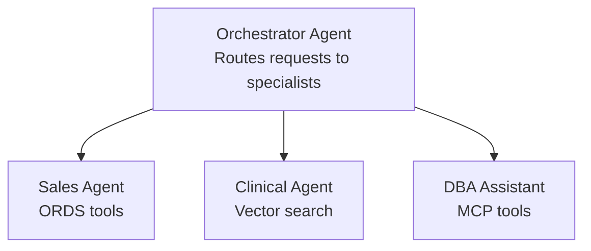

---

## 11. Path 3 — Oracle MCP Server (Model Context Protocol)

### 11.1 What is MCP?

The **Model Context Protocol (MCP)** is an open standard that enables AI agents and LLMs to discover and use tools provided by external servers. Oracle provides an MCP Server via **SQLcl** that exposes Oracle Database capabilities as tools to any MCP-compatible client.

### 11.2 What MCP Enables on OD@A

| Capability | Description |
|-----------|-------------|
| **Natural Language → SQL** | Agent generates SQL/PL-SQL from user questions |
| **Schema Discovery** | Agent explores tables, views, indexes, constraints |
| **Query Execution** | Agent runs SQL and returns structured results |
| **DBA Automation** | Automate routine DBA tasks through conversation |
| **Data Validation** | Agent validates data quality, checks constraints |
| **Code Generation** | Generate PL/SQL procedures from natural language |

### 11.3 Deployment Option 1: Local MCP via VS Code (Developer Productivity)

**Architecture:**
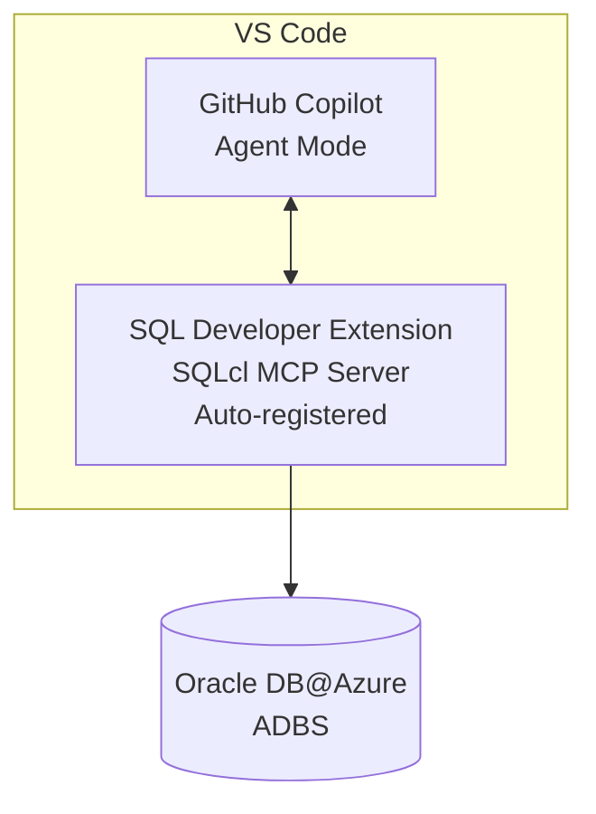

**Setup Steps:**
1. Install **SQL Developer Extension for VS Code**
2. Configure a connection to your OD@A instance
3. SQLcl MCP Server is **automatically registered** for GitHub Copilot Agent Mode
4. Open GitHub Copilot → Agent Mode → Use `@oracle` to interact with your database

**MCP Configuration (`settings.json`):**
```json
{
  "mcpServers": {
    "oracle-adbs": {
      "name": "Oracle Sales History Database",
      "type": "sqlcl",
      "connection": {
        "connectionName": "Adbs Connection",
        "schema": "SH"
      },
      "capabilities": ["sql-query", "schema-information", "data-analysis"]
    }
  }
}
```

**Security Notes:**
- Use least-privilege DB users (never SYS/SYSTEM)
- Avoid production connections during development
- MCP activity is logged in `DBTOOLS$MCP_LOG` table

### 11.4 Deployment Option 2: Hosted MCP Server on Azure Functions (Enterprise)

**Architecture:**
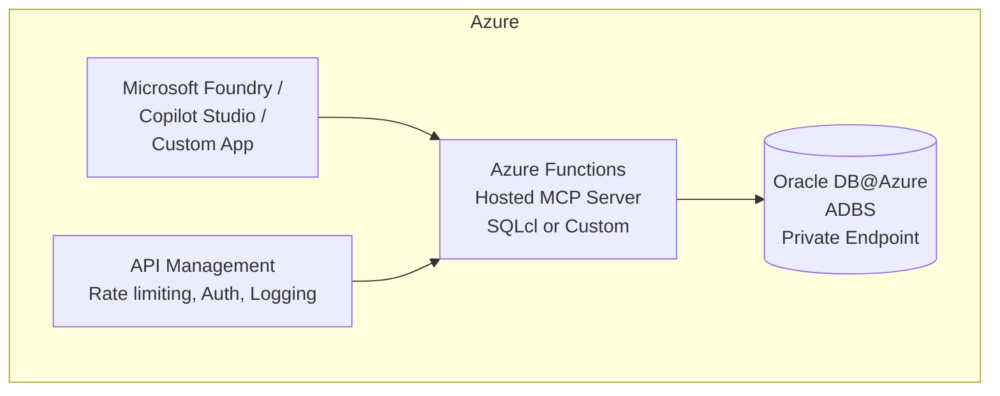

**Why Azure Functions for MCP:**

| Benefit | Detail |
|---------|--------|
| **Serverless scaling** | Zero to N instances based on agent request volume |
| **Native MCP hosting** | Azure Functions supports MCP server hosting natively |
| **HTTPS + auth** | Built-in Entra ID authentication |
| **Centralized governance** | One MCP server shared by many agents |
| **API Management** | Rate limiting, logging, caching via Azure APIM |

**Setup Steps:**
1. Create an Azure Functions App (Python or Node.js runtime)
2. Deploy SQLcl or a custom MCP server implementation
3. Configure Oracle connection string (use Azure Key Vault for credentials)
4. Enable Entra ID authentication on the Function App
5. (Optional) Front with Azure API Management for rate limiting and logging
6. Register the Function's HTTP endpoint as an MCP tool in Microsoft Foundry / Copilot Studio

### 11.5 Available MCP Tools

Once registered (locally or hosted), MCP tools can be used by:

| Client | How to Register |
|--------|----------------|
| **Microsoft Foundry agents** | Add as external MCP tool |
| **Copilot Studio agents** | Via tool integration / custom connector |
| **VS Code GitHub Copilot** | Auto-registered by SQL Developer Extension |
| **Custom applications** | Call MCP server endpoint directly via HTTP |

**Common MCP operations agents can perform:**
- `schema-information` — List tables, columns, types, constraints
- `sql-query` — Execute SELECT, WITH, aggregate queries
- `explain-plan` — Get query execution plans
- `generate-sql` — Generate SQL from natural language
- `run-plsql` — Execute PL/SQL blocks (with appropriate permissions)

---

## 12. Path 4 — Microsoft Fabric + Data Agents

### 12.1 Architecture

Microsoft Fabric mirrors Oracle data into OneLake, creating a unified analytics layer that can power Fabric Data Agents and Microsoft Foundry agents.

### 12.2 Prerequisites

- Microsoft Fabric capacity (F2 or above)
- Oracle Database@Azure instance
- Fabric mirroring configured for Oracle

### 12.3 Setup Steps

1. **Configure Fabric Mirroring for Oracle:**
   - In Fabric workspace, create a new **Mirrored Database**
   - Select Oracle Database as the source
   - Provide OD@A connection details (host, port, service name, credentials)
   - Select tables/schemas to mirror (e.g., SH schema)
   - Configure refresh schedule (near-real-time or scheduled)

2. **Create a Lakehouse:**
   - Mirrored data lands in OneLake automatically
   - Create SQL analytics endpoints for querying
   - Build a semantic model for business-friendly naming

3. **Create a Fabric Data Agent:**
   - Navigate to **Data Engineering** → **AI** in Fabric
   - Create a new Data Agent connected to your mirrored data
   - Configure natural language understanding
   - Data Agent can answer questions across mirrored Oracle data + other Fabric sources

4. **Connect to Microsoft Foundry (Optional):**
   - Use Fabric's Microsoft Foundry integration to create agents grounded in mirrored data
   - Combine with Azure AI Search for hybrid retrieval

### 12.4 Design Considerations

| Consideration | Guidance |
|--------------|----------|
| **Latency** | Mirroring introduces latency (minutes to hours depending on config); not suitable for real-time transactional Q&A |
| **Data scope** | Mirror only the tables/schemas needed for analytics; don't mirror entire databases |
| **Cross-source** | Fabric's strength is joining Oracle data with SQL Server, Azure SQL, Dataverse, etc. |
| **Cost** | Fabric CU consumption scales with data volume and query complexity |
| **Security** | Data inherits Fabric workspace security; does NOT inherit Oracle RLS |

---

## 13. Path 5 — Power Apps + Power Automate AI

### 13.1 Architecture

Power Apps and Power Automate connect to Oracle Database@Azure via the Oracle Database connector and the On-Premises Data Gateway, enabling business workflows with incremental AI capabilities.

### 13.2 Setup Steps

1. **Set up On-Premises Data Gateway** (same as Path 1 — see Section 9.3)
2. **Create a Power App:**
   - Use the Oracle Database connector
   - Build forms, views, and dashboards connected to Oracle tables
3. **Add AI Builder:**
   - Form processing (OCR on Oracle-stored documents)
   - Prediction models on Oracle data
   - Text classification and summarization
4. **Create Power Automate flows:**
   - Trigger on Oracle data changes (via polling or scheduled)
   - Use Copilot in Power Automate for natural language flow creation
   - Chain with Azure AI services for enrichment

### 13.3 AI Capabilities in Power Platform

| Capability | How It Works |
|-----------|-------------|
| **AI Builder** | Pre-built and custom AI models (prediction, form processing, object detection) |
| **Copilot in Power Apps** | Natural language app building; auto-generates screens from Oracle tables |
| **Copilot in Power Automate** | Describe a flow in English; Copilot builds it |
| **GPT action** | Call Azure OpenAI from within a flow for summarization, extraction |

---

## 14. Path 6 — Oracle 23ai Vector Search + Azure OpenAI RAG

### 14.1 Overview

Oracle Database 23ai introduces native **VECTOR** data type and **VECTOR_DISTANCE** function, enabling semantic similarity search directly inside the database. Combined with **Azure OpenAI embeddings**, this creates a powerful RAG (Retrieval-Augmented Generation) pattern without a separate vector database.

### 14.2 Architecture

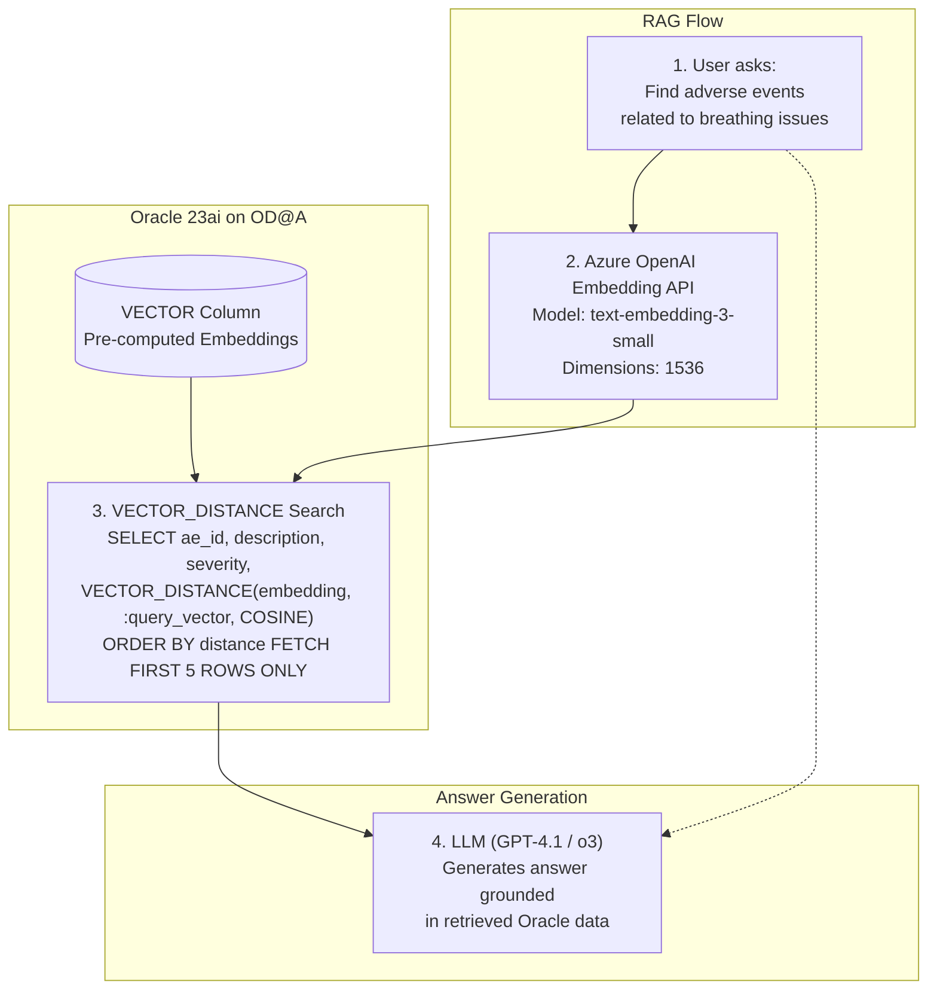

### 14.3 Prerequisites

- Oracle Database 23ai on OD@A (ADBS or Exadata with 23ai)
- Azure OpenAI resource with `text-embedding-3-small` or `text-embedding-3-large` deployed
- Oracle REST Data Services (ORDS) configured for the vector search schema

### 14.4 Implementation Steps

#### Step 1: Create the Vector Table

```sql
-- Create table with native VECTOR column
CREATE TABLE clinical_app.adverse_events (
    ae_id         NUMBER GENERATED ALWAYS AS IDENTITY PRIMARY KEY,
    enrollment_id NUMBER,
    event_date    DATE,
    severity      VARCHAR2(20),
    description   CLOB,
    embedding     VECTOR(1536, FLOAT64)  -- 1536 dimensions for text-embedding-3-small
);
```

#### Step 2: Generate and Store Embeddings

```sql
-- PL/SQL procedure to generate embeddings via Azure OpenAI
CREATE OR REPLACE PROCEDURE generate_embedding(
    p_ae_id IN NUMBER
) IS
    v_description CLOB;
    v_embedding   VECTOR(1536, FLOAT64);
    v_response    CLOB;
BEGIN
    SELECT description INTO v_description
    FROM clinical_app.adverse_events
    WHERE ae_id = p_ae_id;

    -- Call Azure OpenAI endpoint using UTL_HTTP or DBMS_CLOUD
    v_response := DBMS_CLOUD.send_request(
        credential_name => 'AZURE_OPENAI_CRED',
        uri => 'https://<your-resource>.openai.azure.com/openai/deployments/'
               || 'text-embedding-3-small/embeddings?api-version=2024-02-01',
        method => 'POST',
        body => JSON_OBJECT('input' VALUE v_description)
    );

    -- Parse embedding from response and update table
    UPDATE clinical_app.adverse_events
    SET embedding = JSON_VALUE(v_response, '$.data[0].embedding'
                              RETURNING VECTOR(1536, FLOAT64))
    WHERE ae_id = p_ae_id;

    COMMIT;
END;
/
```

#### Step 3: Create Vector Index

```sql
-- Create vector index for fast similarity search
CREATE VECTOR INDEX idx_ae_embedding
ON clinical_app.adverse_events(embedding)
ORGANIZATION NEIGHBOR PARTITIONS
DISTANCE COSINE
WITH TARGET ACCURACY 95;
```

#### Step 4: Create ORDS Endpoint for Vector Search

```sql
-- ORDS REST endpoint for semantic search
BEGIN
    ORDS.DEFINE_MODULE(
        p_module_name => 'vectorsearch',
        p_base_path   => '/vectorsearch/',
        p_items_per_page => 5
    );

    ORDS.DEFINE_TEMPLATE(
        p_module_name  => 'vectorsearch',
        p_pattern      => 'search_adverse_event/'
    );

    ORDS.DEFINE_HANDLER(
        p_module_name  => 'vectorsearch',
        p_pattern      => 'search_adverse_event/',
        p_method       => 'POST',
        p_source_type  => ORDS.source_type_plsql,
        p_source       => '
        DECLARE
            v_query_vector VECTOR(1536, FLOAT64);
        BEGIN
            -- Generate embedding for the search query
            v_query_vector := generate_query_embedding(:p_query);

            -- Return top 5 matches
            OPEN :result FOR
                SELECT ae_id, description, severity, event_date,
                       VECTOR_DISTANCE(embedding, v_query_vector, COSINE) AS distance
                FROM clinical_app.adverse_events
                ORDER BY distance
                FETCH FIRST 5 ROWS ONLY;
        END;'
    );
    COMMIT;
END;
/
```

#### Step 5: Integrate with AI Agent

Register the ORDS vector search endpoint as a tool in Microsoft Foundry:

```json
{
  "type": "function",
  "function": {
    "name": "search_adverse_events",
    "description": "Semantic vector search for clinical adverse events using AI embeddings",
    "parameters": {
      "type": "object",
      "properties": {
        "p_query": {
          "type": "string",
          "description": "Natural language query (e.g., 'severe breathing problems')"
        }
      },
      "required": ["p_query"]
    }
  }
}
```

### 14.5 Design Considerations

| Consideration | Guidance |
|--------------|----------|
| **Embedding model** | `text-embedding-3-small` (1536d) for cost efficiency; `text-embedding-3-large` (3072d) for higher accuracy |
| **Vector index** | Use `ORGANIZATION NEIGHBOR PARTITIONS` for large tables (>100K rows) |
| **Distance metric** | `COSINE` for normalized embeddings; `DOT_PRODUCT` for unnormalized |
| **Embedding refresh** | Batch-update embeddings when source data changes; use triggers or scheduled jobs |
| **Hybrid search** | Combine vector distance with traditional SQL filters for higher precision |
| **Cost** | Azure OpenAI embedding calls are billed per token; batch for efficiency |

### 14.6 Hybrid Search Example (Vector + SQL Filters)

```sql
-- Combine semantic search with traditional filters
SELECT ae_id, description, severity, event_date,
       VECTOR_DISTANCE(embedding, :query_vector, COSINE) AS distance
FROM clinical_app.adverse_events
WHERE severity IN ('SEVERE', 'LIFE_THREATENING')
  AND event_date >= DATE '2025-01-01'
ORDER BY distance
FETCH FIRST 10 ROWS ONLY;
```

---

## 15. Combined Patterns — Multi-Path Architectures

Real-world deployments often combine multiple paths. Here are the most common patterns:

### 15.1 Pattern: Microsoft Foundry Agent + MCP + Vector Search (Full Agentic RAG)

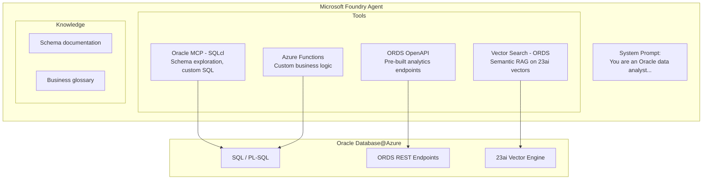

**When to use:** Most comprehensive pattern for teams that need SQL access, pre-built analytics, AND semantic search.

### 15.2 Pattern: Copilot Studio (Business) + Microsoft Foundry (Technical)

Deploy separate experiences for different audiences:

| Audience | Tool | Data Access |
|----------|------|-------------|
| Business users | Copilot Studio | Gateway → Oracle (simple queries) |
| Data analysts | Fabric Data Agent | Mirrored Oracle data in OneLake |
| Developers | Microsoft Foundry Agent + MCP | Full SQL + vector search |
| DBAs | VS Code + MCP | Schema management, automation |

### 15.3 Pattern: ETL + RAG Hybrid

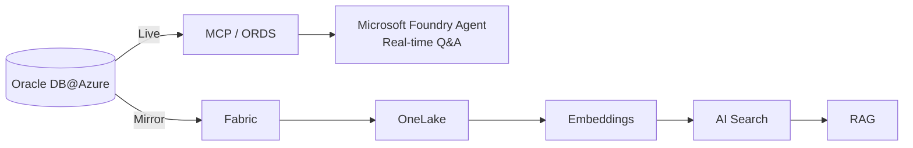

**When to use:** Some questions need real-time data; others benefit from pre-computed embeddings on historical data.

---

## 16. Security & Governance Guardrails

### 16.1 Security Architecture

```mermaid
graph LR
    subgraph L1["Layer 1 · Network"]
        N1["Private Endpoints"]
        N2["VNET Integration"]
        N3["NSG Rules"]
        N4["TLS 1.2+"]
    end

    subgraph L2["Layer 2 · Identity"]
        I1["Entra ID"]
        I2["Managed Identities"]
        I3["Azure Key Vault"]
        I4["Dedicated DB Users"]
    end

    subgraph L3["Layer 3 · Data"]
        D1["Read-Only AI Users"]
        D2["Oracle VPD Row-Level"]
        D3["Data Redaction PII"]
        D4["Separate AI Schemas"]
    end

    subgraph L4["Layer 4 · AI Governance"]
        G1["Content Safety"]
        G2["Prompt Guardrails"]
        G3["APIM Rate Limiting"]
        G4["Token Budgets"]
    end

    subgraph L5["Layer 5 · Audit"]
        A1["Oracle Unified Audit"]
        A2["DBTOOLS$MCP_LOG"]
        A3["Azure Monitor"]
        A4["Fabric Audit Logs"]
    end

    L1 --> L2 --> L3 --> L4 --> L5
```

### 16.2 Security Checklist

| # | Control | Required | Notes |
|---|---------|----------|-------|
| 1 | Dedicated read-only Oracle user per agent | ✅ Yes | Never use ADMIN/SYS |
| 2 | Private Endpoints for OD@A | ✅ Yes | No public IP |
| 3 | Entra ID auth for Azure services | ✅ Yes | Managed identities preferred |
| 4 | Key Vault for Oracle credentials | ✅ Yes | No plaintext secrets |
| 5 | System prompt restricts DDL/DML | ✅ Yes | Agent can only read by default |
| 6 | Oracle VPD for row-level security | ⚠️ Recommended | Limits data exposed to agents |
| 7 | Column masking for PII | ⚠️ Recommended | Data Redaction for sensitive columns |
| 8 | MCP audit logging enabled | ✅ Yes | Check `DBTOOLS$MCP_LOG` |
| 9 | Rate limiting via APIM | ⚠️ Recommended | Prevents runaway agent queries |
| 10 | Azure AI Content Safety | ⚠️ Recommended | Filters harmful inputs/outputs |
| 11 | Network segmentation (NSGs) | ✅ Yes | Agent services in separate subnet |
| 12 | Encryption at rest and in transit | ✅ Yes | TLS 1.2+ for all connections; Oracle TDE |

### 16.3 Key Principle

> **MCP does not bypass Oracle security — it operates inside it.** Every SQL statement executed via MCP runs under the connected Oracle user's privileges, subject to Oracle's standard authentication, authorization, auditing, and VPD policies.

---

## 17. Step-by-Step Implementation Guides

### 17.1 Guide: Build a Microsoft Foundry agent with Oracle MCP + ORDS in 1 Hour

**Goal:** Create an AI agent in Microsoft Foundry that can query Oracle Sales History data via both MCP (SQL) and ORDS (REST).

**Prerequisites:**
- Microsoft Foundry project with GPT-4.1 deployed
- Oracle ADBS on OD@A with SH schema
- ORDS endpoints configured
- [Optional] SQLcl MCP server accessible

**Steps:**

| Step | Action | Time |
|------|--------|------|
| 1 | Open [ai.azure.com](https://ai.azure.com) → select your project | 2 min |
| 2 | **Agents** → **+ New Agent** → Name: `Oracle Sales Agent` → Model: `gpt-4.1` | 3 min |
| 3 | Paste system prompt from Section 10.4 into System message | 5 min |
| 4 | **+ Add Tool** → **OpenAPI** → Upload `promotion-insights-api.json` → Set base URL → Enable all operations | 10 min |
| 5 | **+ Add Tool** → **OpenAPI** → Upload `clinical-vector-search-api.json` → Set base URL → Configure Basic Auth credentials | 10 min |
| 6 | [Optional] **+ Add Tool** → **MCP Server** → Configure Oracle SQLcl connection | 10 min |
| 7 | Test in Playground: "What were the top 5 promotions by ROI?" | 5 min |
| 8 | Test: "Search for adverse events related to severe breathing problems" | 5 min |
| 9 | Test: "Compare promotion performance across internet vs TV channels" | 5 min |
| 10 | Deploy via API endpoint | 5 min |

---

### 17.2 Guide: Set Up Oracle MCP in VS Code in 15 Minutes

**Goal:** Get natural language → SQL working on OD@A in VS Code.

**Steps:**

| Step | Action | Time |
|------|--------|------|
| 1 | Install **SQL Developer Extension for VS Code** from marketplace | 2 min |
| 2 | Click the Database icon → **+ New Connection** | 2 min |
| 3 | Enter OD@A connection details (host, port, service name, username, password) | 3 min |
| 4 | Test connection → connected ✅ | 1 min |
| 5 | Open **GitHub Copilot** → switch to **Agent Mode** | 1 min |
| 6 | Type: `@oracle List all tables in the SH schema` | 1 min |
| 7 | Type: `@oracle Write a query to find the top 10 products by revenue` | 2 min |
| 8 | Type: `@oracle Explain the execution plan for this query` | 2 min |
| 9 | Verify MCP logs: `SELECT * FROM DBTOOLS$MCP_LOG ORDER BY timestamp DESC` | 1 min |

---

### 17.3 Guide: Build Oracle 23ai Vector Search + RAG in 2 Hours

**Goal:** Implement semantic search on Oracle data using 23ai vectors and Azure OpenAI embeddings.

**Prerequisites:**
- Oracle 23ai on OD@A
- Azure OpenAI with `text-embedding-3-small` deployed
- ORDS configured

**Steps:**

| Step | Action | Time |
|------|--------|------|
| 1 | Create table with VECTOR column (see Section 14.4 Step 1) | 10 min |
| 2 | Configure Azure OpenAI credential in Oracle (DBMS_CLOUD) | 10 min |
| 3 | Create embedding generation procedure (Section 14.4 Step 2) | 15 min |
| 4 | Generate embeddings for existing data (batch process) | 15 min |
| 5 | Create vector index (Section 14.4 Step 3) | 5 min |
| 6 | Test vector search via SQL | 5 min |
| 7 | Create ORDS endpoint (Section 14.4 Step 4) | 15 min |
| 8 | Test ORDS endpoint via curl/Postman | 5 min |
| 9 | Create OpenAPI spec for the endpoint | 15 min |
| 10 | Register as tool in Microsoft Foundry agent | 10 min |
| 11 | Test end-to-end: natural language → embedding → vector search → LLM answer | 15 min |

---

### 17.4 Guide: Configure Fabric Mirroring for Oracle in 1 Hour

**Goal:** Mirror Oracle SH schema into Microsoft Fabric OneLake.

**Steps:**

| Step | Action | Time |
|------|--------|------|
| 1 | Open Fabric workspace → **+ New** → **Mirrored Database** | 2 min |
| 2 | Select **Oracle Database** as source | 1 min |
| 3 | Enter OD@A connection: host, port, service name | 5 min |
| 4 | Provide Oracle credentials (read-only user) | 2 min |
| 5 | Select tables: SH.SALES, SH.PRODUCTS, SH.PROMOTIONS, SH.CUSTOMERS, SH.TIMES | 5 min |
| 6 | Configure refresh schedule (e.g., every 15 minutes) | 3 min |
| 7 | Start mirroring → wait for initial sync | 10 min |
| 8 | Create SQL analytics endpoint on mirrored data | 5 min |
| 9 | Build a semantic model with business-friendly names | 10 min |
| 10 | Create a Fabric Data Agent on the semantic model | 10 min |
| 11 | Test: "What is the year-over-year revenue trend for golf products?" | 7 min |

---

## 18. Oracle ORDS as an AI Tool Layer

### 18.1 Why ORDS Matters for AI

Oracle REST Data Services (ORDS) transforms Oracle database objects (tables, views, PL/SQL procedures) into REST APIs. For AI agents, this means:

| Benefit | Detail |
|---------|--------|
| **Pre-built, governed endpoints** | DBAs create curated REST APIs; agents call them without writing SQL |
| **No direct SQL needed** | Reduces risk of SQL injection or unintended queries |
| **OpenAPI compatible** | ORDS generates OpenAPI specs that AI agents can consume directly |
| **Authentication** | Supports OAuth2, Basic Auth, API keys |
| **Pagination** | Built-in `limit`/`offset` for large result sets |
| **Filtering** | JSON-based `q` parameter for flexible filtering |

### 18.2 ORDS Configuration for AI Agents

**Best practices for ORDS endpoints consumed by AI:**

1. **Create purpose-built views** — Don't expose raw tables; create views with business-friendly column names and pre-computed metrics
2. **Use modules for grouping** — Group related endpoints under a single ORDS module (e.g., `/aisearch/`, `/vectorsearch/`)
3. **Document with OpenAPI** — Generate or hand-craft OpenAPI specs with rich descriptions; LLMs use descriptions to decide which endpoint to call
4. **Add examples in OpenAPI** — Include example request/response pairs; this dramatically improves LLM tool selection accuracy
5. **Implement pagination** — Set sensible `items_per_page` defaults (25-50); agents can request more if needed
6. **Use filtering** — Expose the `q` parameter for agents to filter dynamically

### 18.3 Sample OpenAPI Pattern for AI

```json
{
  "operationId": "getPromotionPerformance",
  "summary": "Get detailed promotion performance with ROI metrics",
  "description": "Returns ROI percentage, profit, revenue per dollar spent. Use this when the user asks about promotion effectiveness, best/worst promotions, or marketing ROI. Filter by year with q={\"sales_year\":2025} or by channel with q={\"promo_category\":\"internet\"}."
}
```

> **Tip:** The `description` field in OpenAPI is the most important field for AI agents. Write it as if you're explaining the endpoint to a human analyst.

---

## 19. Monitoring, Observability & Cost

### 19.1 Monitoring Stack

| Component | Monitoring Tool | Key Metrics |
|-----------|----------------|-------------|
| AI Agent interactions | Azure Monitor / Application Insights | Request count, latency, token usage, error rate |
| Oracle MCP activity | `DBTOOLS$MCP_LOG` table | SQL executed, user, timestamp, duration |
| Oracle database | Oracle Enterprise Manager / OCI Monitoring | CPU, memory, I/O, query performance |
| ORDS endpoints | ORDS access logs + Azure APIM analytics | Call volume, response times, errors |
| Fabric mirroring | Fabric monitoring hub | Sync latency, row counts, failures |
| Azure OpenAI | Azure Monitor | Token consumption, throttling, latency |
| Network | Azure Network Watcher | Traffic flows, NSG hits |

### 19.2 Cost Estimation Guide

| Component | Pricing Model | Typical Pilot Cost |
|-----------|--------------|-------------------|
| OD@A (ADBS) | OCPU-hour | Existing — no incremental for AI |
| Azure OpenAI (GPT-4.1) | Per 1M tokens (input/output) | ~$50-200/month for pilot |
| Azure OpenAI (Embeddings) | Per 1M tokens | ~$5-20/month for pilot |
| Microsoft Foundry | Compute + model hosting | ~$100-300/month for pilot |
| Copilot Studio | Per message (varied plans) | ~$200/month per 25K messages |
| Microsoft Fabric | Fabric CU-hour | ~$200-500/month (F2) |
| Azure Functions | Per execution + compute | ~$5-20/month |
| API Management | Per unit | ~$50/month (Developer tier) |

### 19.3 Cost Optimization Tips

1. **Start with Copilot Studio or MCP local** — lowest-cost entry points
2. **Use `o4-mini` for non-critical tasks** — significantly cheaper than GPT-4.1 or o3
3. **Cache ORDS responses** via APIM — reduce Oracle query load and Azure OpenAI token usage
4. **Batch embeddings** — generate embeddings in bulk rather than per-request
5. **Use Fabric mirroring selectively** — don't mirror tables you won't query
6. **Set token limits** on agents — prevent runaway conversations

---

## 20. Appendix — Resources & References

### 20.1 Official Documentation

| Resource | URL |
|----------|-----|
| Oracle Database@Azure | https://docs.oracle.com/en-us/iaas/Content/multicloud/oaa.htm |
| Oracle MCP Server (SQLcl) | https://docs.oracle.com/en/database/oracle/sql-developer-command-line/ |
| Oracle 23ai Vector Search | https://docs.oracle.com/en/database/oracle/oracle-database/23/vecse/ |
| Oracle ORDS | https://docs.oracle.com/en/database/oracle/oracle-rest-data-services/ |
| Microsoft Foundry | https://learn.microsoft.com/en-us/azure/ai-studio/ |
| Copilot Studio | https://learn.microsoft.com/en-us/microsoft-copilot-studio/ |
| Microsoft Fabric | https://learn.microsoft.com/en-us/fabric/ |
| Power Platform Oracle Connector | https://learn.microsoft.com/en-us/connectors/oracle/ |
| Azure Functions MCP Hosting | https://learn.microsoft.com/en-us/azure/azure-functions/ |
| Model Context Protocol (MCP) | https://modelcontextprotocol.io/ |

### 20.2 OpenAPI Specifications (Include with Agent Setup)

| API | File | Auth |
|-----|------|------|
| Promotion Insights | `openapi/promotion-insights-api.json` | None |
| Clinical Vector Search | `openapi/clinical-vector-search-api.json` | Basic Auth |

### 20.3 Configuration Files (Ready to Use)

| File | Purpose |
|------|---------|
| `mcp-config/oracle-mcp-config.json` | MCP server configuration for Oracle ADBS |
| `mcp-config/agent-tools.json` | Function tool definitions for Microsoft Foundry Agents |
| `mcp-config/agent-system-prompt.md` | System prompt template for Oracle analytics agent |
| `mcp-config/FOUNDRY-AGENT-SETUP.md` | Step-by-step Microsoft Foundry agent creation guide |

### 20.4 Architecture Decision Record Template

Use this template when documenting a customer's chosen path:

```markdown
# ADR: AI Agent Architecture for [Customer Name]

## Context
- Oracle DB version: [19c / 23ai]
- OD@A deployment: [ADBS / Exadata]
- Primary use case: [Q&A / Analytics / Automation / RAG]
- User persona: [Business / Developer / DBA]
- Data movement: [Allowed / Not allowed]

## Decision
Selected Path(s): [1-6]
Rationale: [Why this path fits]

## Architecture
[Reference pattern from Section 8]

## Security Controls
[Checklist from Section 16.2]

## Estimated Timeline
- Pilot: [X weeks]
- Production: [X months]

## Cost Estimate
[From Section 19.2]
```

### 20.5 Glossary

| Term | Definition |
|------|-----------|
| **OD@A** | Oracle Database@Azure — Oracle databases running natively on Azure infrastructure |
| **ADBS** | Autonomous Database Serverless — Oracle's fully managed database service |
| **MCP** | Model Context Protocol — open standard for AI agent tool integration |
| **ORDS** | Oracle REST Data Services — REST API layer for Oracle Database |
| **RAG** | Retrieval-Augmented Generation — grounding LLM responses with retrieved data |
| **Vector Search** | Semantic similarity search using embedding vectors |
| **Microsoft Foundry** | Microsoft Foundry — Microsoft's platform for building AI applications |
| **Copilot Studio** | Microsoft's low-code platform for building copilots |
| **Fabric** | Microsoft Fabric — unified analytics platform with OneLake |
| **VPD** | Virtual Private Database — Oracle's row-level security feature |
| **Entra ID** | Microsoft's identity platform (formerly Azure AD) |
| **APIM** | Azure API Management — API gateway service |

---

## Version History

| Version | Date | Change |
|---------|------|--------|
| 1.0 | 2025 | Initial field playbook (4 paths) |
| 2.0 | February 2026 | Expanded to 6 paths; added Oracle 23ai vector search; added step-by-step implementation guides; added ORDS as AI tool layer; added monitoring and cost sections; added security checklist |

---

*This playbook is maintained by the OD@A AI Solutions team. For contributions, corrections, or customer-specific architecture reviews, contact the authors.*
