# 8. Reference Architecture Patterns

Patterns are organized into three categories based on how Oracle data flows into the Microsoft AI ecosystem.
Platforms used are Microsoft Foundry, Copilot Studio, Power Apps, Logic apps for workflows 

---

## Category 1: Live Oracle Data (No Migration)

Agents query Oracle data directly running on Oracle Database@Azure at runtime. No data leaves Oracle.

| Pattern | AI Platform | How It Connects | Surfaces | Value Proposition |
|---------|------------|-----------------|----------|-------------------|
| **1** | **Copilot Studio** | Gateway / Oracle as Knowledge / Oracle as Tool | Teams, Web, M365 | • Fastest time-to-value (hours) • No-code builder • Business users self-serve answers • Zero data movement |
| **2** | **MS Foundry** | Agent Framework: Oracle MCP server (hosted on Azure Functions / Azure Container Apps) + ORDS APIs; Knowledge Base (Blob, SharePoint, Fabric Files); Oracle 26ai vectors | API, M365 Copilot, Agent Store | • Full model & tool control • Multi-agent orchestration • Production-grade custom AI apps • Live Oracle data, no migration • Publish to M365 + Agent Store |
| **3** | **Oracle MCP** (developer) | SQLcl MCP in VS Code or hosted | VS Code, Foundry, Copilot Studio | • Natural language → SQL in minutes • Zero infrastructure to start • Schema discovery on demand • DBA task automation |
| **4** | **Power Apps** | Gateway / Oracle Connector | Power Platform | • Modernize workflows without rebuilding • AI Builder for forms & predictions • Citizen developer friendly • Incremental AI adoption |
| **5** | **Logic Apps** | Oracle DB Connector (Gateway) / ORDS REST (via HTTP + APIM) | Workflow orchestration, enterprise integration | • Event-driven automation • 400+ enterprise connectors • No custom code needed • Orchestrate Oracle + SaaS + Azure |

---

### Pattern 1: Copilot Studio + Oracle Connector (On-Prem Data Gateway)

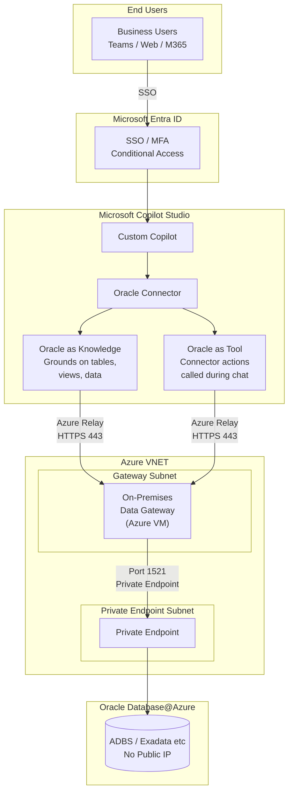
Azure Relay is the service that the On-Premises Data Gateway uses to communicate with cloud services like Copilot Studio. This is already how the On-Premises Data Gateway works by default — you don't configure Azure Relay separately. It's built into the gateway installer.

Here's how it works:

How the Gateway Communicates:
The gateway VM makes an outbound HTTPS connection (port 443) to Azure Relay when it starts up.
This creates a persistent, secure tunnel — no inbound ports need to be opened on the gateway VM.
When Copilot Studio needs Oracle data, the request flows through this tunnel to the gateway, which then queries Oracle over port 1521 via the Private Endpoint.

---

### Pattern 2: MS Foundry + Oracle MCP Server

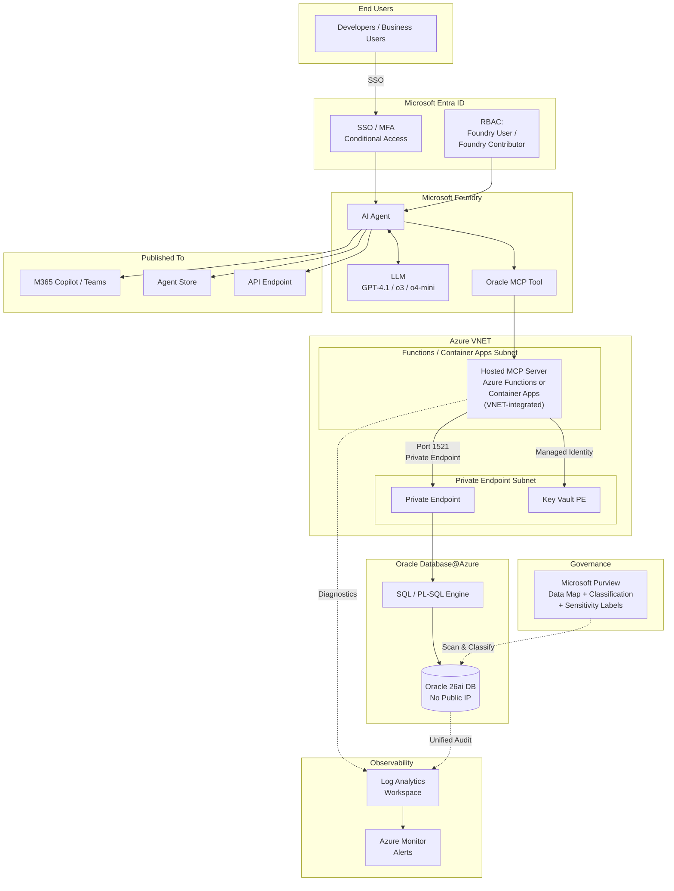

---

### Pattern Pattern 3: MS Foundry + Oracle ORDS API Endpoints (RAG / Vector Search)

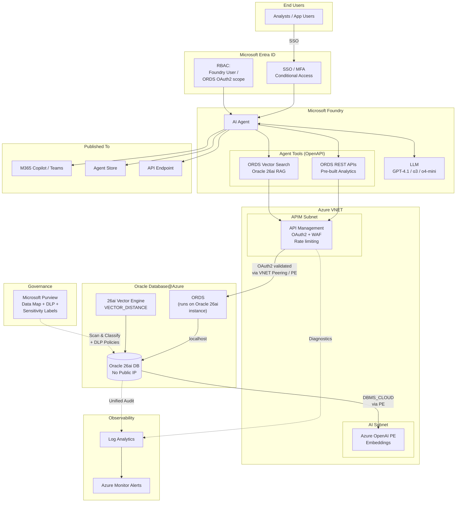

> **Key difference from previous version**: ORDS runs natively on the Oracle 26ai instance — no separate Azure compute (App Service / Container Apps) is needed. APIM connects to ORDS via VNET Peering or Private Endpoint. Embedding calls from Oracle to Azure OpenAI also route via Private Endpoint.

---

### Pattern Pattern 4: MS Foundry + Oracle MCP + Oracle ORDS APIs + Foundry IQ (Full Stack)

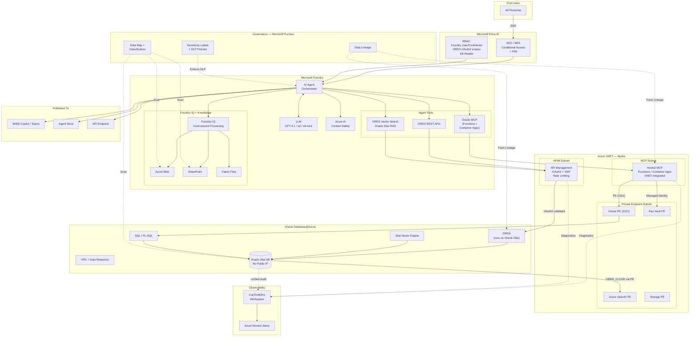

> **Key changes**: ORDS runs natively on the Oracle 26ai instance (no separate Azure compute). Hub-spoke VNET with all Private Endpoints. Microsoft Purview scans Oracle, Blob, and SharePoint — enforces DLP on agent responses and tracks data lineage from Oracle → Agent → User. Log Analytics provides centralized observability across MCP, APIM, and Oracle Unified Audit.

---

### Pattern 5: Oracle MCP Server (Developer + Hosted)

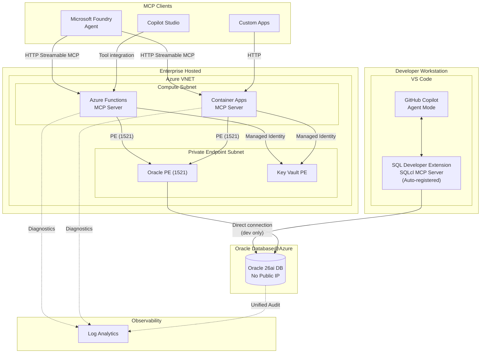

> Oracle MCP Server supports two deployment modes: **local** (VS Code with SQLcl extension — zero infrastructure, auto-registered for GitHub Copilot Agent Mode) and **hosted** (Azure Functions for serverless/bursty workloads, Azure Container Apps for production/steady traffic). See [Path 3 — Oracle MCP](05-path3-oracle-mcp.md) for detailed setup.

---

### Pattern 6: Power Apps + Oracle Database@Azure

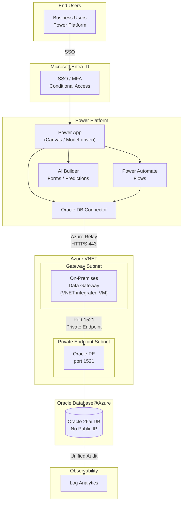

> Power Apps connects to Oracle Database@Azure via the Oracle DB Connector and the On-Premises Data Gateway — same gateway infrastructure as Copilot Studio (Pattern 1). AI Builder adds OCR, form processing, and predictions on top of Oracle data. See [Path 5 — Power Apps](07-path5-power-apps.md) for details.

---

### Pattern 7: Logic Apps + Oracle Database@Azure

#### Option A: Oracle DB Connector (via Gateway)

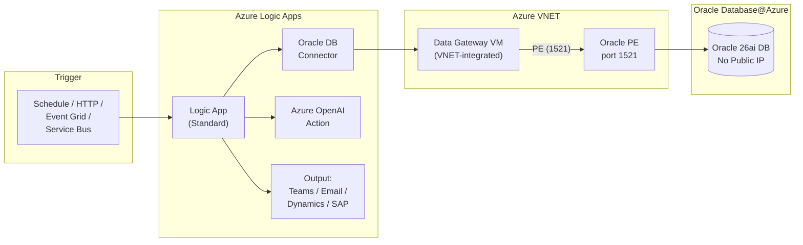

#### Option B: ORDS via HTTP + APIM (Recommended)

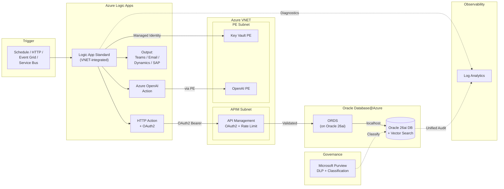

> **Option B is recommended** — ORDS runs natively on Oracle 26ai (no gateway infrastructure), APIM enforces OAuth2 + rate limiting, Logic App Standard provides VNET integration for fully private connectivity; supports vector search endpoints. See [Pattern 7 — Logic Apps](08-path6-logic-apps.md) for detailed setup, NSG rules, and workflow patterns.

---

## Category 2: Mirrored / Analytics Data

Oracle data is replicated into Microsoft Fabric via Mirrored Database for analytics, cross-source joins, and AI grounding. Data Agents built on Mirrored Database can be published as MCP servers, deployed to Teams, or connected to Copilot Studio and MS Foundry via native connectors.

| Pattern | AI Platform | How It Connects | Surfaces | Value Proposition |
|---------|------------|-----------------|----------|-------------------|
| **2A** | **Mirrored Database + Data Agents** | Oracle → Fabric Mirroring → Mirrored Database → Data Agents → Published as MCP Server / Teams / Copilot Studio / Foundry | Teams, Copilot Studio, Foundry, MCP clients | • Natural language analytics on mirrored Oracle data • Data Agent as MCP server for any MCP client • Publish directly to Teams • Connect to Copilot Studio or Foundry via native connectors • Cross-source joins • Entra ID + private networking |
| **2B** | **Fabric Mirroring + Foundry** | Mirrored Database → Data Agents → Foundry agents (via native connector) | API, M365 Copilot, Agent Store | • AI agents grounded in curated analytics • Data Agent feeds Foundry as a tool • Best of Fabric + Foundry • Governed data layer • Publish insights to M365 Copilot |

---

### Pattern 2A: Mirrored Database + Data Agents

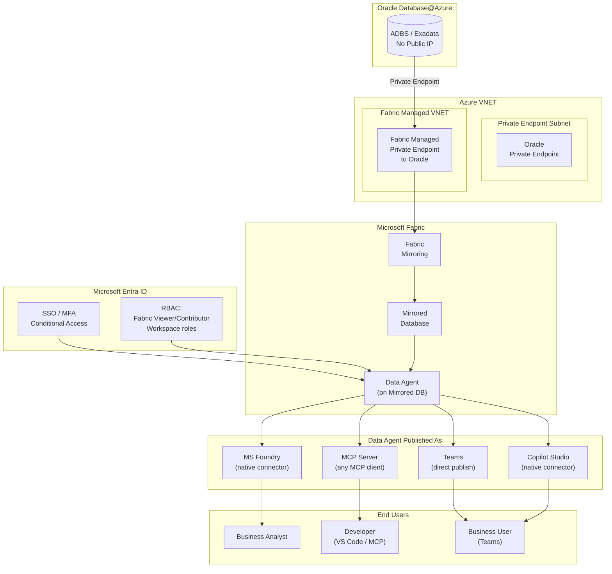

#### RBAC Model

| Layer | Role | Who Gets It | What It Controls |
|-------|------|-------------|------------------|
| **Entra ID** | Security Group: `Fabric-DataAgent-Users` | Analysts, business users | Who can query the Data Agent |
| **Entra ID** | Conditional Access | All users | MFA, device compliance |
| **Fabric Workspace** | Viewer | End users | Read-only access to mirrored data + Data Agent |
| **Fabric Workspace** | Contributor | Data engineers | Create/modify mirroring, Data Agents, semantic models |
| **Fabric Workspace** | Admin | Platform admin | Manage workspace security, capacity, private endpoints |
| **Copilot Studio** | Maker / User | Citizen devs / End users | Build copilots using Data Agent connector vs use them |
| **MS Foundry** | Foundry User / Contributor | End users / Developers | Use vs create agents connected to Data Agent |
| **Oracle DB** | Dedicated mirroring user | Fabric mirroring connection | `SELECT` on mirrored schemas only; read-only, no DDL/DML |

#### Private Networking

| # | Control | Details |
|---|---------|---------|
| 1 | Oracle Private Endpoint | No public IP on Oracle; Fabric connects via managed private endpoint |
| 2 | Fabric Managed VNET | Fabric workspace uses managed private endpoints for outbound connections to Oracle |
| 3 | Mirroring over private path | All data replication flows through private networking — no public internet |
| 4 | Entra ID auth for Fabric | All Fabric access authenticated via Entra ID SSO/MFA |
| 5 | Workspace-level security | Data Agent inherits Fabric workspace RBAC — controls who can query |
| 6 | Data Agent publishing security | MCP server / Teams / Copilot Studio access controlled by Entra ID groups |
| 7 | No Oracle credentials in agent | Mirrored Database is the source — Data Agent never connects to Oracle directly |

#### Data Agent Publishing Options

| Publish As | How | Use Case |
|-----------|-----|----------|
| **MCP Server** | Data Agent published as MCP endpoint — any MCP-compatible client can connect | Developers in VS Code, custom agents, multi-agent workflows |
| **Teams App** | Data Agent published directly into Teams | Business users ask questions in natural language in Teams chat |
| **Copilot Studio Connector** | Native connector in Copilot Studio connects to the Data Agent | Build no-code copilots grounded on mirrored Oracle analytics |
| **MS Foundry Tool** | Native connector in Foundry registers Data Agent as a tool | Foundry agents call Data Agent for analytics alongside other tools |

---

### Pattern 2B: Fabric Mirroring + Data Agents + Foundry

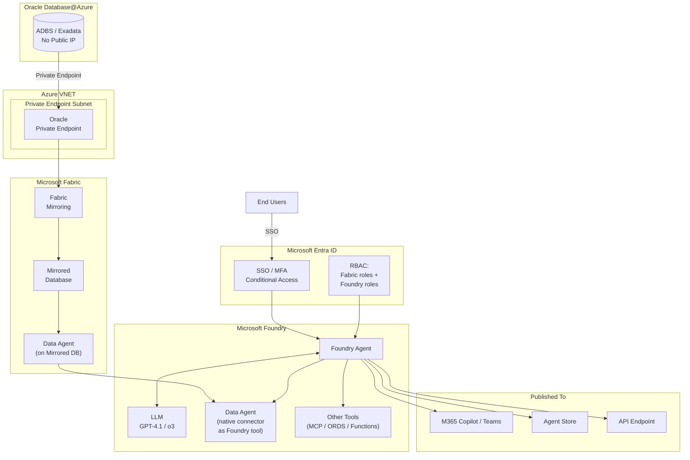

#### RBAC Model

| Layer | Role | Who Gets It | What It Controls |
|-------|------|-------------|------------------|
| **Entra ID** | Security Group: `Foundry-Analytics-Users` | All agent users | Who can use the Foundry agent |
| **Fabric Workspace** | Viewer / Contributor | Data team | Access to mirrored data and Data Agent |
| **MS Foundry** | Foundry User / Contributor | End users / Developers | Use vs create agents |
| **Azure RBAC** | Key Vault Secrets User (if other tools used) | Managed Identity | Read credentials for MCP/ORDS |
| **Oracle DB** | Dedicated mirroring user | Fabric mirroring | `SELECT` on mirrored schemas only |

#### Private Networking

| # | Control | Details |
|---|---------|---------|
| 1 | Oracle Private Endpoint | No public IP; Fabric mirroring via managed PE |
| 2 | Fabric Managed VNET | Mirroring over private path |
| 3 | Data Agent → Foundry (native connector) | Internal Azure service-to-service connection — no public exposure |
| 4 | Other Foundry tools (MCP/ORDS) | VNET-integrated as per Category 1 patterns |
| 5 | Entra ID everywhere | SSO/MFA for Fabric, Foundry, and published surfaces |

---

## Category 3: IQ — Intelligent Data Processing

AI-powered intelligence layers that process, enrich, and surface insights from structured, unstructured, and work data.

| Pattern | AI Platform | What It Does | Surfaces | Value Proposition |
|---------|------------|--------------|----------|-------------------|
| **3A** | **Fabric IQ** | AI-powered analytics and insights over data in OneLake (mirrored Oracle + other sources) | Fabric, Data Agents | • Automated insight discovery • AI finds patterns humans miss • Multi-source data intelligence • Scales with Fabric capacity |
| **3B** | **Foundry IQ** | Unstructured data processing — ingests docs from Blob, SharePoint, Fabric Files to ground Foundry agents | Foundry, M365 Copilot | • Unlock PDFs, docs, emails • Combine unstructured + structured Oracle data • Single agent, full context • Enterprise-grade grounding |
| **3C** | **Work IQ** | AI-driven productivity insights across M365 work patterns connected to Oracle business data | M365, Copilot | • Bridge work signals + business data • Meeting, email, doc intelligence • Organizational productivity insights • Connected to Oracle context |
| **3D** | **Unified IQ** | All IQ layers combined — Fabric IQ + Foundry IQ + Work IQ feeding a single intelligent agent | Fabric, Foundry, M365 Copilot | • Complete organizational intelligence • Structured + unstructured + work signals • One agent, all context • Maximum AI value from Oracle investment |

---

### Pattern 3D: Unified IQ — All Layers Combined

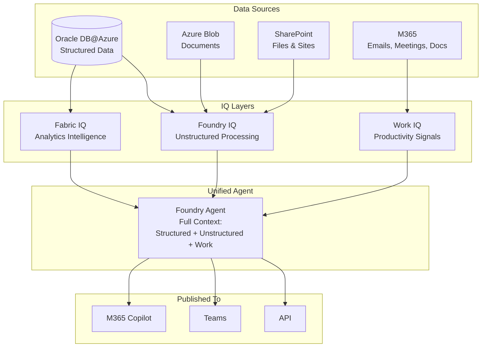
