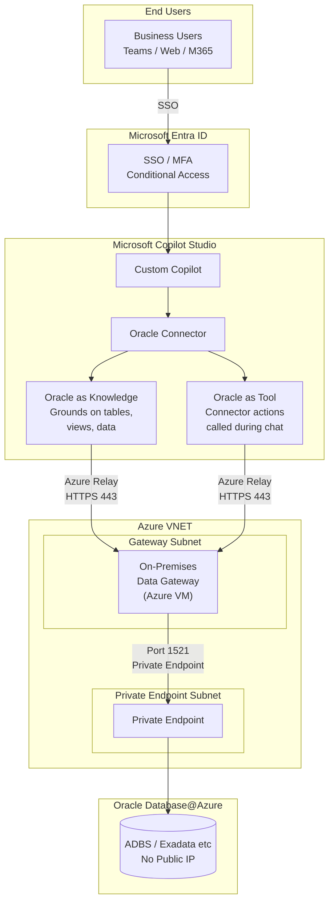
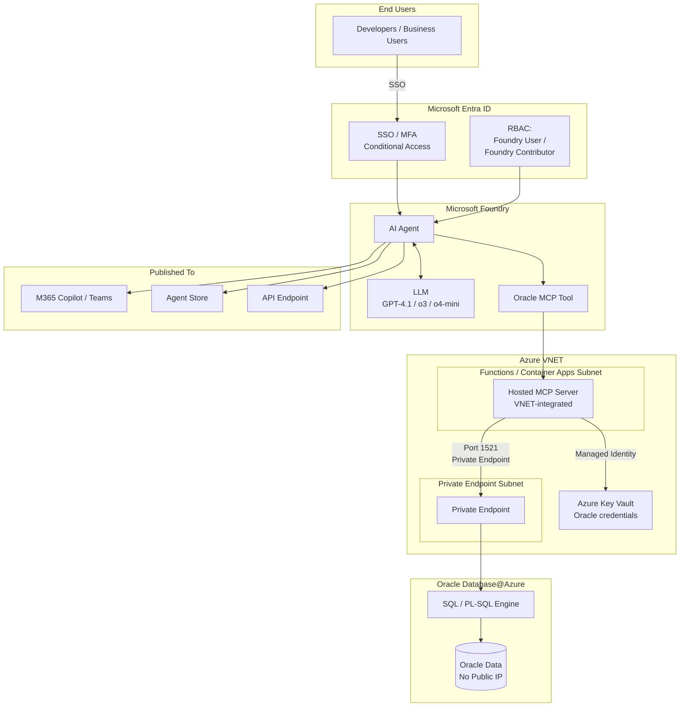
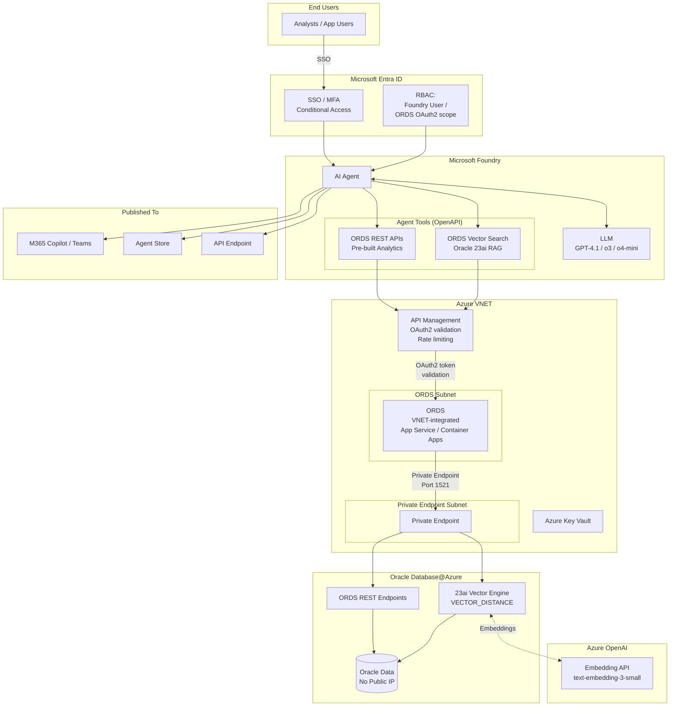
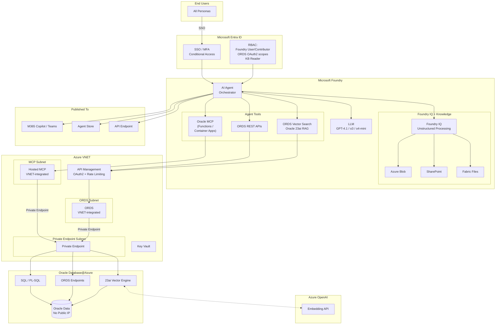
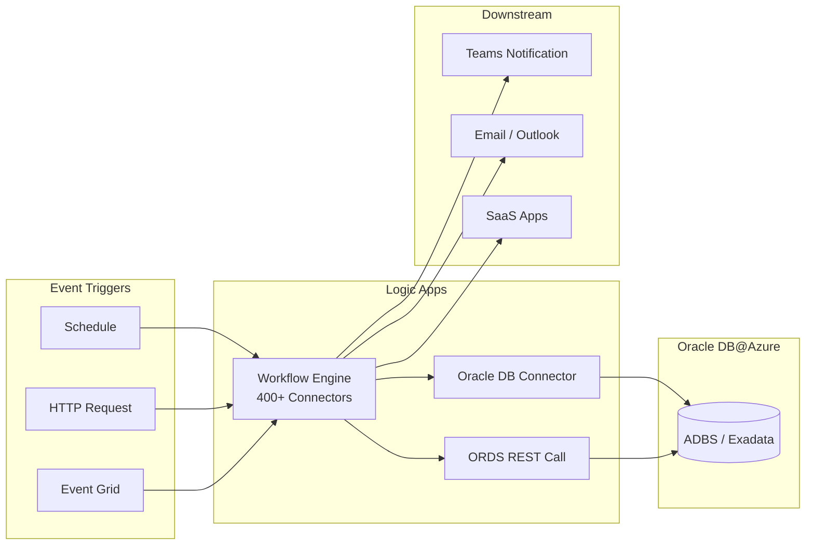
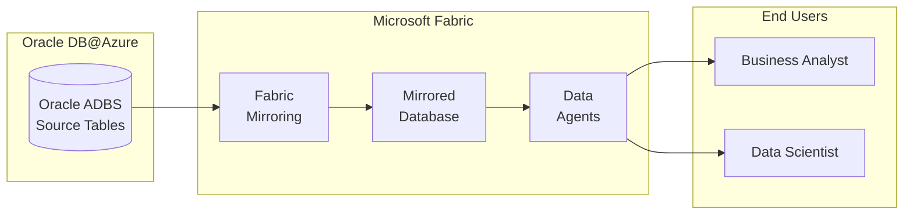
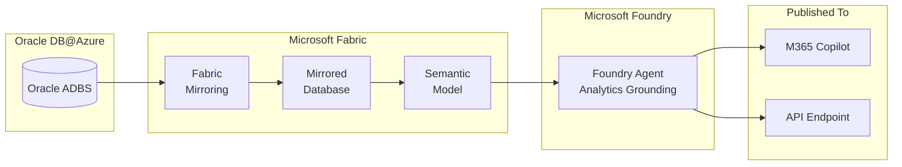
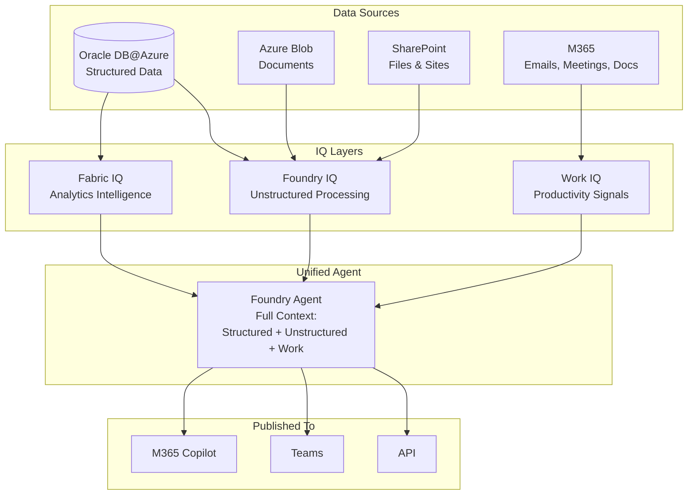

# 8. Reference Architecture Patterns

Patterns are organized into three categories based on how Oracle data flows into the Microsoft AI ecosystem.
Platforms used are Microsoft Foundry, Copilot Studio, Power Apps, Logic apps for workflows 

---

## Category 1: Live Oracle Data (No Migration)

Agents query Oracle data directly running on Oracle Database@Azure at runtime. No data leaves Oracle.

| Pattern | AI Platform | How It Connects | Surfaces | Value Proposition |
|---------|------------|-----------------|----------|-------------------|
| **1A** | **Copilot Studio** | Gateway / Oracle as Knowledge / Oracle as Tool | Teams, Web, M365 | • Fastest time-to-value (hours) • No-code builder • Business users self-serve answers • Zero data movement |
| **1B** | **MS Foundry** | Agent Framework: Oracle MCP server (hosted on Azure Functions / Azure Container Apps) + ORDS APIs; Knowledge Base (Blob, SharePoint, Fabric Files); Oracle 23ai vectors | API, M365 Copilot, Agent Store | • Full model & tool control • Multi-agent orchestration • Production-grade custom AI apps • Live Oracle data, no migration • Publish to M365 + Agent Store |
| **1C** | **Oracle MCP** (developer) | SQLcl MCP in VS Code or hosted | VS Code, Foundry, Copilot Studio | • Natural language → SQL in minutes • Zero infrastructure to start • Schema discovery on demand • DBA task automation |
| **1D** | **Power Apps** | Gateway / Oracle Connector | Power Platform | • Modernize workflows without rebuilding • AI Builder for forms & predictions • Citizen developer friendly • Incremental AI adoption |
| **1E** | **Logic Apps** | Oracle DB Connector / ORDS REST calls | Workflow orchestration, enterprise integration | • Event-driven automation • 400+ enterprise connectors • No custom code needed • Orchestrate Oracle + SaaS + Azure |

---

### Pattern 1A: Copilot Studio + Oracle Connector (On-Prem Data Gateway)

Azure Relay is the service that the On-Premises Data Gateway uses to communicate with cloud services like Copilot Studio. This is already how the On-Premises Data Gateway works by default — you don't configure Azure Relay separately. It's built into the gateway installer.

Here's how it works:

How the Gateway Communicates:
The gateway VM makes an outbound HTTPS connection (port 443) to Azure Relay when it starts up.
This creates a persistent, secure tunnel — no inbound ports need to be opened on the gateway VM.
When Copilot Studio needs Oracle data, the request flows through this tunnel to the gateway, which then queries Oracle over port 1521 via the Private Endpoint.

---

### Pattern 1B: MS Foundry + Oracle MCP Server

---

### Pattern 1B-2: MS Foundry + Oracle ORDS API Endpoints (RAG / Vector Search)

---

### Pattern 1B-3: MS Foundry + Oracle MCP + Oracle ORDS APIs + Foundry IQ (Full Stack)

---

---

### Pattern 1D: Logic Apps + Oracle connector

---

## Category 2: Mirrored / Analytics Data

Oracle data is replicated into Microsoft Fabric for analytics, cross-source joins, and AI grounding.

| Pattern | AI Platform | How It Connects | Surfaces | Value Proposition |
|---------|------------|-----------------|----------|-------------------|
| **2A** | **Mirrored Database + Fabric Data Agents** | Oracle → Fabric Mirroring → Mirrored Database → Data Agents | Fabric, Foundry | • Natural language analytics • Cross-source joins (SQL Server, Dataverse, etc.) • Managed mirroring, no ETL pipelines • Governed semantic models |
| **2B** | **Fabric Mirroring + Fabric Data agents + MS Foundry** | Mirrored Database → Semantic Model → grounds Foundry agents | API, M365 Copilot | • AI agents grounded in curated analytics • Best of Fabric + Foundry • Governed data layer • Publish insights to M365 Copilot |

---

### Pattern 2A: Mirrored Database + Data Agents

---

### Pattern 2B: Fabric Mirroring + Foundry Agents

---

## Category 3: IQ — Intelligent Data Processing

AI-powered intelligence layers that process, enrich, and surface insights from structured, unstructured, and work data.

| Pattern | AI Platform | What It Does | Surfaces | Value Proposition |
|---------|------------|--------------|----------|-------------------|
| **3A** | **Fabric IQ** | AI-powered analytics and insights over data in OneLake (mirrored Oracle + other sources) | Fabric, Data Agents | • Automated insight discovery • AI finds patterns humans miss • Multi-source data intelligence • Scales with Fabric capacity |
| **3B** | **Foundry IQ** | Unstructured data processing — ingests docs from Blob, SharePoint, Fabric Files to ground Foundry agents | Foundry, M365 Copilot | • Unlock PDFs, docs, emails • Combine unstructured + structured Oracle data • Single agent, full context • Enterprise-grade grounding |
| **3C** | **Work IQ** | AI-driven productivity insights across M365 work patterns connected to Oracle business data | M365, Copilot | • Bridge work signals + business data • Meeting, email, doc intelligence • Organizational productivity insights • Connected to Oracle context |
| **3D** | **Unified IQ** | All IQ layers combined — Fabric IQ + Foundry IQ + Work IQ feeding a single intelligent agent | Fabric, Foundry, M365 Copilot | • Complete organizational intelligence • Structured + unstructured + work signals • One agent, all context • Maximum AI value from Oracle investment |

---

### Pattern 3D: Unified IQ — All Layers Combined

