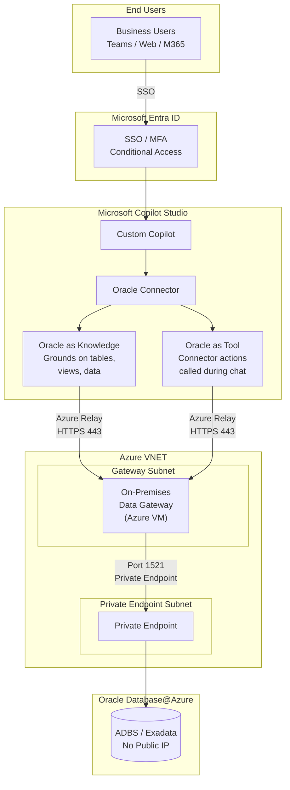
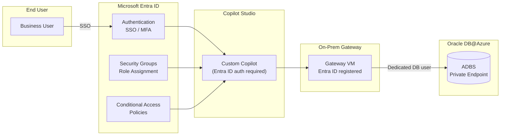

# 9. Pattern 1A -- Copilot Studio + Oracle (Connector-Only)

## 9.1 Architecture

Copilot Studio connects to Oracle Database@Azure through the **On-Premises Data Gateway connector**. All three integration modes use the connector -- no ORDS required.

1. **Oracle as a Connector** -- Direct read/write access to Oracle tables through the On-Premises Data Gateway
2. **Oracle as Knowledge** -- Ground your copilot on specific Oracle tables/views via the connector so the LLM uses Oracle data as context
3. **Oracle as a Tool** -- Register Oracle connector actions as tools that the copilot calls during conversations

All modes flow through: **Copilot Studio --' On-Prem Data Gateway --' Oracle DB@Azure (Private Endpoint)**



## 9.2 Three Integration Modes (Detailed)

### Mode A: Oracle via Gateway Connector (Direct Data Access)

The On-Premises Data Gateway provides a direct, secure channel to Oracle data. The copilot executes actions that read/write Oracle tables.

**Use when:** You need the copilot to fetch specific rows, run parameterized queries, or update records.

### Mode B: Oracle as Knowledge Source (Grounding)

Copilot Studio allows you to add **Knowledge sources** that ground the copilot's responses. You point Knowledge at Oracle tables or views via the connector so the copilot uses that data as context when answering questions.

**Use when:** You want the copilot to "know" about Oracle data (e.g., product catalogs, policies, FAQs stored in Oracle) and answer questions conversationally without the user needing to specify exact queries.

**How it works:**
1. Create Oracle views that expose the data you want to ground on (e.g., `V_PRODUCT_FAQ`, `V_POLICY_DOCS`)
2. In Copilot Studio --' **Knowledge** --' Add the Oracle connector as data source
3. Select the specific tables, views, or data you want the copilot to use
4. The copilot automatically retrieves relevant rows when answering questions

### Mode C: Oracle as a Tool (Action-Based)

Register Oracle connector actions as **Tools** in Copilot Studio. The copilot decides when to call these tools based on the conversation.

**Use when:** You want the copilot to perform specific Oracle operations (lookup a customer, check order status, run a report) as part of a conversation flow.

**How it works:**
1. In Copilot Studio --' **Tools** --' Add a **Connector** tool
2. Select the Oracle Database connector and choose the action (e.g., Get rows, Get row by ID, Insert row)
3. Configure parameters and trigger conditions
4. The copilot calls the connector action during conversations when relevant

## 9.3 Prerequisites

- Microsoft 365 license with Copilot Studio entitlement
- Microsoft Entra ID tenant (for authentication and identity management)
- On-Premises Data Gateway installed on an Azure VM or hybrid machine with network access to OD@A (for Gateway mode)
- Oracle Database@Azure instance (ADBS or Exadata) with Private Endpoints configured
- Oracle client libraries (Oracle Instant Client) on the gateway machine
- Azure VNET with appropriate subnets for gateway VM and OD@A connectivity
- Network Security Groups (NSGs) configured to restrict traffic to required ports only

## 9.4 Setup Steps

**For Gateway Connector:**
1. **Install the On-Premises Data Gateway** on an Azure VM within the same VNET (or peered VNET) as OD@A
2. **Install Oracle Instant Client** on the gateway VM
3. **Configure Entra ID authentication** for the gateway:
   - Register the gateway in Microsoft Entra ID
   - Assign the gateway to an Entra ID security group for centralized access control
   - Configure the gateway data source with Entra ID single sign-on (SSO) where supported
4. **Configure the Oracle connection** in Power Platform Admin Center:
   - Connection type: Oracle Database
   - Server: `<OD@A private endpoint hostname>:<port>/<service_name>`
   - Authentication: Basic (Oracle DB user) with credentials stored in Azure Key Vault, or Entra ID pass-through

**For Oracle as Knowledge:**
5. **Create curated Oracle views** for the data you want to ground on
6. In Copilot Studio --' **Knowledge** --' **+ Add data source** --' Select the Oracle connector
7. Select specific tables, views, or columns to include (don't expose entire schemas)

**For Oracle as Tool:**
8. In Copilot Studio --' **Tools** --' **+ Add tool** --' Select the Oracle Database connector
9. Choose the connector action (Get rows, Get row by ID, Insert row, etc.)
10. Configure parameters and tool descriptions (the LLM uses these to decide when to call the tool)

**Deploy:**
11. **Test in the embedded chat** --' Deploy to Teams / Web / Mobile

## 9.5 Entra ID Authentication

Entra ID provides centralized identity management across the Copilot Studio + Oracle integration stack.

### Authentication Flow



### Entra ID Configuration

| Component | Entra ID Integration | Details |
|--|--|--|
| **Copilot Studio** | Native Entra ID auth | Users authenticate via SSO; enforce MFA through Conditional Access policies |
| **On-Prem Gateway** | Entra ID registered | Gateway registered as enterprise application; access controlled via security groups |
| **Oracle Connection** | Dedicated DB user | Oracle credentials stored in Azure Key Vault; gateway uses Key Vault reference for connection string |
| **ORDS Endpoints** | OAuth2 with Entra ID | ORDS configured to accept Entra ID tokens for Tool/Knowledge mode calls |
| **Power Platform** | DLP Policies | Data Loss Prevention policies restrict which connectors and data flows are allowed |

### Entra ID Best Practices

- Enable **Conditional Access** policies to enforce MFA and device compliance for Copilot Studio users
- Use **Entra ID security groups** to control which users can access specific copilots
- Configure **DLP (Data Loss Prevention) policies** in Power Platform to restrict Oracle connector usage to authorized environments
- Use **Managed Identities** for the gateway VM to access Azure Key Vault (no stored credentials on the VM)
- Enable **Entra ID audit logs** to track authentication events and access patterns

## 9.6 Private Networking

All traffic between Copilot Studio and Oracle Database@Azure flows through private, non-internet-routable paths.

### Network Architecture

```mermaid
graph TB
    subgraph Internet["Internet / M365"]
        CS["Copilot Studio<br/>(SaaS)"]
    end

    subgraph AzureVNET["Azure VNET"]
        subgraph GWSub["Gateway Subnet"]
            GW["On-Prem Data Gateway<br/>Azure VM"]
        end

        subgraph PESub["Private Endpoint Subnet"]
            PE["Private Endpoint<br/>Oracle DB@Azure"]
        end

        subgraph ORDSSub["ORDS Subnet (optional)"]
            ORDS["ORDS on Compute<br/>or App Service"]
        end

        NSG1["NSG: Allow 1521<br/>from Gateway Subnet"]
        NSG2["NSG: Allow 443<br/>from ORDS Subnet"]
    end

    subgraph ODA["Oracle DB@Azure"]
        DB[("ADBS / Exadata<br/>No Public IP")]
    end

    CS -->|HTTPS via<br/>Azure Relay| GW
    GW -->|Private Endpoint<br/>Port 1521| PE
    PE --> DB
    ORDS -->|Private Endpoint<br/>Port 1521| PE
    GWSub -- NSG1
    ORDSSub -- NSG2
```

### Network Configuration Checklist

| # | Control | Required | Details |
|--|--|--|--|
| 1 | OD@A Private Endpoint | --... Yes | No public IP on Oracle database; all access through Private Endpoint |
| 2 | Gateway VM in same VNET or peered VNET | --... Yes | Gateway must have network line-of-sight to Oracle Private Endpoint |
| 3 | NSG on Gateway subnet | --... Yes | Allow outbound to Oracle PE subnet on port 1521; deny all other outbound |
| 4 | NSG on Oracle PE subnet | --... Yes | Allow inbound from Gateway subnet on port 1521 only |
| 5 | Azure Relay for gateway | --... Yes | Copilot Studio communicates with On-Prem Gateway via Azure Relay (HTTPS 443); no inbound ports needed on gateway VM |
| 6 | TLS 1.2+ everywhere | --... Yes | All connections (Copilot --' Gateway --' Oracle) encrypted in transit |
| 7 | DNS resolution | --... Yes | Private DNS zones configured for Oracle Private Endpoint hostname resolution |
| 8 | No public internet egress for DB traffic | --... Yes | Oracle data never traverses the public internet |

### Private Networking Best Practices

- Deploy the **On-Prem Data Gateway on an Azure VM** (not on-premises) for lowest latency to OD@A Private Endpoint
- Use **Azure Private DNS Zones** to resolve Oracle Private Endpoint hostnames within the VNET
- Enable **VNET peering** if the gateway and Oracle DB are in different VNETs (same region preferred)
- Use **Azure Bastion** for gateway VM management -- no RDP exposed to the internet
- Monitor network flows with **Azure Network Watcher** and **NSG Flow Logs**

## 9.7 Design Considerations

| Consideration | Guidance |
|--|--|
| **Knowledge vs Tool** | Use Knowledge for open-ended Q&A ("tell me about product X"); use Tools for specific actions ("look up order #123") |
| **Query complexity** | Pre-build Oracle views for complex joins; keep connector queries simple |
| **Data scoping** | For Knowledge sources, expose only the tables/columns relevant to the copilot's purpose; don't expose entire schemas |
| **Performance** | Gateway adds ~100-300ms latency; connector is the simplest path with no additional REST layer |
| **Security** | Use a dedicated read-only Oracle user; never expose DBA credentials; scope Knowledge to non-sensitive data |
| **Identity** | Enforce Entra ID SSO + MFA for all Copilot Studio users; use Conditional Access policies for compliance |
| **Networking** | All Oracle traffic flows through Private Endpoints; no public IP on OD@A; gateway communicates via Azure Relay |
| **Credential management** | Store Oracle DB credentials in Azure Key Vault; gateway VM uses Managed Identity to access Key Vault |
| **Freshness** | Knowledge sources reflect live Oracle data; no caching delay |
| **Scaling** | Gateway supports clustering for high availability |
| **Data types** | Gateway handles standard Oracle types; LOBs and custom types may need views |

## 9.8 Sample Configurations

**Knowledge Grounding Example:**
```yaml
Knowledge Source: Oracle Product Catalog
Type: Oracle Database (via connector)
Table: SH.PRODUCTS (view: V_PRODUCT_DETAILS)
Columns: PROD_NAME, PROD_CATEGORY, PROD_DESC, PROD_LIST_PRICE, PROD_STATUS
Behavior: Copilot answers "What products do we have in Golf?" by retrieving relevant rows
```

**Tool Example:**
```yaml
Tool: Get Promotion Performance
Type: Oracle Database Connector (via gateway)
Action: Get rows
Table: SH.V_PROMO_PERFORMANCE (view with pre-computed ROI metrics)
Filter: SALES_YEAR = {year}
Trigger: User asks about promotion performance or ROI
Response: Copilot calls the connector action, formats the results as a table
```

**Topic + Connector Example:**
```yaml
Topic: Quarterly Sales Summary
Trigger: "What were sales in {quarter} {year}?"
Action:
  - Get rows from Oracle (via gateway)
  - Table: SH.SALES joined with SH.TIMES
  - Filter: CALENDAR_QUARTER = {quarter}, CALENDAR_YEAR = {year}
  - Aggregate: SUM(AMOUNT_SOLD), COUNT(*)
Response: "In {quarter} {year}, total sales were ${total} across {count} transactions."
```
