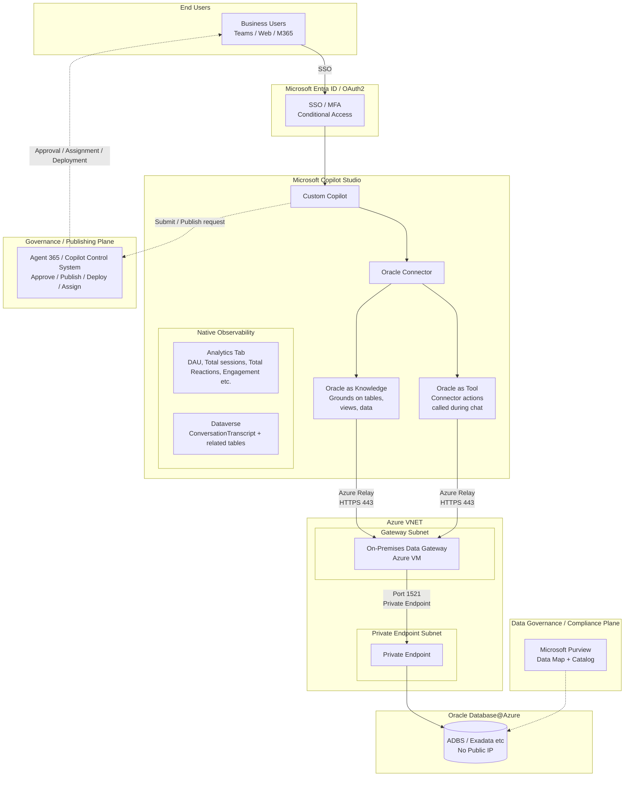
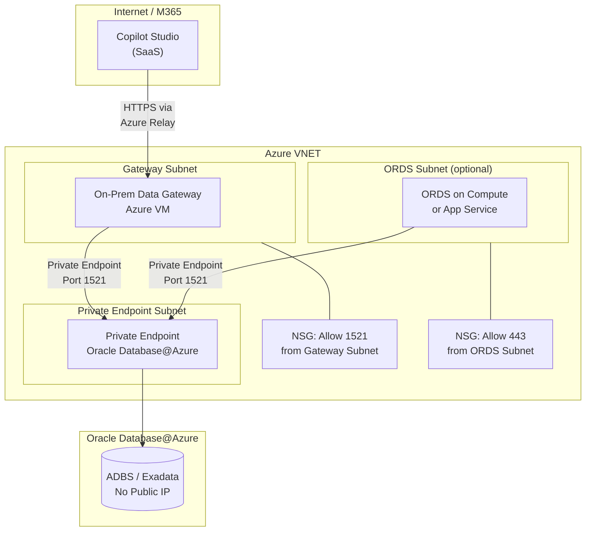
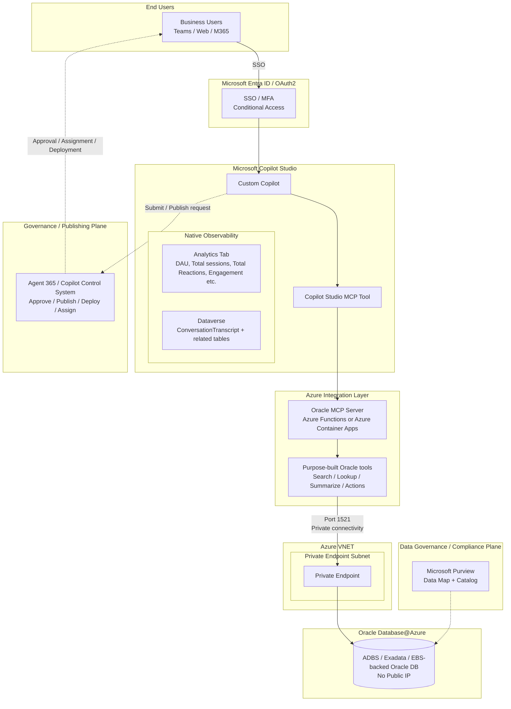
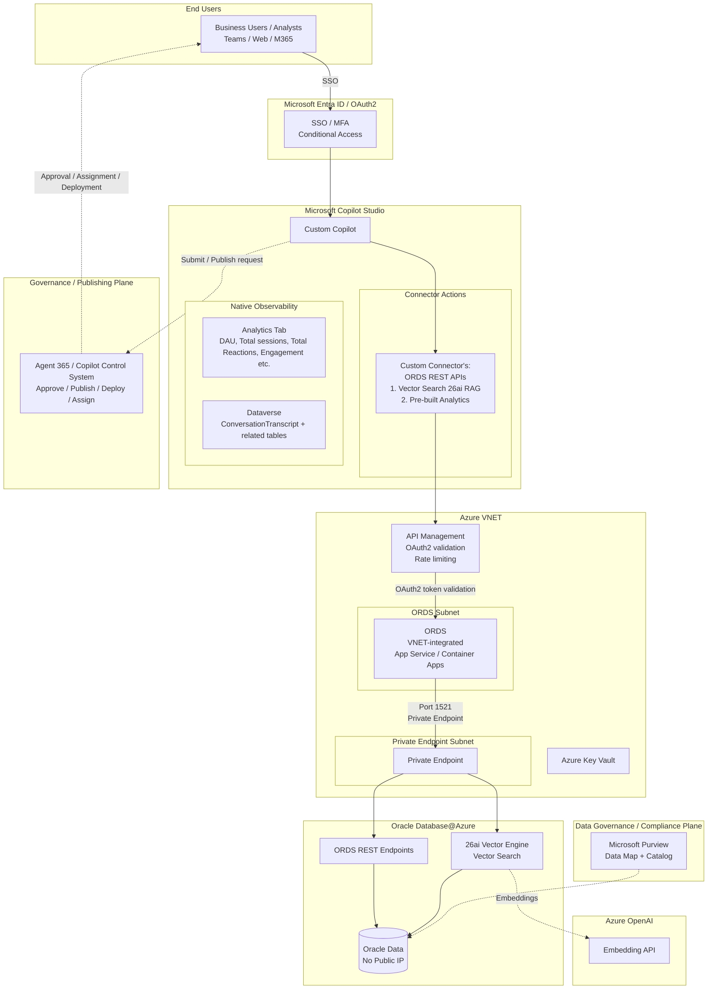

# Patterns for Copilot Studio Agents + Oracle

Copilot Studio  provides a low-code/no-code platform for building AI agents on Oracle Database@Azure. Three sub-patterns cover different levels of complexity.

| Sub-Pattern | Tools | Best For |
|-------------|-------|----------|
| **1** | Oracle native connectors | Fast time to value + Least effort |
| **2** | Oracle MCP | SQL-first agents — natural language to SQL |
| **3** | ORDS + Oracle 26ai Vector Search | REST API-first agents — governed endpoints + RAG |

---
## Pattern 1 — Copilot Studio + Native Oracle Connectors

### Architecture

Copilot Studio connects to Oracle Database@Azure through an **On-Premises Data Gateway**. All integration modes use the connector — no ORDS required.

1. **Oracle as Knowledge** — Ground your copilot on specific Oracle tables/views via the connector so the agent uses Oracle data as context
2. **Oracle as a Tool** — Register Oracle connector actions as tools that the agent calls during conversations

All modes flow through: **Copilot Studio → Oracle Connector → On-Prem Data Gateway → Oracle Database@Azure (Private Endpoint)**

### Prerequisites

- Microsoft 365 license with Copilot Studio entitlement
- Microsoft Entra ID tenant (for authentication and identity management)
- On-Premises Data Gateway installed on an Azure VM or hybrid machine with network access to OD@A (for Gateway mode)
- Oracle Database@Azure instance (ADBS or Exadata) with Private Endpoints configured
- Oracle client libraries (Oracle Instant Client) on the gateway machine
- Azure VNET with appropriate subnets for gateway VM and OD@A connectivity
- Network Security Groups (NSGs) configured to restrict traffic to required ports only

### Private Networking

All traffic between Copilot Studio and Oracle Database@Azure flows through private, non-internet-routable paths.

#### Network Architecture

#### Network Configuration Checklist

| # | Control | Required | Details |
|---|---------|----------|----------|
| 1 | Oracle Database@Azure Private Endpoint | ✅ Yes | No public IP on Oracle database; all access through Private Endpoint |
| 2 | Gateway VM in same VNET or peered VNET | ✅ Yes | Gateway must have network line-of-sight to Oracle Private Endpoint |
| 3 | NSG on Gateway subnet | ✅ Yes | Allow outbound to Oracle PE subnet on port 1521; deny all other outbound |
| 4 | NSG on Oracle PE subnet | ✅ Yes | Allow inbound from Gateway subnet on port 1521 only |
| 5 | Azure Relay for gateway | ✅ Yes | Copilot Studio communicates with On-Prem Gateway via Azure Relay (HTTPS 443); no inbound ports needed on gateway VM |
| 6 | TLS 1.2+ everywhere | ✅ Yes | All connections (Copilot → Gateway → Oracle) encrypted in transit |
| 7 | DNS resolution | ✅ Yes | Private DNS zones configured for Oracle Private Endpoint hostname resolution |
| 8 | No public internet egress for DB traffic | ✅ Yes | Oracle data never traverses the public internet |

#### Private Networking Best Practices

- Deploy the **On-Prem Data Gateway on an Azure VM** (not on-premises) for lowest latency to OD@A Private Endpoint
- Use **Azure Private DNS Zones** to resolve Oracle Private Endpoint hostnames within the VNET
- Enable **VNET peering** if the gateway and Oracle DB are in different VNETs (same region preferred)
- Use **Azure Bastion** for gateway VM management — no RDP exposed to the internet
- Monitor network flows with **Azure Network Watcher** and **NSG Flow Logs**

### Integration Modes Setup Steps

#### Installing On-Prem Data Gateway

In order to use Oracle connectors, the On-Premises Data Gateway needs to be setup first. The On-Premises Data Gateway provides a direct, secure channel to Oracle data that the agent can then use to execute actions that read/write Oracle tables.
[More information Oracle Connectors + Gateway Setup.](https://learn.microsoft.com/en-us/connectors/oracle/)

**Setup steps:**
1. **Install the On-Premises Data Gateway** on an Azure VM within the same VNET (or peered VNET) as OD@A
2. **Install Oracle Instant Client** on the gateway VM
3. **Configure Entra ID authentication** for the gateway:
   - Register the gateway in Microsoft Entra ID
   - Assign the gateway to an Entra ID security group for centralized access control
   - Configure the gateway data source with Entra ID single sign-on (SSO) where supported
4. **Configure the Oracle connection** in Power Platform Admin Center:
   - Connection type: Oracle Database
   - Server: `<Oracle Database@Azure private endpoint hostname>:<port>/<service_name>`
   - Authentication: Basic (Oracle DB user) with credentials stored in Azure Key Vault, or Entra ID pass-through

#### Mode A: Oracle as Knowledge Source (Grounding)

Copilot Studio allows you to add **Knowledge sources** that ground the agent's responses. You point Knowledge at Oracle tables or views via the connector so the copilot uses that data as context when answering questions.

**Use when:** You want the copilot to "know" about Oracle data (e.g., product catalogs, policies, FAQs stored in Oracle) and answer questions conversationally without the user needing to specify exact queries.

**How to set it up:**
1. Create Oracle views that expose the data you want to ground on (e.g., `V_PRODUCT_FAQ`, `V_POLICY_DOCS`)
2. In Copilot Studio → **Knowledge** → Add the Oracle connector as data source (Here you will connect to your On-prem Data Gateway)
3. Select the specific tables, views, or data you want the agent to use
4. The agent automatically retrieves relevant rows when answering questions

#### Mode B: Oracle as a Tool (Action-Based)

Register Oracle connector actions as **Tools** in Copilot Studio. The agent decides when to call these tools based on the conversation.

**Use when:** You want the agent to perform specific Oracle operations (lookup a customer, check order status, run a report) as part of a conversation flow.

**How to set it up:**
1. In Copilot Studio → **Tools** → Add a **Connector** tool
2. Select the Oracle Database connector and choose the action (e.g., Get rows, Get row by ID, Insert row)
3. Configure parameters and trigger conditions
4. The agent calls the connector action during conversations when relevant

---
## Pattern 2 — Copilot Studio + Oracle MCP (Through Azure Functions/Container Apps)

### Architecture

### Prerequisites

- Microsoft 365 license with Copilot Studio entitlement
- Microsoft Entra ID tenant (for authentication and identity management)
- Oracle Database@Azure instance (ADBS or Exadata) with Private Endpoints configured
- Azure Functions or Azure Container Apps for hosting Oracle MCP server (VNET-integrated)
- Azure Key Vault for Oracle credentials (rotation policy configured)
- Azure VNET with subnets for Azure Functions/Container Apps and Oracle Private Endpoints
- Azure Private DNS Zones for Private Endpoint resolution
- Network Security Groups (NSGs) configured to restrict traffic to required ports only
- Microsoft Purview account for data governance

### Setup Steps

1. **Deploy Oracle Database tools MCP Server** on VNET-integrated Azure Functions or Container Apps
2. **Configure Oracle connection** — store Oracle database connection credentials in Azure Key Vault; MCP host uses Managed Identity to access Key Vault
3. **Connect DB tools MCP server to Oracle instance running on Oracle Database@Azure** via Private Endpoint (port 1521)
4. **Configure Private DNS Zones** — create zones for `privatelink.oraclecloud.com`, `privatelink.vaultcore.azure.net`
5. **Register Oracle in Purview** — add Oracle Database@Azure as a data source; run classification scan
6. **Create a Copilot Studio Agent** — go [here](https://copilotstudio.microsoft.com/), and make sure to select the right environment from the top right and then select "Create an agent"
7. **Connect your MCP through "Tools"** — Once your agent has the basic configurations, select "Tools" → "Add a tool" → "Add new MCP". Fill in the required information. For more guidance on setting this up click [here](https://learn.microsoft.com/en-us/microsoft-copilot-studio/agent-extend-action-mcp)

---
## Pattern 3 — Copilot Studio + Oracle ORDS API Endpoints + Custom Connector

### Architecture

### Prerequisites

- **Existing Oracle 26ai instance** on Oracle Database@Azure with ORDS already enabled
- **Existing tables with text-heavy columns** (e.g., `CLOB`, `VARCHAR2`) that you want to enable for vector search
- Azure subscription with Microsoft Foundry access
- Microsoft 365 license with Copilot Studio entitlement
- Microsoft Entra ID tenant with App Registration for ORDS OAuth2
- Azure API Management (APIM) with WAF for OAuth2 validation and rate limiting
- Azure OpenAI with `text-embedding-3-small` or similar models deployed (for embedding generation)
- Network connectivity from APIM to ORDS (via VNET Peering or Private Endpoint to the Oracle 26ai instance)
- Network connectivity from Oracle 26ai to Azure OpenAI (via Private Endpoint for `DBMS_CLOUD` calls)
- Microsoft Purview for data classification and DLP

### Setup Steps
1. **Follow steps 1-6 outlined [here](https://github.com/ryellajo12/ODAA-AI-Agent-Playbook/blob/editsv2/docs/04-path2-foundry-agents.md#setup-steps-1)** for setting up your ORDS Endpoints and RAG.
2. **Create a Copilot Studio Agent** — go [here](https://copilotstudio.microsoft.com/), and make sure to select the right environment from the top right and then select "Create an agent".
3. **Connect your ORDS Endpoints through a custom connector**a. Once your agent has the basic configurations, select "Tools" → "Add a tool" → "Add new custom connector".
    - You will be redirected to a PowerApps page where you will click on "New Custom Connector" at the top right.
    - Choose a method of your choice, for this playbook we will focus on importing an OpenAPI file.
    - Give your connector a name and import the OpenAPI file for the ORDS endpoints. If you do not have an OpenAPI file, then you will need to create one.
    - Go through the "General", "Security", "Definition", "Code" and "Test" tabs to make sure your OpenAPI file was imported correctly. Make any necessary changes in the setup in case there were mistakes.
    - Once all sections are validated, you will click on "Create connector". For more guidance on setting up your connector find information [here.](https://learn.microsoft.com/en-us/connectors/custom-connectors/)
    - Go back to your Copilot Studio agent,  select "Tools" → "Add a tool" → search for your connector name. The different actions defined in the OpenAPI file should surface now.
    - Once you add and configure your tool, make sure to add a strong description of what the tool does, this allows the orchestrator to know when to call your tool
    - You can now test your tool by using the test chat window in the Copilot Studio platform.
   
## Observability for Oracle-Connected Copilot Studio Agents

When Copilot Studio agents interact with enterprise Oracle data (via Native Connector, MCP Tooling, or ORDS APIs), runtime execution becomes a multi‑layered orchestration across:

- LLM reasoning  
- Topic execution  
- Tool invocation  
- External API retrieval  
- Vector search / embedding pipelines  

Observability in these deployments must therefore capture both:

| Observability Layer | Runtime Scope |
|---------------------|--------------|
| Agent Runtime | Conversation and orchestration execution |
| Tool Runtime | External Oracle interaction behavior |
| Inference Runtime | Generative reasoning and response formation |

---

### 1. Agent Runtime Telemetry (Copilot Studio Analytics)

Copilot Studio provides native service‑layer telemetry through the Analytics tab which captures runtime usage and behavioral metrics for agent interactions.

Usage telemetry available through this layer includes:

- Run outcomes  
- Knowledge source utilization  
- Session execution data  
- Topic invocation frequency  
- User satisfaction score  

These metrics help enterprise teams understand:

- Which Oracle-connected tools are being invoked most frequently  
- Where agent flows are abandoning execution  
- Whether retrieval‑based answers are resolving successfully  

However, this telemetry is generated at the **conversation layer**, and therefore does not capture:

- Downstream Oracle API latency  
- MCP execution chains  
- Tool reasoning decisions  
- Generative orchestration planning  

---

### 2. Interaction-Level Telemetry (Dataverse Conversation Logs)

During runtime execution, Copilot Studio automatically generates structured logs of each user interaction and stores them within the **ConversationTranscript** table in Dataverse.

These transcripts contain:

- Agent‑user interaction content  
- Triggered topic metadata  
- Conversation start and end timestamps  
- Topic selection events  

The backend Copilot Studio service automatically generates these transcripts during execution and stores them in JSON/text format in Dataverse.

These logs allow enterprises to:

- Correlate agent responses with MCP or ORDS tool execution  
- Identify tool invocation patterns across Oracle integrations  
- Analyze retrieval‑augmented generation behavior  
- Detect escalation indicators or response failures  

Conversation transcript data can also be programmatically processed using Power Automate and AI Builder to:

- Analyze sentiment  
- Detect personal data  
- Extract failure patterns  
- Identify runtime escalation indicators  

This becomes critical in Oracle MCP scenarios where:

Agent → MCP Tool → Oracle REST → Vector Engine → Embeddings → Response

must be analyzed as a full execution chain rather than as an isolated conversational response.

---

### 3. Inference-Level Telemetry (Azure Application Insights in Azure Monitor)

Enterprise deployments typically require **deeper visibility** into:

- Prompt execution  
- Generative answer formation  
- Moderation outcomes  
- Topic-to-tool execution planning  

Copilot Studio agents can **optionally** emit enriched runtime telemetry into **Azure Application Insights in Azure Monitor**, allowing organizations to track:

- Logged messages sent to and from the agent  
- Topics triggered during user conversations  
- Custom telemetry events emitted from agent topics  

Telemetry stored within Application Insights enables runtime diagnostics across:

- Conversation metrics  
- Tool execution behavior  
- Latency across Oracle API calls  
- Failure patterns in MCP execution  
- User behavior patterns  

Telemetry from generative responses is emitted into the `customEvents` table where event types such as:

- GenerativeAnswers  
- Bot Message Send  

can be queried to determine:

- Why a response was generated or not generated  
- Which topic or reasoning path was selected  
- Execution metadata tied to Oracle retrieval  

For example, telemetry related to generative responses can be queried using custom dimensions such as:

- conversationId  
- TopicName  
- Result  
- SerializedData  

This allows enterprise operators to:

- Inspect LLM reasoning tied to Oracle query results  
- Monitor latency introduced by vector search execution  
- Identify inference failures in MCP‑based tool chains  
- Troubleshoot runtime planning across multi‑tool orchestration  

Without this telemetry, downstream Oracle integrations effectively operate as a runtime “black box”, making production‑level debugging dependent on vendor escalation rather than tenant‑level diagnostics. **For guidance on setting up Application Insights on your Copilot Studio agent refer to [this link.](https://learn.microsoft.com/en-us/microsoft-copilot-studio/advanced-bot-framework-composer-capture-telemetry)**

---

### 4. Enterprise Observability Strategy

Oracle‑connected Copilot Studio agents should therefore implement a layered observability strategy across:

| Runtime Layer | Observability Source |
|--------------|----------------------|
Conversation Behavior | Copilot Studio Analytics |
Interaction Metadata | Dataverse Transcript Tables |
Tool Invocation & Planning | Azure Application Insights |
Oracle API Diagnostics | External Logging Platform |

This enables:

- End‑to‑end execution tracing  
- LLM‑to‑tool interaction monitoring  
- Runtime performance diagnostics  
- Failure pattern detection across Oracle integrations  

which are required for enterprise production deployment of MCP‑ or ORDS‑enabled agent architectures.

---

## Publishing and Governance

When Copilot Studio agents interact with enterprise Oracle systems (via Native Connector, MCP Tooling, or ORDS APIs), publishing is no longer simply a deployment step.

Publishing an agent enables runtime access to:

- Production operational databases  
- Infrastructure configuration metadata  
- Compliance‑regulated datasets  
- Sensitive enterprise records  

This introduces enterprise risk in environments governed by:

- SOX
- HIPAA
- PCI-DSS
- Internal ITGC and audit controls

As a result, enterprise Copilot Studio agent rollout must be governed across multiple independent control planes.

### Enterprise Governance Model

| Governance Domain | Control Plane | Responsibility |
|-------------------|--------------|---------------|
Agent Lifecycle | Agent365 | Whether an agent can exist in tenant |
Runtime Data Access | Microsoft Purview | What data an agent can retrieve |
Channel Exposure | Teams Admin Center | Where users can interact with it |
Connector Invocation | Power Platform DLP | Which APIs/tools may be invoked |

These governance layers apply at different stages of the publishing lifecycle.

### 1. Agent365 – Agent Lifecycle Governance

Agent365 serves as Microsoft's enterprise control plane for managing AI agents across Microsoft 365 and third‑party systems.

It provides:

- Centralized agent registry  
- Identity and access control  
- Policy-based lifecycle governance  
- Ownership assignment  
- Approval workflows  
- Audit logging  

Agent365 allows IT administrators to:

- Discover all agents operating in the tenant  
- Require approval before activation  
- Assign ownership to deployed agents  
- Apply baseline governance templates  
- Enforce expiration or retirement policies  

Agent365 enables organizations to:

- Register and identify every agent  
- Manage identity and access to organizational resources  
- Apply policies across collaboration tools  
- Monitor risks such as unmanaged agents  

In regulated environments (e.g., SOX or HIPAA), lifecycle governance ensures:

- Agents cannot be deployed without IT approval  
- Agents cannot access enterprise APIs without identity governance  
- Agents cannot persist beyond approved operational timelines  

Agent365 can also enforce governance templates during approval so that:

> Security, compliance, and access controls are automatically applied to agents during activation in the Microsoft Admin Center [1](https://learn.microsoft.com/en-us/microsoft-copilot-studio/faqs-generative-orchestration)  

Without Agent365:

- Agents may exist in production environments  
- Ownership may be undefined  
- Connector permissions may be uncontrolled  
- Lifecycle auditability cannot be enforced  

### 2. Microsoft Purview – Runtime Data Governance

Agent365 governs whether an agent may exist.

Microsoft Purview governs what data that agent may access during runtime.

Oracle-connected agents retrieve enterprise data dynamically through:

- MCP tool execution  
- ORDS REST invocation  
- Native connector queries  

Purview applies enterprise governance policies to:

- Agent prompts  
- Generated responses  
- Connector‑retrieved content  
- Interaction transcripts  

Purview enables:

- Sensitivity labeling  
- Data classification  
- Information protection  
- Lifecycle management  
- eDiscovery  
- Audit logging  

This allows organizations to:

- Prevent agents from processing labeled Oracle datasets  
- Block connector invocation against sensitive systems  
- Enforce DLP policies on MCP or ORDS tool usage  

For example:

HIPAA‑governed patient data retrieved through Oracle APIs may be:

- Masked  
- Logged  
- Blocked from runtime response generation  

Purview audit logs capture:

- Administrative agent changes  
- Runtime interaction activity  

which support:

- Compliance tracking  
- Security monitoring  
- Investigation workflows  

Purview policies may also prevent:

- Agent testing  
- Publishing  
- Connector execution  

until enterprise data protection policies are satisfied.

### 3. Teams Admin Center – Runtime Surface Governance

Agent365 governs agent lifecycle.

Purview governs runtime data interaction.

Teams Admin Center governs:

> Where users are allowed to interact with the agent.

Agents deployed through Microsoft 365 Admin Center may still be:

- Invisible  
- Non-interactive  

within Microsoft Teams until explicitly approved by a Teams Administrator.

This separation allows enterprise tenants to:

- Restrict Oracle-connected agents from appearing in Teams  
- Limit runtime availability to Microsoft 365 Copilot Chat  
- Enforce staged rollout across business units  

Teams Admin Center therefore governs:

- Channel exposure  
- User discoverability  
- Runtime interaction surfaces  

### 4. Enterprise Publishing Workflow

Recommended enterprise rollout sequence:

1. Configure Microsoft Purview data governance policies  
2. Enable Agent365 lifecycle governance  
3. Build agents in Copilot Studio  
4. Submit agent to organizational catalog  
5. Apply Agent365 approval + governance templates  
6. Approve runtime channel exposure via Teams Admin Center  

### Governance Summary

| Platform | Governs | Applies To |
|----------|---------|------------|
Agent365 | Agent existence and lifecycle | Deployment stage |
Microsoft Purview | Runtime data interaction | Execution stage |
Teams Admin Center | User interaction surfaces | Runtime stage |

Enterprise customers operating under SOX, HIPAA, or PCI‑regulated workloads should:

- Configure Purview before production rollout  
- Require Agent365 approval workflows  
- Restrict Teams channel exposure  

to ensure that Oracle production environments are not exposed through agent runtime without appropriate governance controls.

