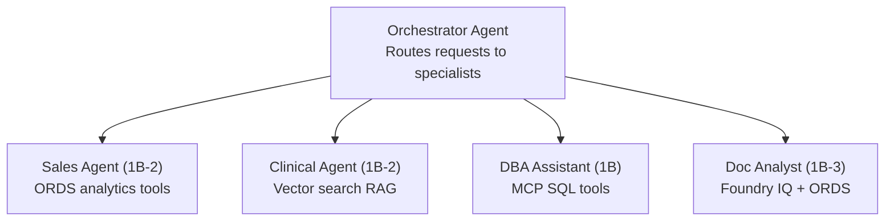

# 10. Patterns 1B / 1B-2 / 1B-3 — Microsoft Foundry Agents + Oracle

Microsoft Foundry provides a full-featured platform for building AI agents on Oracle Database@Azure. Three sub-patterns cover different levels of complexity.

| Sub-Pattern | Tools | Best For |
|-------------|-------|----------|
| **1B** | MCP only | SQL-first agents — natural language to SQL |
| **1B-2** | ORDS + Oracle 23ai Vector Search | REST API-first agents — governed endpoints + RAG |
| **1B-3** | MCP + ORDS + Foundry IQ | Full stack — structured + unstructured + RAG |

---

## 10.1 Pattern 1B: MS Foundry + Oracle MCP Server

### Architecture

Agent uses Oracle MCP Server (hosted on Azure Functions or Container Apps) for natural language → SQL, schema discovery, and query execution.

> See [Reference Architecture — Pattern 1B](02-reference-architectures.md) for the full Mermaid diagram.

### Prerequisites

- Azure subscription with Microsoft Foundry access
- Microsoft Entra ID tenant
- Azure OpenAI or model deployment (GPT-4.1, o3, o4-mini)
- Oracle Database@Azure instance with Private Endpoints
- Azure Functions or Container Apps for MCP hosting (VNET-integrated)
- Azure Key Vault for Oracle credentials
- Azure VNET with subnets for Functions/Container Apps and Oracle PE

### Setup Steps

1. **Deploy MCP Server** on VNET-integrated Azure Functions or Container Apps
2. **Configure Oracle connection** — store credentials in Key Vault; MCP host uses Managed Identity to access Key Vault
3. **Connect MCP to Oracle** via Private Endpoint (port 1521)
4. **Create Foundry Agent** at [ai.azure.com](https://ai.azure.com):
   - Model: `gpt-4.1` or `o3`
   - Add MCP as an external tool
5. **Configure Entra ID** — register the agent; assign security group for user access
6. **Test in Playground** → Deploy to M365 Copilot / Agent Store / API

### RBAC Model

| Layer | Role | Who Gets It | What It Controls |
|-------|------|-------------|------------------|
| **Entra ID** | Security Group: `Foundry-MCP-Users` | Business users, analysts | Who can use the agent |
| **Entra ID** | Conditional Access Policy | All users | MFA, device compliance, location restrictions |
| **Microsoft Foundry** | Foundry User | End users | Interact with deployed agents |
| **Microsoft Foundry** | Foundry Contributor | Developers | Create/edit agents and tools |
| **Azure RBAC** | Key Vault Secrets User | MCP hosting (Managed Identity) | Read Oracle credentials from Key Vault |
| **Azure RBAC** | Contributor | DevOps team | Manage Functions / Container Apps |
| **Azure RBAC** | Network Contributor | Network admin | Manage VNET, Private Endpoints, NSGs |
| **Oracle DB** | Dedicated read-only user | MCP server connection | `GRANT SELECT ON SH.* TO mcp_agent_user` — no DDL/DML |

### Private Networking

| # | Control | Details |
|---|---------|---------|
| 1 | MCP on VNET-integrated Functions / Container Apps | No public endpoint for MCP |
| 2 | Oracle Private Endpoint | MCP connects via PE (port 1521) |
| 3 | Key Vault Private Endpoint | Credentials accessed privately |
| 4 | NSG rules | Allow Functions subnet → Oracle PE subnet (1521); deny all else |
| 5 | No public IP on Oracle | All traffic stays within Azure backbone |
| 6 | API Management (optional) | APIM with VNET integration fronts MCP for rate limiting + auth |

### Agent System Prompt

```markdown
## Agent Identity
You are an Oracle Database agent connected via MCP.

## Your Capabilities
- Execute SQL queries via Oracle MCP SQLcl tool
- Explore schema (tables, views, indexes, constraints)
- Generate SQL from natural language

## Guidelines
- Always qualify table names with schema prefix (e.g., SH.SALES)
- Never execute DDL or DML — read-only queries only
- Present results in clear tables with key metrics highlighted
```

---

## 10.2 Pattern 1B-2: MS Foundry + ORDS Endpoints (RAG / Vector Search)

### Architecture

Agent uses pre-built ORDS REST endpoints for governed data access, plus Oracle 23ai vector search for semantic RAG — all secured by APIM with Entra ID OAuth2.

> See [Reference Architecture — Pattern 1B-2](02-reference-architectures.md) for the full Mermaid diagram.

### Prerequisites

- Azure subscription with Microsoft Foundry access
- Microsoft Entra ID tenant with App Registration for ORDS OAuth2
- Oracle Database@Azure (23ai for vector search) with Private Endpoints
- ORDS deployed on VNET-integrated App Service or Container Apps
- Azure API Management (APIM) for OAuth2 validation and rate limiting
- Azure OpenAI with `text-embedding-3-small` deployed (for vector search)
- Azure Key Vault for credentials

### Setup Steps

1. **Deploy ORDS** on VNET-integrated App Service or Container Apps
2. **Create ORDS modules** — define REST endpoints for analytics + vector search
3. **Configure Oracle 23ai vector tables** with embeddings (see [Path 6](08-path6-vector-search-rag.md))
4. **Set up APIM** — import ORDS OpenAPI spec; add OAuth2 validation policy with Entra ID
5. **Register Entra ID App** — create App Registration for ORDS with scopes (`ORDS.Read`, `ORDS.VectorSearch`)
6. **Create Foundry Agent** at [ai.azure.com](https://ai.azure.com):
   - Model: `gpt-4.1` or `o3`
   - Add ORDS endpoints as OpenAPI tools (via APIM URL)
7. **Configure Entra ID** — assign security group; enable Conditional Access
8. **Test in Playground** → Deploy to M365 Copilot / Agent Store / API

### RBAC Model

| Layer | Role | Who Gets It | What It Controls |
|-------|------|-------------|------------------|
| **Entra ID** | Security Group: `Foundry-ORDS-Users` | Analysts, app users | Who can use the agent |
| **Entra ID** | App Registration: `ORDS-API` | ORDS OAuth2 | Defines OAuth2 scopes (`ORDS.Read`, `ORDS.VectorSearch`) |
| **Entra ID** | Conditional Access | All users | MFA, device compliance |
| **Microsoft Foundry** | Foundry User / Contributor | End users / Developers | Use vs create agents |
| **Azure RBAC** | API Management Contributor | API admin | Manage APIM policies, rate limits |
| **Azure RBAC** | Key Vault Secrets User | ORDS hosting (Managed Identity) | Read Oracle credentials |
| **APIM** | OAuth2 policy | Per-endpoint | Validate Entra ID tokens; enforce scopes per ORDS endpoint |
| **Oracle DB** | Dedicated ORDS user | ORDS connection | ORDS modules restrict which views/procedures are exposed |
| **Oracle DB** | Vector search grants | Vector endpoint | `SELECT` on vector tables + `EXECUTE` on embedding procedures |

### Private Networking

| # | Control | Details |
|---|---------|---------|
| 1 | ORDS on VNET-integrated App Service / Container Apps | No public endpoint |
| 2 | Oracle Private Endpoint | ORDS connects via PE (port 1521) |
| 3 | APIM with VNET integration | Validates OAuth2 before forwarding to ORDS |
| 4 | Azure OpenAI Private Endpoint | Embedding calls stay on Azure backbone |
| 5 | Key Vault Private Endpoint | No public access to credentials |
| 6 | NSGs | ORDS subnet → Oracle PE (1521); APIM → ORDS (443) |

### Agent System Prompt

```markdown
## Agent Identity
You are an Oracle analytics agent with access to governed REST APIs and semantic search.

## Your Capabilities
- Call pre-built ORDS endpoints for structured analytics
- Perform semantic vector search via Oracle 23ai for RAG

## Available Tools
- get_promotion_summary: High-level promotion summaries
- get_promotion_performance: ROI metrics per promotion
- search_adverse_events: Semantic vector search for clinical data

## Guidelines
- Use the most specific endpoint available for the user's question
- For semantic questions, use vector search tools
- Present results in clear tables; cite the endpoint used
```

---

## 10.3 Pattern 1B-3: MS Foundry + MCP + ORDS + Foundry IQ (Full Stack)

### Architecture

Complete agent combining structured data (MCP + ORDS), unstructured data (Foundry IQ from Blob, SharePoint, Fabric Files), and semantic RAG (Oracle 23ai vectors).

> See [Reference Architecture — Pattern 1B-3](02-reference-architectures.md) for the full Mermaid diagram.

### Prerequisites

All prerequisites from 1B and 1B-2, plus:
- Foundry IQ configured in Microsoft Foundry project
- Azure Blob Storage / SharePoint / Fabric Files with documents for grounding
- Managed Identity permissions for Foundry IQ to access Blob and SharePoint

### Setup Steps

1. **Deploy MCP Server** on VNET-integrated Functions / Container Apps (same as 1B)
2. **Deploy ORDS** on VNET-integrated App Service / Container Apps (same as 1B-2)
3. **Configure APIM** with OAuth2 for ORDS endpoints (same as 1B-2)
4. **Configure Foundry IQ**:
   - Connect Azure Blob Storage (documents, PDFs)
   - Connect SharePoint (files, sites)
   - Connect Fabric Files (OneLake)
5. **Create Foundry Agent** at [ai.azure.com](https://ai.azure.com):
   - Model: `gpt-4.1` or `o3`
   - Add MCP as external tool
   - Add ORDS endpoints as OpenAPI tools (via APIM)
   - Enable Foundry IQ as knowledge source
6. **Configure Entra ID** — security groups, Conditional Access, App Registration for ORDS
7. **Test in Playground** → Deploy to M365 Copilot / Agent Store / API

### RBAC Model

| Layer | Role | Who Gets It | What It Controls |
|-------|------|-------------|------------------|
| **Entra ID** | Security Group: `Foundry-FullStack-Users` | All agent users | Who can use the agent |
| **Entra ID** | Conditional Access | All users | MFA, device compliance, location restrictions |
| **Entra ID** | App Registration: `ORDS-API` | ORDS OAuth2 | Scopes: `ORDS.Read`, `ORDS.VectorSearch`, `ORDS.Write` |
| **Microsoft Foundry** | Foundry User | End users | Interact with agents |
| **Microsoft Foundry** | Foundry Contributor | Developers | Create/edit agents, tools, Foundry IQ configs |
| **Azure RBAC** | Key Vault Secrets User | MCP + ORDS (Managed Identity) | Read Oracle credentials |
| **Azure RBAC** | Storage Blob Data Reader | Foundry IQ (Managed Identity) | Read documents from Azure Blob |
| **Azure RBAC** | Sites.Read.All (Graph API) | Foundry IQ (Managed Identity) | Read SharePoint files for grounding |
| **APIM** | OAuth2 policy per endpoint | Per ORDS endpoint | Validate tokens; enforce scopes; rate limit |
| **Oracle DB** | `mcp_agent_user` | MCP connection | `SELECT` on allowed schemas; read-only |
| **Oracle DB** | `ords_agent_user` | ORDS connection | ORDS modules expose only specific views/procedures |
| **Oracle DB** | Vector search grants | ORDS vector endpoint | `SELECT` on vector tables + `EXECUTE` on embedding procedures |

### Private Networking

| # | Control | Details |
|---|---------|---------|
| 1 | MCP on VNET-integrated Functions / Container Apps | No public endpoint for MCP |
| 2 | ORDS on VNET-integrated App Service / Container Apps | No public endpoint for ORDS |
| 3 | Oracle Private Endpoint | Both MCP and ORDS connect via PE (port 1521) |
| 4 | APIM with VNET integration | Fronts ORDS — OAuth2 validation + rate limiting |
| 5 | Azure OpenAI Private Endpoint | Embedding calls stay private |
| 6 | Key Vault Private Endpoint | No public access to credentials |
| 7 | Storage / SharePoint | Foundry IQ accesses Blob via PE; SharePoint via Graph API with Managed Identity |
| 8 | NSGs | MCP subnet → Oracle PE (1521); ORDS subnet → Oracle PE (1521); APIM → ORDS (443) |
| 9 | Separate Oracle DB users | MCP and ORDS use different DB users with different privilege grants |

### Agent System Prompt

```markdown
## Agent Identity
You are a full-stack Oracle data analyst with access to SQL, REST APIs, 
semantic search, and unstructured documents.

## Your Capabilities
1. **Direct SQL Queries**: Execute SQL via Oracle MCP SQLcl tool
2. **REST API Access**: Call pre-built ORDS endpoints for governed analytics
3. **Vector Search**: Semantic similarity search via Oracle 23ai
4. **Document Knowledge**: Access PDFs, docs from Blob/SharePoint via Foundry IQ

## Guidelines
- Use ORDS endpoints for pre-built analytics; MCP SQL for custom queries
- For semantic questions, use vector search
- For document/policy questions, leverage Foundry IQ knowledge
- Always qualify table names with schema prefix (e.g., SH.SALES)
- Present results in clear tables; cite your data source
```

---

## 10.4 Multi-Agent Pattern

For complex scenarios, use multiple specialized agents across sub-patterns:


