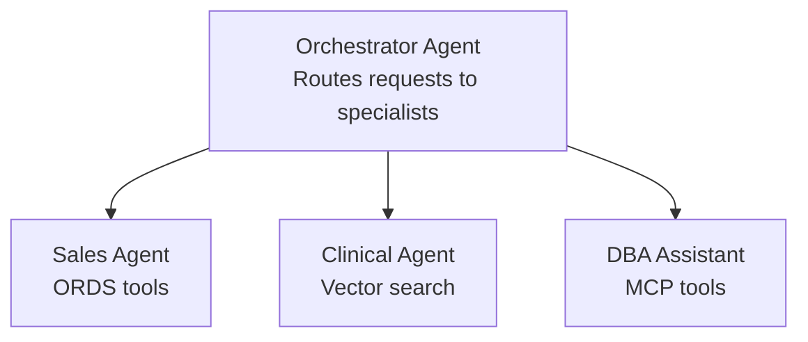

# 10. Path 2 — Microsoft Foundry Agents

## 10.1 Architecture

Microsoft Foundry provides a full-featured platform for building AI agents that can call external tools (MCP, OpenAPI, Azure Functions) to access Oracle data.

## 10.2 Prerequisites

- Azure subscription with Microsoft Foundry access
- Azure OpenAI or model deployment (GPT-4.1, o3, o4-mini recommended for tool-calling)
- Oracle Database@Azure instance
- Oracle ORDS endpoints configured (recommended) and/or MCP server

## 10.3 Setup Steps

1. **Navigate to [ai.azure.com](https://ai.azure.com)** → Create or select an Microsoft Foundry project
2. **Create a new Agent**:
   - Name: e.g., `Oracle Sales Analytics Agent`
   - Model: `gpt-4.1` or `o3` (best tool-calling performance)
3. **Configure system instructions** (see [Implementation Guides](11-implementation-guides.md) for full prompt template)
4. **Add tools** (one or more):

   **Option A — MCP Tools (Recommended for SQL access):**
   ```json
   {
     "mcpServer": {
       "name": "oracle-sqlcl",
       "command": "sqlcl",
       "args": ["@Connection_Name"],
       "capabilities": ["sql-query", "schema-information"]
     }
   }
   ```

   **Option B — OpenAPI Tools (For pre-built ORDS REST endpoints):**
   - Upload your OpenAPI spec (e.g., `promotion-insights-api.json`)
   - Set base URL to your ORDS endpoint
   - Select operations to enable (e.g., `getPromotionSummary`, `getPromotionPerformance`)

   **Option C — Azure Functions (For custom business logic):**
   - Deploy custom functions that query Oracle via ODP.NET or node-oracledb
   - Register as Function tools in the agent

5. **Add knowledge sources** (optional):
   - Upload schema documentation for grounding
   - Connect Azure AI Search index with Oracle data

6. **Test in the Playground** → Deploy via API

## 10.4 Agent System Prompt Template

```markdown
## Agent Identity
You are an AI-powered Oracle Database Analytics Agent specialized in analyzing
data from Oracle Database@Azure.

## Your Capabilities
1. **Direct SQL Queries**: Execute SQL via Oracle MCP SQLcl tool
2. **REST API Access**: Call pre-built ORDS endpoints
3. **Vector Search**: Semantic similarity search via Oracle 23ai

## Available Tools
- oracle_sql_query: Execute SQL against Oracle schemas
- get_promotion_summary: High-level promotion summaries
- get_promotion_performance: ROI metrics per promotion
- search_adverse_events: Vector search for clinical data

## Guidelines
- Always qualify table names with schema prefix (e.g., SH.SALES)
- Use ORDS endpoints for pre-built analytics; SQL for custom queries
- Present results in clear tables with key metrics highlighted
- Cite your data source (SQL query or API endpoint)
```

## 10.5 Multi-Agent Pattern

For complex scenarios, use multiple specialized agents:


