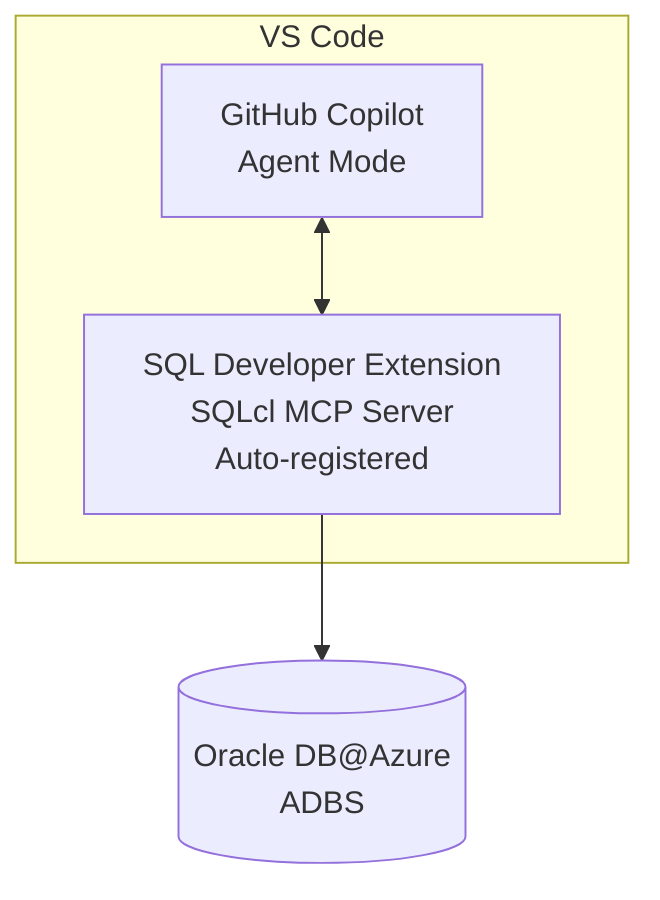
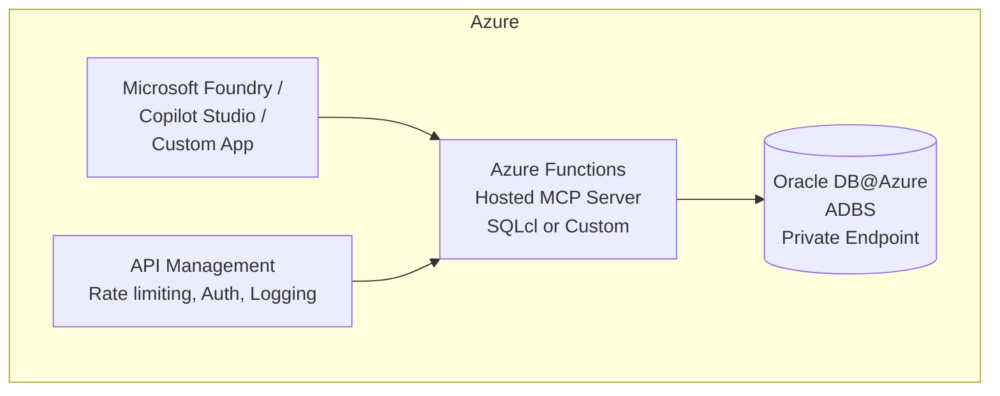

# 11. Path 3 — Oracle MCP Server (Model Context Protocol)

## 11.1 What is MCP?

The **Model Context Protocol (MCP)** is an open standard that enables AI agents and LLMs to discover and use tools provided by external servers. Oracle provides an MCP Server via **SQLcl** that exposes Oracle Database capabilities as tools to any MCP-compatible client.

## 11.2 What MCP Enables on OD@A

| Capability | Description |
|-----------|-------------|
| **Natural Language → SQL** | Agent generates SQL/PL-SQL from user questions |
| **Schema Discovery** | Agent explores tables, views, indexes, constraints |
| **Query Execution** | Agent runs SQL and returns structured results |
| **DBA Automation** | Automate routine DBA tasks through conversation |
| **Data Validation** | Agent validates data quality, checks constraints |
| **Code Generation** | Generate PL/SQL procedures from natural language |

## 11.3 Deployment Option 1: Local MCP via VS Code (Developer Productivity)

**Architecture:**


**Setup Steps:**
1. Install **SQL Developer Extension for VS Code**
2. Configure a connection to your OD@A instance
3. SQLcl MCP Server is **automatically registered** for GitHub Copilot Agent Mode
4. Open GitHub Copilot → Agent Mode → Use `@oracle` to interact with your database

**MCP Configuration (`settings.json`):**
```json
{
  "mcpServers": {
    "oracle-adbs": {
      "name": "Oracle Sales History Database",
      "type": "sqlcl",
      "connection": {
        "connectionName": "Adbs Connection",
        "schema": "SH"
      },
      "capabilities": ["sql-query", "schema-information", "data-analysis"]
    }
  }
}
```

**Security Notes:**
- Use least-privilege DB users (never SYS/SYSTEM)
- Avoid production connections during development
- MCP activity is logged in `DBTOOLS$MCP_LOG` table

## 11.4 Deployment Option 2: Hosted MCP Server on Azure Functions (Enterprise)

**Architecture:**


**Why Azure Functions for MCP:**

| Benefit | Detail |
|---------|--------|
| **Serverless scaling** | Zero to N instances based on agent request volume |
| **Native MCP hosting** | Azure Functions supports MCP server hosting natively |
| **HTTPS + auth** | Built-in Entra ID authentication |
| **Centralized governance** | One MCP server shared by many agents |
| **API Management** | Rate limiting, logging, caching via Azure APIM |

**Setup Steps:**
1. Create an Azure Functions App (Python or Node.js runtime)
2. Deploy SQLcl or a custom MCP server implementation
3. Configure Oracle connection string (use Azure Key Vault for credentials)
4. Enable Entra ID authentication on the Function App
5. (Optional) Front with Azure API Management for rate limiting and logging
6. Register the Function's HTTP endpoint as an MCP tool in Microsoft Foundry / Copilot Studio

## 11.5 Available MCP Tools

Once registered (locally or hosted), MCP tools can be used by:

| Client | How to Register |
|--------|----------------|
| **Microsoft Foundry agents** | Add as external MCP tool |
| **Copilot Studio agents** | Via tool integration / custom connector |
| **VS Code GitHub Copilot** | Auto-registered by SQL Developer Extension |
| **Custom applications** | Call MCP server endpoint directly via HTTP |

**Common MCP operations agents can perform:**
- `schema-information` — List tables, columns, types, constraints
- `sql-query` — Execute SELECT, WITH, aggregate queries
- `explain-plan` — Get query execution plans
- `generate-sql` — Generate SQL from natural language
- `run-plsql` — Execute PL/SQL blocks (with appropriate permissions)
