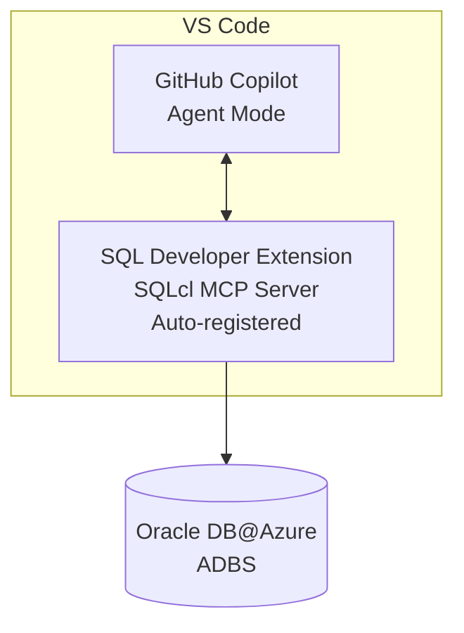
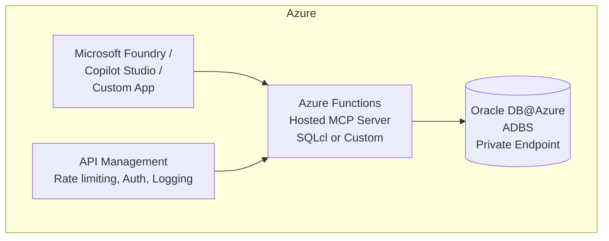
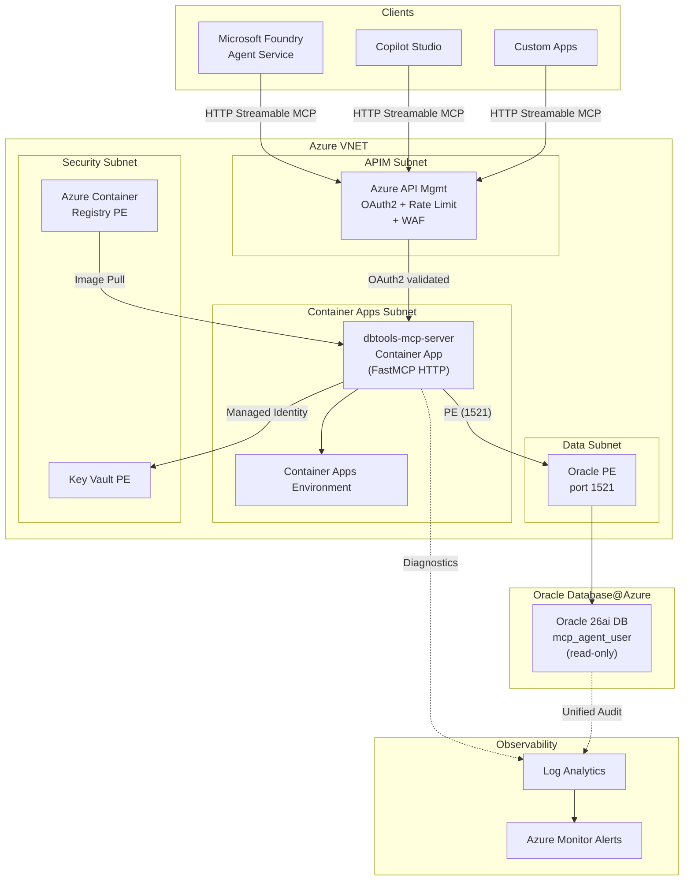

# How to use Oracle MCP Server (Model Context Protocol)

## What is MCP?

The **Model Context Protocol (MCP)** is an open standard that enables AI agents and LLMs to discover and use tools provided by external servers. Oracle provides a number of MCP servers( https://github.com/oracle/mcp/tree/main/src) for various purposes. For customers running **Oracle Database@Azure** and want to build agents that can retrieve data insights, the **DB tools MCP server** is the most relevant one to use.
Oracle's MCP Server can also be using via **SQLcl VS code extension** that exposes Oracle Database querying capabilities as tools to any MCP-compatible client.

## What MCP Enables on Oracle Database@Azure

| Capability | Description |
|-----------|-------------|
| **Natural Language → SQL** | Agent generates SQL/PL-SQL from user questions |
| **Schema Discovery** | Agent explores tables, views, indexes, constraints |
| **Query Execution** | Agent runs SQL and returns structured results |
| **DBA Automation** | Automate routine DBA tasks through conversation |
| **Data Validation** | Agent validates data quality, checks constraints |
| **Code Generation** | Generate PL/SQL procedures from natural language |

## Deployment Option 1: Local MCP via VS Code (Developer Productivity)

**Architecture:**


**Setup Steps:**
1. Install **SQL Developer Extension for VS Code**
2. Configure a connection to your Oracle Database@Azure instance
3. SQLcl MCP Server is **automatically registered** for GitHub Copilot Agent Mode
4. Open GitHub Copilot → Agent Mode → Use `@oracle` to interact with your database

**MCP Configuration (`settings.json`):**
```json
{
  "mcpServers": {
    "oracle-adbs": {
      "name": "Oracle Sales History Database",
      "type": "sqlcl",
      "connection": {
        "connectionName": "Adbs Connection",
        "schema": "SH"
      },
      "capabilities": ["sql-query", "schema-information", "data-analysis"]
    }
  }
}
```

**Security Notes:**
- Use least-privilege DB users with READ only access (never SYS/SYSTEM)
- Avoid production connections during development
- MCP activity is logged in `DBTOOLS$MCP_LOG` table

## Deployment Option 2: Hosted MCP Server on Azure Functions (Enterprise)

**Architecture:**


**Why Azure Functions for MCP:**

| Benefit | Detail |
|---------|--------|
| **Serverless scaling** | Zero to N instances based on agent request volume |
| **Native MCP hosting** | Azure Functions supports MCP server hosting natively |
| **HTTPS + auth** | Built-in Entra ID authentication |
| **Centralized governance** | One MCP server shared by many agents |
| **API Management** | Rate limiting, logging, caching via Azure APIM |

**Setup Steps:**
1. Create an Azure Functions App (Python or Node.js runtime)
2. Deploy DB tools MCP server (steps: https://github.com/oracle/mcp/tree/main/src/dbtools-mcp-server) or a custom MCP server implementation
3. Configure Oracle connection string (use Azure Key Vault for credentials)
4. Enable Entra ID authentication on the Function App
5. (Optional) Front with Azure API Management for rate limiting and logging
6. Register the Function's HTTP endpoint as an MCP tool in Microsoft Foundry / Copilot Studio

---

## Deployment Option 3: Hosted MCP Server on Azure Container Apps (Production)

Azure Container Apps provides a container-native hosting option for the Oracle DB tools MCP Server—ideal for production workloads requiring steady-state availability, custom runtime control, and VNET integration with Oracle Database@Azure.

### Architecture



### Why Container Apps for MCP

| Benefit | Detail |
|---------|--------|
| **Always-on (no cold start)** | Set `min-replicas=1` to eliminate cold start latency for production agents |
| **Full container control** | Use the provided `Dockerfile`; add custom dependencies, Oracle Instant Client, or debug tools |
| **VNET integration** | Container Apps Environment deploys into your VNET—private access to Oracle PE and Key Vault PE |
| **Auto-scaling with KEDA** | Scale on HTTP concurrency, queue depth, or custom metrics |
| **Built-in revision management** | Blue/green deployments, traffic splitting between revisions |
| **Secrets management** | Native integration with Key Vault for OCI credentials |
| **Cost-efficient at scale** | Per vCPU-second billing; more predictable than Functions for steady traffic patterns |

### Prerequisites

- Azure subscription with Container Apps, ACR, and VNET resources
- Docker installed locally (for build + test)
- Oracle Database@Azure instance with Private Endpoint
- Azure Key Vault for OCI/Oracle credentials
- Azure Container Registry (ACR) for storing the MCP server image
- OCI API key credentials (tenancy, user, fingerprint, PEM key)

### Setup Steps

#### Step 1 — Build the MCP Server Container Image

```powershell
cd src\dbtools-mcp-server

# Build the Docker image
docker build -t dbtools-mcp-server .
```

The Dockerfile uses `python:3.11-slim`, installs dependencies from `requirements.txt`, and runs `dbtools-mcp-server.py` with `MCP_TRANSPORT=streamable-http` on port 8000. A built-in healthcheck pings `/mcp`.

#### Step 2 — Test Locally

```powershell
# Create a .env file with your OCI credentials (see .env.template)
docker run -p 8000:8000 --env-file .env dbtools-mcp-server

# Verify the MCP endpoint is responsive
curl http://localhost:8000/mcp
```

#### Step 3 — Push to Azure Container Registry

```powershell
# Create ACR (one-time, or use an existing one)
az acr create --resource-group <rg-name> --name <acr-name> --sku Standard

# Login to ACR
az acr login --name <acr-name>

# Tag and push
docker tag dbtools-mcp-server <acr-name>.azurecr.io/dbtools-mcp-server:v1
docker push <acr-name>.azurecr.io/dbtools-mcp-server:v1
```

> **Tip**: Use ACR Standard or Premium SKU for Private Endpoint support in production.

#### Step 4 — Create a VNET-Integrated Container Apps Environment

```powershell
# Create a Container Apps Environment inside your VNET
az containerapp env create \
  --name dbtools-mcp-env \
  --resource-group <rg-name> \
  --location <azure-region> \
  --infrastructure-subnet-resource-id <container-apps-subnet-id> \
  --internal-only true \
  --logs-workspace-id <log-analytics-workspace-id>
```

Setting `--internal-only true` ensures no public endpoint—all traffic goes through APIM or Private Endpoints.

#### Step 5 — Deploy the Container App with Key Vault Secrets

```powershell
# Create the container app
az containerapp create \
  --name dbtools-mcp-server \
  --resource-group <rg-name> \
  --environment dbtools-mcp-env \
  --image <acr-name>.azurecr.io/dbtools-mcp-server:v1 \
  --target-port 8000 \
  --ingress internal \
  --min-replicas 1 \
  --max-replicas 5 \
  --cpu 1.0 \
  --memory 2.0Gi \
  --registry-server <acr-name>.azurecr.io \
  --registry-identity system \
  --env-vars \
    MCP_TRANSPORT=streamable-http \
    OCI_REGION=<your-oci-region> \
  --secrets \
    oci-tenancy=keyvaultref:<keyvault-uri>/secrets/oci-tenancy,identityref:system \
    oci-user=keyvaultref:<keyvault-uri>/secrets/oci-user,identityref:system \
    oci-fingerprint=keyvaultref:<keyvault-uri>/secrets/oci-fingerprint,identityref:system \
    oci-key-content=keyvaultref:<keyvault-uri>/secrets/oci-key-content,identityref:system \
  --secret-env-vars \
    OCI_TENANCY=oci-tenancy \
    OCI_USER=oci-user \
    OCI_FINGERPRINT=oci-fingerprint \
    OCI_KEY_CONTENT=oci-key-content
```

Key configuration choices:
- `--ingress internal` — no public endpoint; only accessible within the VNET
- `--min-replicas 1` — always-on to avoid cold start
- `--registry-identity system` — uses system-assigned Managed Identity to pull images from ACR (no stored credentials)
- Secrets reference Key Vault via Managed Identity (no credentials in environment variables)

#### Step 6 — Configure Scaling Rules

```powershell
# Scale based on HTTP concurrency (default KEDA HTTP scaler)
az containerapp update \
  --name dbtools-mcp-server \
  --resource-group <rg-name> \
  --scale-rule-name mcp-http-scaler \
  --scale-rule-type http \
  --scale-rule-http-concurrency 10
```

This scales up a new replica for every 10 concurrent MCP requests, up to `max-replicas`.

#### Step 7 — Front with Azure API Management

```powershell
# Import the MCP endpoint into APIM
# APIM validates OAuth2 tokens and rate-limits before forwarding to the Container App
```

APIM policy example for the MCP endpoint:

```xml
<inbound>
    <validate-jwt header-name="Authorization" failed-validation-httpcode="401">
        <openid-config url="https://login.microsoftonline.com/<tenant-id>/v2.0/.well-known/openid-configuration" />
        <required-claims>
            <claim name="aud" match="any">
                <value><mcp-app-registration-client-id></value>
            </claim>
        </required-claims>
    </validate-jwt>
    <rate-limit calls="100" renewal-period="60" />
</inbound>
```

#### Step 8 — Connect to Microsoft Foundry Agent Service

```python
from azure.ai.projects import AIProjectClient
from azure.identity import DefaultAzureCredential

client = AIProjectClient(
    credential=DefaultAzureCredential(),
    endpoint="https://<your-foundry-endpoint>",
)

# Container Apps MCP server URL (internal, routed via APIM)
mcp_server_url = "https://<apim-name>.azure-api.net/mcp"

agent = client.agents.create_agent(
    model="gpt-4.1",
    name="Oracle Database Agent",
    instructions="You are a helpful assistant that manages Oracle databases "
                 "using the available MCP tools. Always use read-only queries. "
                 "Never execute DDL or DML.",
    tools=[
        {
            "type": "mcp",
            "server_label": "dbtools",
            "server_url": mcp_server_url,
            "allowed_tools": [
                "list_all_compartments",
                "list_all_databases",
                "list_all_connections",
                "execute_sql_tool",
                "list_tables",
                "get_table_info"
            ]
        }
    ]
)
print(f"Agent created: {agent.id}")
```

> **Important**: Foundry Agent Service has a **50-second timeout** for non-streaming MCP tool calls. Ensure Oracle queries and OCI API calls complete within this limit.

### Networking

| # | Control | Details |
|---|---------|---------|
| 1 | Container Apps Environment `--internal-only` | No public endpoint; all ingress via APIM or VNET |
| 2 | Oracle Private Endpoint | MCP connects to Oracle via PE (port 1521) |
| 3 | Key Vault Private Endpoint | Secrets retrieved via PE using Managed Identity |
| 4 | ACR Private Endpoint | Image pulls stay private (ACR Premium required) |
| 5 | APIM with VNET integration | Fronts MCP—OAuth2 validation + rate limiting + WAF |
| 6 | NSGs — ingress | Container Apps subnet ← APIM (8000); deny all else |
| 7 | NSGs — egress | Container Apps subnet → Oracle PE (1521), KV PE (443); block internet |

### Security

| Control | Details |
|---------|---------|
| **No credentials in env vars** | All OCI secrets stored in Key Vault; referenced via Managed Identity |
| **Read-only Oracle user** | `mcp_agent_user` has only `SELECT` grants—no DDL/DML |
| **Entra ID auth via APIM** | OAuth2 tokens validated before requests reach the container |
| **Image signing (optional)** | Sign container images with Notation/Cosign; verify on pull |
| **Revision pinning** | Pin to specific image tags (`v1`, `v2`); never use `latest` in production |

### Container Apps vs Azure Functions Comparison

| Aspect | Azure Functions | Azure Container Apps |
|--------|----------------|---------------------|
| **Billing** | Serverless (pay-per-execution) | Per vCPU-second + memory |
| **Cold start** | Yes (can be slow) | None with `min-replicas=1` |
| **Auth** | Built-in key/Entra ID | Custom via APIM or Dapr |
| **Scaling** | Automatic, bursty | KEDA-based, configurable |
| **VNET integration** | VNET injection (Premium plan) | Native VNET injection |
| **Runtime control** | Limited (language runtimes) | Full Dockerfile control |
| **Recommended for** | Dev/test, low/bursty traffic | Production, steady traffic |
| **Setup complexity** | Lower (`host.json` config) | Higher (Dockerfile + ACR + env) |

## Available MCP Tools

Once registered (locally or hosted), MCP tools can be used by:

| Client | How to Register |
|--------|----------------|
| **Microsoft Foundry agents** | Add as external MCP tool |
| **Copilot Studio agents** | Via tool integration / custom connector |
| **VS Code GitHub Copilot** | Auto-registered by SQL Developer Extension |
| **Custom applications** | Call MCP server endpoint directly via HTTP |

**Common MCP operations agents can perform:**
- `schema-information` — List tables, columns, types, constraints
- `sql-query` — Execute SELECT, WITH, aggregate queries
- `explain-plan` — Get query execution plans
- `generate-sql` — Generate SQL from natural language
- `run-plsql` — Execute PL/SQL blocks (with appropriate permissions)
