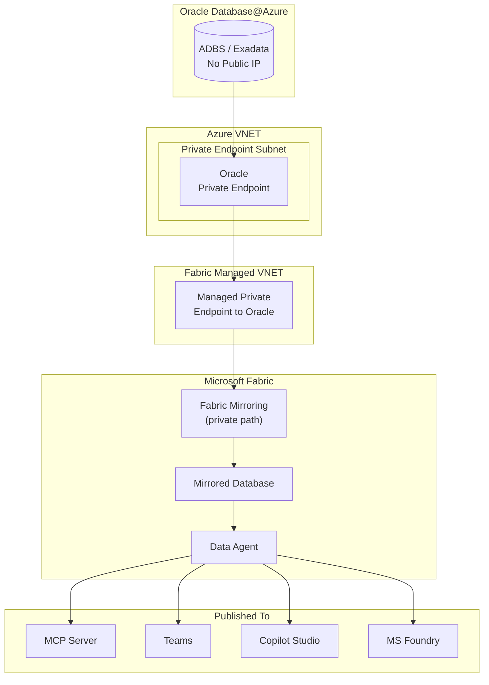

# 12. Patterns 8 / 9 -- Fabric Mirrored Database + Data Agents

## 12.1 Architecture

Oracle data is mirrored into a **Fabric Mirrored Database** via managed private endpoints. **Data Agents** are built directly on the Mirrored Database as the source -- no additional lakehouse or semantic model required for basic scenarios.

Once published, a Data Agent can be consumed as:
- **MCP Server** -- any MCP-compatible client can connect (VS Code, custom agents)
- **Teams App** -- published directly into Teams for business users
- **Copilot Studio connector** -- native connector to build no-code copilots
- **MS Foundry tool** -- native connector to use Data Agent as a tool inside Foundry agents

## 12.2 Prerequisites

- Microsoft Fabric capacity (F2 or above)
- Microsoft Entra ID tenant
- Oracle Database@Azure instance with Private Endpoints configured
- Fabric workspace with Managed VNET enabled (for private mirroring)
- Dedicated read-only Oracle user for mirroring

## 12.3 Setup Steps

1. **Configure Fabric Managed Private Endpoint** to Oracle DB@Azure:
   - In Fabric workspace settings --' **Managed private endpoints**
   - Create new managed PE pointing to Oracle Private Endpoint
   - Approve the PE connection in Azure

2. **Configure Fabric Mirroring for Oracle:**
   - In Fabric workspace --' **+ New** --' **Mirrored Database**
   - Select Oracle Database as the source
   - Provide Oracle Database@Azure connection via managed private endpoint
   - Credentials: dedicated read-only Oracle user (stored securely in Fabric)
   - Select tables/schemas to mirror (e.g., SH schema)
   - Configure refresh schedule (near-real-time or scheduled)

3. **Create a Fabric Data Agent on Mirrored Database:**
   - In Fabric workspace --' select your Mirrored Database
   - **+ New Data Agent** --' Data Agent uses Mirrored Database as direct source
   - Configure natural language understanding
   - Test with sample queries

4. **Configure Entra ID access:**
   - Assign Fabric workspace roles (Viewer for end users, Contributor for data engineers)
   - Enable Conditional Access policies for MFA enforcement
   - Configure DLP policies if needed

5. **Publish the Data Agent:**

   **Option A -- As MCP Server:**
   - Publish Data Agent as MCP endpoint
   - MCP-compatible clients (VS Code, Foundry agents, custom apps) connect via MCP protocol
   - Access controlled by Entra ID

   **Option B -- To Teams:**
   - Publish Data Agent directly to Teams
   - Business users query mirrored Oracle data in natural language via Teams chat
   - Access controlled by Entra ID security groups

   **Option C -- To Copilot Studio:**
   - In Copilot Studio --' **Tools** --' Add **Fabric Data Agent** via native connector
   - Build copilots grounded on mirrored Oracle analytics data
   - Combine with Oracle connector (Pattern 1) for live + mirrored data in one copilot

   **Option D -- To MS Foundry:**
   - In Foundry --' Agent --' **+ Add Tool** --' select Fabric Data Agent via native connector
   - Foundry agent uses Data Agent as one of its tools
   - Combine with MCP (Pattern 2) and ORDS (Pattern 3) tools for live + mirrored in one agent

## 12.4 Entra ID Authentication

| Component | Entra ID Integration | Details |
|--|--|--|
| **Fabric Workspace** | Native Entra ID auth | Users authenticate via SSO; workspace roles control access |
| **Data Agent** | Inherits workspace auth | Only users with Fabric Viewer+ role can query |
| **MCP Server publish** | Entra ID token required | MCP clients must present valid Entra ID token |
| **Teams publish** | Teams SSO | Inherits user's Teams/Entra ID identity |
| **Copilot Studio connector** | Entra ID delegated auth | Copilot authenticates on behalf of user |
| **Foundry connector** | Entra ID service auth | Foundry agent's Managed Identity or delegated auth |
| **Oracle mirroring** | Dedicated DB user | Read-only Oracle user; credentials stored in Fabric (not exposed to end users) |

## 12.5 RBAC Model

| Layer | Role | Who Gets It | What It Controls |
|--|--|--|--|
| **Entra ID** | Security Group: `Fabric-DataAgent-Users` | Analysts, business users | Who can query the Data Agent |
| **Entra ID** | Conditional Access Policy | All users | MFA, device compliance |
| **Fabric Workspace** | Viewer | End users | Read-only access to mirrored data + Data Agent |
| **Fabric Workspace** | Contributor | Data engineers | Create/modify mirroring, Data Agents |
| **Fabric Workspace** | Admin | Platform admin | Manage workspace security, capacity, private endpoints |
| **Copilot Studio** | Maker / User | Citizen devs / End users | Build vs use copilots connected to Data Agent |
| **MS Foundry** | Foundry User / Contributor | End users / Developers | Use vs create Foundry agents with Data Agent tool |
| **Oracle DB** | Dedicated mirroring user | Fabric mirroring connection | `GRANT SELECT ON SH.* TO fabric_mirror_user` -- no DDL/DML |

## 12.6 Private Networking

### Network Architecture

### Network Controls

| # | Control | Details |
|--|--|--|
| 1 | Oracle Private Endpoint | No public IP on Oracle; all access via PE |
| 2 | Fabric Managed VNET | Fabric uses managed private endpoints for outbound to Oracle |
| 3 | Mirroring over private path | Data replication never touches public internet |
| 4 | No Oracle credentials in Data Agent | Mirrored Database is the source -- Data Agent never connects to Oracle directly |
| 5 | Entra ID for all published surfaces | MCP, Teams, Copilot Studio, Foundry -- all require Entra ID auth |
| 6 | Workspace-level security | Fabric workspace RBAC controls who can query Data Agent |

## 12.7 Design Considerations

| Consideration | Guidance |
|--|--|
| **Data source** | Data Agent uses Mirrored Database directly as source -- no separate lakehouse required |
| **Latency** | Mirroring introduces latency (minutes to hours); not for real-time transactional Q&A |
| **Data scope** | Mirror only the tables/schemas needed; don't mirror entire databases |
| **Cross-source** | Fabric's strength is joining Oracle data with SQL Server, Azure SQL, Dataverse, etc. |
| **Publishing** | Choose publish target based on audience: Teams for business users, MCP for developers, Foundry for pro-dev agents |
| **Combining with live data** | Use Data Agent (mirrored) alongside MCP/ORDS (live Oracle) in Foundry for hybrid scenarios |
| **Cost** | Fabric CU consumption scales with data volume, mirroring frequency, and query complexity |
| **Security** | Data inherits Fabric workspace security; does NOT inherit Oracle RLS -- apply Fabric-level security separately |
