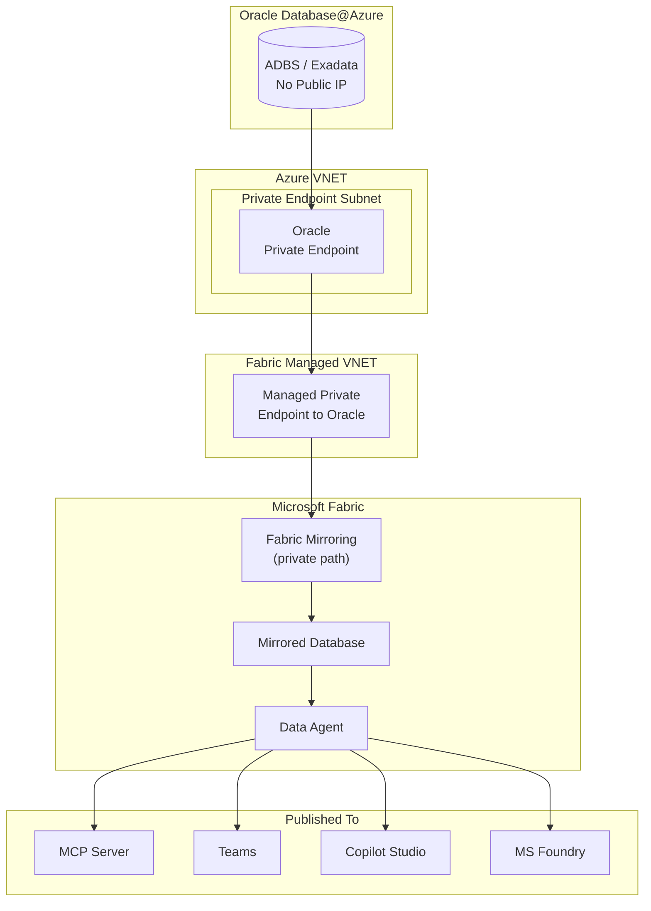
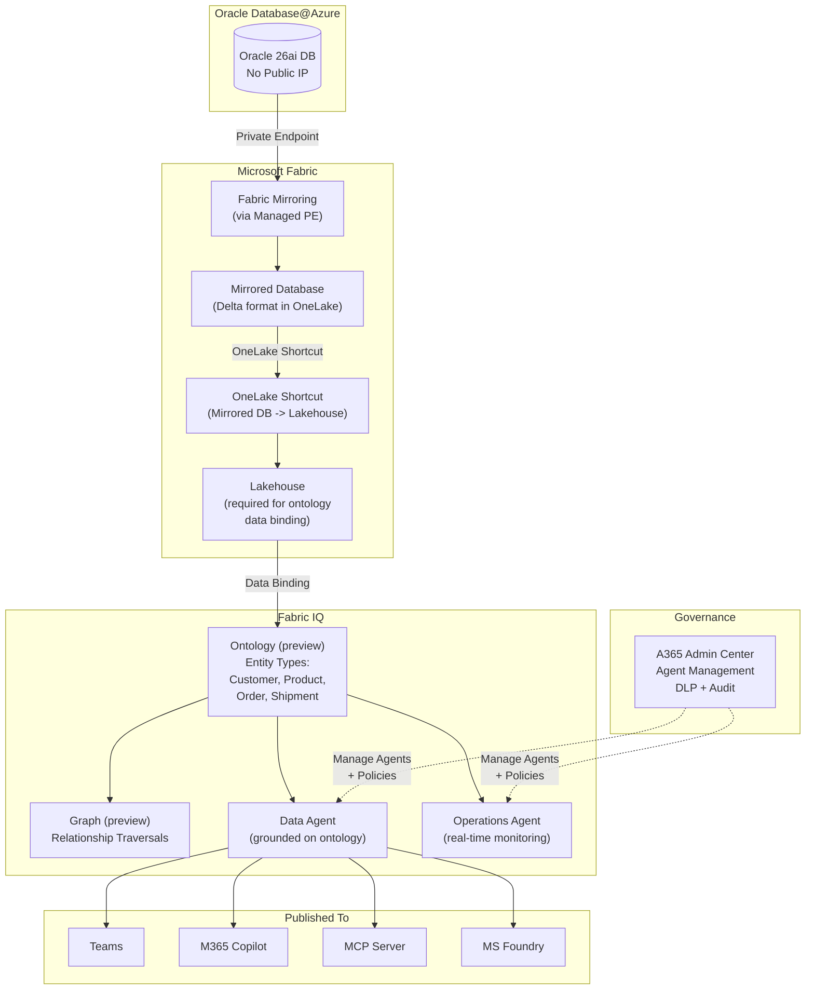
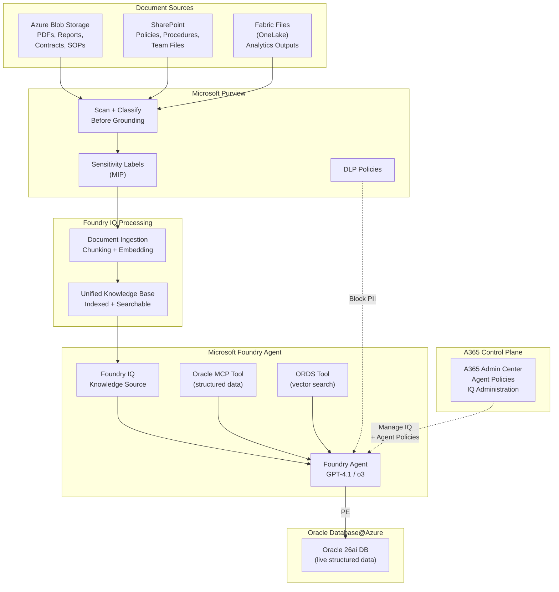
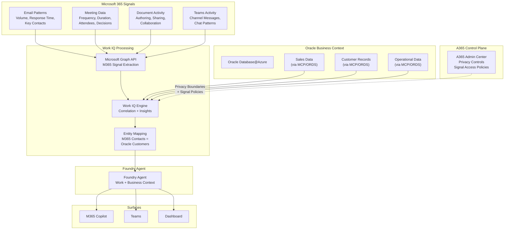
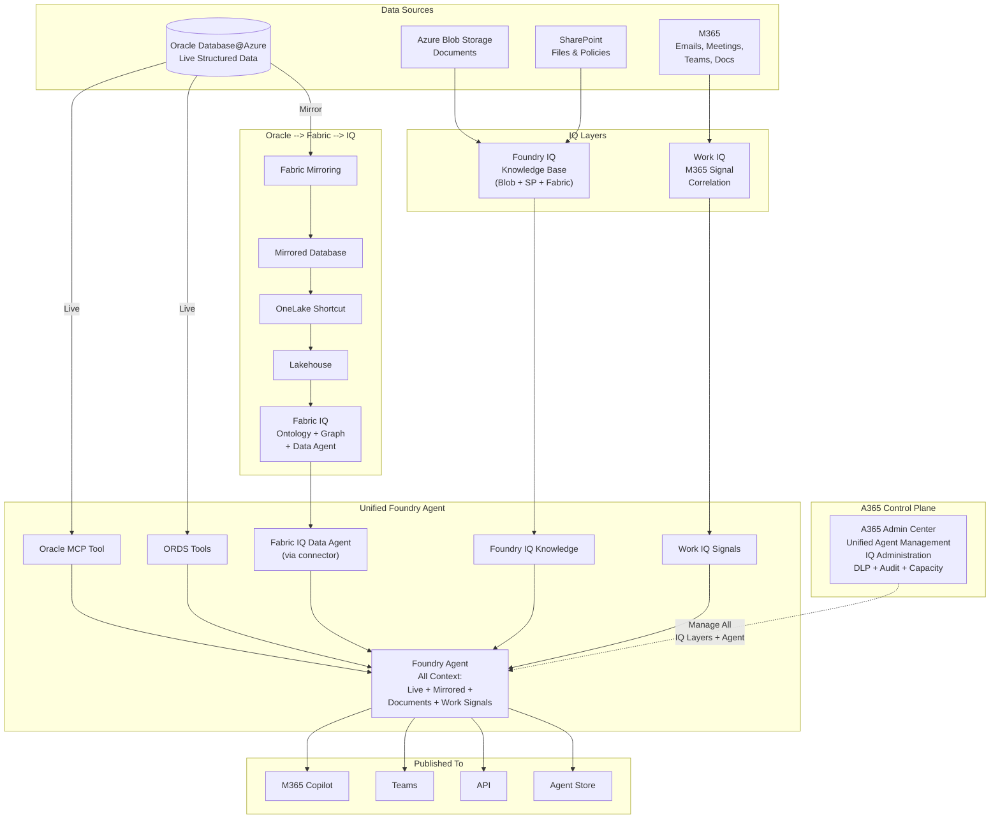

# 12. Patterns 8 / 9 -- Fabric Mirrored Database + Data Agents

## 12.1 Architecture

Oracle data is mirrored into a **Fabric Mirrored Database** via managed private endpoints. **Data Agents** are built directly on the Mirrored Database as the source -- no additional lakehouse or semantic model required for basic scenarios.

Once published, a Data Agent can be consumed as:
- **MCP Server** -- any MCP-compatible client can connect (VS Code, custom agents)
- **Teams App** -- published directly into Teams for business users
- **Copilot Studio connector** -- native connector to build no-code copilots
- **MS Foundry tool** -- native connector to use Data Agent as a tool inside Foundry agents

## 12.2 Prerequisites

- Microsoft Fabric capacity (F2 or above)
- Microsoft Entra ID tenant
- Oracle Database@Azure instance with Private Endpoints configured
- Fabric workspace with Managed VNET enabled (for private mirroring)
- Dedicated read-only Oracle user for mirroring

## 12.3 Setup Steps

1. **Configure Fabric Managed Private Endpoint** to Oracle DB@Azure:
   - In Fabric workspace settings --' **Managed private endpoints**
   - Create new managed PE pointing to Oracle Private Endpoint
   - Approve the PE connection in Azure

2. **Configure Fabric Mirroring for Oracle:**
   - In Fabric workspace --' **+ New** --' **Mirrored Database**
   - Select Oracle Database as the source
   - Provide Oracle Database@Azure connection via managed private endpoint
   - Credentials: dedicated read-only Oracle user (stored securely in Fabric)
   - Select tables/schemas to mirror (e.g., SH schema)
   - Configure refresh schedule (near-real-time or scheduled)

3. **Create a Fabric Data Agent on Mirrored Database:**
   - In Fabric workspace --' select your Mirrored Database
   - **+ New Data Agent** --' Data Agent uses Mirrored Database as direct source
   - Configure natural language understanding
   - Test with sample queries

4. **Configure Entra ID access:**
   - Assign Fabric workspace roles (Viewer for end users, Contributor for data engineers)
   - Enable Conditional Access policies for MFA enforcement
   - Configure DLP policies if needed

5. **Publish the Data Agent:**

   **Option A -- As MCP Server:**
   - Publish Data Agent as MCP endpoint
   - MCP-compatible clients (VS Code, Foundry agents, custom apps) connect via MCP protocol
   - Access controlled by Entra ID

   **Option B -- To Teams:**
   - Publish Data Agent directly to Teams
   - Business users query mirrored Oracle data in natural language via Teams chat
   - Access controlled by Entra ID security groups

   **Option C -- To Copilot Studio:**
   - In Copilot Studio --' **Tools** --' Add **Fabric Data Agent** via native connector
   - Build copilots grounded on mirrored Oracle analytics data
   - Combine with Oracle connector (Pattern 1) for live + mirrored data in one copilot

   **Option D -- To MS Foundry:**
   - In Foundry --' Agent --' **+ Add Tool** --' select Fabric Data Agent via native connector
   - Foundry agent uses Data Agent as one of its tools
   - Combine with MCP (Pattern 2) and ORDS (Pattern 3) tools for live + mirrored in one agent

## 12.4 Entra ID Authentication

| Component | Entra ID Integration | Details |
|--|--|--|
| **Fabric Workspace** | Native Entra ID auth | Users authenticate via SSO; workspace roles control access |
| **Data Agent** | Inherits workspace auth | Only users with Fabric Viewer+ role can query |
| **MCP Server publish** | Entra ID token required | MCP clients must present valid Entra ID token |
| **Teams publish** | Teams SSO | Inherits user's Teams/Entra ID identity |
| **Copilot Studio connector** | Entra ID delegated auth | Copilot authenticates on behalf of user |
| **Foundry connector** | Entra ID service auth | Foundry agent's Managed Identity or delegated auth |
| **Oracle mirroring** | Dedicated DB user | Read-only Oracle user; credentials stored in Fabric (not exposed to end users) |

## 12.5 RBAC Model

| Layer | Role | Who Gets It | What It Controls |
|--|--|--|--|
| **Entra ID** | Security Group: `Fabric-DataAgent-Users` | Analysts, business users | Who can query the Data Agent |
| **Entra ID** | Conditional Access Policy | All users | MFA, device compliance |
| **Fabric Workspace** | Viewer | End users | Read-only access to mirrored data + Data Agent |
| **Fabric Workspace** | Contributor | Data engineers | Create/modify mirroring, Data Agents |
| **Fabric Workspace** | Admin | Platform admin | Manage workspace security, capacity, private endpoints |
| **Copilot Studio** | Maker / User | Citizen devs / End users | Build vs use copilots connected to Data Agent |
| **MS Foundry** | Foundry User / Contributor | End users / Developers | Use vs create Foundry agents with Data Agent tool |
| **Oracle DB** | Dedicated mirroring user | Fabric mirroring connection | `GRANT SELECT ON SH.* TO fabric_mirror_user` -- no DDL/DML |

## 12.6 Private Networking

### Network Architecture



### Network Controls

| # | Control | Details |
|--|--|--|
| 1 | Oracle Private Endpoint | No public IP on Oracle; all access via PE |
| 2 | Fabric Managed VNET | Fabric uses managed private endpoints for outbound to Oracle |
| 3 | Mirroring over private path | Data replication never touches public internet |
| 4 | No Oracle credentials in Data Agent | Mirrored Database is the source -- Data Agent never connects to Oracle directly |
| 5 | Entra ID for all published surfaces | MCP, Teams, Copilot Studio, Foundry -- all require Entra ID auth |
| 6 | Workspace-level security | Fabric workspace RBAC controls who can query Data Agent |

## 12.7 Design Considerations

| Consideration | Guidance |
|--|--|
| **Data source** | Data Agent uses Mirrored Database directly as source -- no separate lakehouse required |
| **Latency** | Mirroring introduces latency (minutes to hours); not for real-time transactional Q&A |
| **Data scope** | Mirror only the tables/schemas needed; don't mirror entire databases |
| **Cross-source** | Fabric's strength is joining Oracle data with SQL Server, Azure SQL, Dataverse, etc. |
| **Publishing** | Choose publish target based on audience: Teams for business users, MCP for developers, Foundry for pro-dev agents |
| **Combining with live data** | Use Data Agent (mirrored) alongside MCP/ORDS (live Oracle) in Foundry for hybrid scenarios |
| **Cost** | Fabric CU consumption scales with data volume, mirroring frequency, and query complexity |
| **Security** | Data inherits Fabric workspace security; does NOT inherit Oracle RLS -- apply Fabric-level security separately |

---

## Pattern 10: Fabric IQ on Oracle Mirrored Database

### What is Fabric IQ

Fabric IQ (preview) is a Fabric workload for unifying data across OneLake and organizing it according to the language of your business. It consists of:

- **Ontology (preview)** -- defines entity types (e.g., Customer, Product, Order), their properties, relationships, and constraints. This is the enterprise vocabulary layer.
- **Graph (preview)** -- native graph storage for relationship-heavy queries (impact chains, dependencies, shortest paths)
- **Plan (preview)** -- collaborative planning, reporting, and data management on a single platform
- **Data Agent** -- conversational Q&A grounded on ontology-defined business concepts
- **Operations Agent** -- monitors real-time data and recommends governed business actions

### Architecture

Oracle data is mirrored into Fabric, then a **shortcut** is created from the Mirrored Database into a **Lakehouse** (the only supported data source for ontology binding today). Business entity types are defined in the ontology and bound to lakehouse tables. Data Agents and Operations Agents use the ontology for consistent, governed reasoning.



### Setup Steps (End-to-End)

#### Step 1 -- Mirror Oracle Data into Fabric

1. **Configure Fabric Managed Private Endpoint** to Oracle Database@Azure (same as Pattern 8)
2. **Set up Fabric Mirroring** -- select Oracle tables/schemas to mirror into a Mirrored Database
3. **Configure refresh schedule** -- near-real-time or scheduled sync

#### Step 2 -- Create a Lakehouse Shortcut from Mirrored Database

4. **Create a Lakehouse** in the same Fabric workspace (if one doesn't exist)
5. **Create OneLake shortcuts** from the Mirrored Database tables into the Lakehouse:
   - In the Lakehouse --> **Get data** --> **New shortcut** --> **Microsoft OneLake**
   - Select the Mirrored Database tables (e.g., `SH.CUSTOMERS`, `SH.PRODUCTS`, `SH.SALES`, `SH.PROMOTIONS`)
   - Shortcuts reference the data in place -- no additional copy or ETL

   > **Why a shortcut?** Ontology data binding today supports **Lakehouse tables** as the data source. The shortcut creates a zero-copy reference from the Mirrored Database into the Lakehouse without duplicating data.

#### Step 3 -- Create the Ontology and Define Entity Types

6. **Create an Ontology item** in the Fabric workspace:
   - Fabric workspace --> **+ New** --> **Ontology (preview)**
   - Name it based on your domain (e.g., `Oracle Sales Ontology`)

7. **Define Entity Types** -- these are your business concepts:

   | Entity Type | Description | Source Table (via Shortcut) |
   |---|---|---|
   | **Customer** | End customer who purchases products | `SH.CUSTOMERS` |
   | **Product** | Items available for sale | `SH.PRODUCTS` |
   | **Sale** | A completed sales transaction | `SH.SALES` |
   | **Promotion** | Marketing campaign or discount | `SH.PROMOTIONS` |
   | **Channel** | Sales channel (online, retail, partner) | `SH.CHANNELS` |
   | **Time** | Date dimension for temporal analysis | `SH.TIMES` |

8. **Define Properties** on each entity type -- map them to lakehouse table columns:
   - Customer: `customer_id` (identifier), `name`, `email`, `country`, `segment`
   - Product: `product_id` (identifier), `name`, `category`, `subcategory`, `list_price`
   - Sale: `sale_id` (identifier), `amount`, `quantity`, `date`

9. **Define Relationships** between entity types:
   - `Customer` --[places]--> `Sale`
   - `Sale` --[contains]--> `Product`
   - `Sale` --[uses]--> `Promotion`
   - `Sale` --[through]--> `Channel`
   - `Sale` --[on]--> `Time`

10. **Add Constraints** (optional):
    - `Sale.amount` must be > 0
    - `Customer.email` must match email pattern
    - `Product.list_price` must be >= 0

#### Step 4 -- Bind Ontology to Lakehouse Data

11. **Create data bindings** -- connect each entity type to its lakehouse table:
    - Select the entity type (e.g., Customer)
    - Choose the lakehouse table (e.g., `SH_CUSTOMERS` via the shortcut)
    - Map each property to the corresponding table column
    - Set identity keys (e.g., `customer_id` as primary identifier)
    - Map relationship keys (e.g., `customer_id` in Sales table links to Customer entity)

12. **Refresh the graph model** -- this materializes entity instances and relationship edges from your bound data

#### Step 5 -- Create Agents on the Ontology

13. **Create a Data Agent** grounded on the ontology:
    - In the ontology item --> **Create Data Agent**
    - The Data Agent understands your business entity types and uses ontology terminology when answering questions
    - Example queries the agent can handle:
      - "Which customers had the highest sales last quarter?"
      - "Show me promotions that drove the most revenue by channel"
      - "What products are trending in the APAC region?"

14. **(Optional) Create an Operations Agent** for real-time monitoring:
    - Connect to eventhouse streams or real-time data
    - Define alert rules using ontology-based business logic (e.g., "Alert when daily sales for any product drop below 80% of its 30-day average")

#### Step 6 -- Publish and Govern via A365

15. **Publish the Data Agent** to Teams, M365 Copilot, MCP Server, or MS Foundry (same options as Pattern 8)
16. **Manage via A365 Admin Center**:
    - Enable/disable agents for the tenant
    - Set publishing policies (who can publish, where agents appear)
    - Configure DLP policies on agent responses
    - Monitor agent usage and query patterns in audit logs

### Ontology Design Considerations

| Consideration | Guidance |
|---|---|
| **Entity scope** | Start with 3-5 core business entities; expand as adoption grows |
| **Shortcut vs copy** | Always use OneLake shortcuts from Mirrored DB to Lakehouse -- avoids data duplication |
| **Refresh cadence** | Graph model refresh is manual today -- schedule it after mirroring refreshes |
| **Naming conventions** | Use business-friendly names (not Oracle column names) -- e.g., "Customer Name" not "CUST_NM" |
| **Cross-domain** | Define relationships between Oracle entities and other data sources (e.g., Oracle Customers linked to Dataverse Contacts) |
| **NL2Ontology** | The natural language query layer converts user questions into structured ontology queries -- test with representative business questions |
| **Governance** | Version and validate ontology definitions; use Fabric monitoring for ontology health |

---

## Pattern 11: Foundry IQ -- Unified Knowledge Base for Unstructured Data

### What is Foundry IQ

Foundry IQ ingests unstructured documents (PDFs, Word, Excel, PowerPoint, emails) from Azure Blob Storage, SharePoint, and Fabric Files (OneLake), processes them into a searchable knowledge base, and makes them available to Foundry agents as a grounding source alongside structured Oracle data.

### Architecture



### How Foundry IQ Creates a Unified Knowledge Base

1. **Connect document sources** to Foundry IQ:
   - Azure Blob Storage: Technical reports, clinical trial documents, contracts, SOPs
   - SharePoint: Company policies, HR procedures, compliance guides, meeting notes
   - Fabric Files / OneLake: Analytics outputs, Fabric notebook exports, lakehouse data extracts

2. **Purview scans documents BEFORE grounding** (critical governance step):
   - Register Blob and SharePoint sources in Purview Data Map
   - Run classification scan -- identifies PII, PHI, financial data in documents
   - Apply sensitivity labels (Public, Internal, Confidential, Highly Confidential)
   - Documents labeled Highly Confidential are excluded from IQ grounding

3. **Foundry IQ processes documents**:
   - Chunks documents into semantic segments
   - Generates embeddings for each chunk
   - Indexes into a searchable knowledge base
   - Preserves document metadata (source, date, author, sensitivity label)

4. **Agent uses IQ alongside Oracle tools**:
   - User asks: "What does our SOP say about adverse event reporting for products with high return rates?"
   - Agent retrieves:
     - SOP document from Foundry IQ knowledge base
     - Product return rate data from Oracle via MCP/ORDS
   - Agent combines both to generate a complete, grounded answer

### Setup Steps (End-to-End)

1. **Create a Foundry project** at [ai.azure.com](https://ai.azure.com)
2. **Register document sources in Purview** -- scan Blob and SharePoint; apply sensitivity labels
3. **Connect document sources to Foundry IQ**:
   - Foundry project --> Knowledge --> **+ Add data source**
   - Select Azure Blob Storage container(s)
   - Select SharePoint site(s)
   - Select Fabric Files / OneLake location(s)
4. **Configure IQ processing pipeline**:
   - Set chunk size (default: 512 tokens) and overlap (default: 128 tokens)
   - Select embedding model (text-embedding-3-small or text-embedding-3-large)
   - Set refresh schedule for document re-indexing
5. **Create a Foundry Agent** with IQ + Oracle tools:
   - Add Foundry IQ as a knowledge source
   - Add Oracle MCP Server as an external tool (Pattern 2)
   - Add ORDS vector search endpoints as OpenAPI tools (Pattern 3)
   - Enable Azure AI Content Safety
6. **Configure agent system prompt** -- instruct the agent to cite sources:
   ```
   When answering, cite both the document source (from Foundry IQ) and the 
   Oracle data source (table/endpoint) used. If a document is labeled 
   Confidential, include the sensitivity label in your response.
   ```
7. **Test cross-source queries** -- verify the agent can combine document knowledge with live Oracle data
8. **Manage via A365 Admin Center**:
   - Monitor IQ processing pipeline health and document ingestion status
   - Set policies for which users can access IQ-grounded agents
   - Configure DLP to prevent sensitive document content from appearing in responses

### Design Considerations

| Consideration | Guidance |
|---|---|
| **Scan before grounding** | Always classify documents in Purview before connecting to Foundry IQ -- prevents sensitive content from entering the knowledge base |
| **Label propagation** | Sensitivity labels flow from documents through IQ into agent responses -- enables DLP enforcement |
| **Chunk size tuning** | Smaller chunks (256-512 tokens) for precise Q&A; larger chunks (1024) for summary/context tasks |
| **Refresh schedule** | Set IQ re-indexing after SharePoint/Blob content updates; stale documents = stale answers |
| **Cross-source queries** | The real power is combining: "What does our policy say about X?" (IQ) + "How many X events occurred?" (Oracle) |
| **Cost** | Embedding generation + index storage billable per document; monitor via A365 |

---

## Pattern 12: Work IQ -- M365 Productivity Signals + Oracle Business Data

### What is Work IQ

Work IQ connects Microsoft 365 productivity signals (emails, meetings, documents, Teams activity, calendar patterns) with Oracle business data to surface organizational intelligence. It bridges *how teams work* with *what the business data shows*.

### Architecture



### How Work IQ Connects M365 Signals to Oracle Data

Work IQ analyzes M365 Graph signals and correlates them with Oracle business data:

| M365 Signal | Oracle Data | Combined Insight |
|---|---|---|
| Email volume with customer contacts | Oracle CRM: deal stage, revenue | "Accounts with >50 emails/month are 2x more likely to close" |
| Meeting frequency per project | Oracle: project timeline, budget | "Projects with weekly Oracle data review meetings deliver 30% faster" |
| Teams channel activity | Oracle: support ticket data | "Teams channels linked to high-priority tickets get 40% faster resolution" |
| Document collaboration patterns | Oracle: product development timeline | "Products with cross-team doc collaboration launch 3 weeks earlier" |
| Calendar blocked time | Oracle: quarterly sales targets | "Reps with >60% calendar utilization miss target by 15%" |

### Setup Steps (End-to-End)

#### Step 1 -- Enable Work IQ

1. **Enable Work IQ** in Microsoft 365 Admin Center:
   - M365 Admin --> Settings --> Org settings --> Work IQ
   - Consent to Microsoft Graph data access for insights
   - Set privacy controls: minimum group size (default 5), exclude specific departments if needed

#### Step 2 -- Configure M365 Graph Data Access

2. **Define which M365 signals are analyzed**:
   - Email metadata (NOT content): sender, recipient, timestamp, response time
   - Meeting metadata: organizer, attendees, duration, recurrence
   - Document metadata: author, editors, sharing scope, last modified
   - Teams: channel activity, message counts (NOT message content)

3. **Set privacy boundaries**:
   - Individual-level data aggregated to team/department level
   - No email/message content -- only metadata patterns
   - Opt-out available for specific users or departments

#### Step 3 -- Connect Oracle Business Data Context

4. **Create a Foundry Agent** that bridges Work IQ + Oracle:
   - Add Oracle MCP Server as a tool (for structured Oracle queries)
   - Add ORDS endpoints as OpenAPI tools (for governed analytics)
   - Enable Work IQ as a signal source

5. **Map business entities** between M365 and Oracle:

   | M365 Entity | Oracle Entity | Mapping Key |
   |---|---|---|
   | M365 Contacts (email addresses) | Oracle `CUSTOMERS` table | Email address match |
   | M365 Projects (Planner/Teams) | Oracle `PROJECTS` table | Project code tag in Teams channel name |
   | M365 Users (department) | Oracle `EMPLOYEES` table | Employee ID or UPN |
   | M365 Teams channels | Oracle `SUPPORT_CASES` | Channel naming convention (e.g., `case-12345`) |

#### Step 4 -- Configure Insights and Govern via A365

6. **Define insight categories**:
   - Sales effectiveness: email/meeting patterns vs Oracle revenue data
   - Operational efficiency: collaboration patterns vs Oracle operational metrics
   - Customer engagement: contact frequency vs Oracle CRM stages

7. **Manage via A365 Admin Center**:
   - Control which M365 signals are analyzed (email, meetings, docs, Teams)
   - Set privacy boundaries per department/region
   - Monitor Work IQ data access in audit logs
   - Enable/disable Work IQ insights for specific agent deployments
   - Set DLP policies on combined work + business insights

### Privacy and Compliance Considerations

| Control | Details |
|---|---|
| **No content access** | Work IQ analyzes metadata patterns only -- never reads email body, message content, or document text |
| **Minimum aggregation** | Insights are aggregated at team level (minimum group size: 5) to prevent individual identification |
| **Opt-out** | Individual users or departments can opt out via M365 Admin Center |
| **GDPR compliance** | Data stays within the tenant's M365 region; subject to M365 DPA |
| **Purview integration** | Combined insights inherit Purview sensitivity labels from both M365 and Oracle data |
| **Audit trail** | All Work IQ signal access logged in A365 audit logs |

---

## Pattern 13: Unified IQ -- All Layers Combined

### Architecture

Unified IQ combines all three IQ layers (Fabric IQ + Foundry IQ + Work IQ) into a single Foundry agent with complete organizational intelligence. The agent can reason across structured Oracle data, mirrored analytics, unstructured documents, and M365 work signals.



### What the Unified Agent Can Answer

| Question Type | IQ Layer Used | Example |
|---|---|---|
| Live Oracle data | MCP/ORDS (Pattern 2/3) | "What were Q1 sales by product category?" |
| Mirrored analytics + ontology | Fabric IQ (Pattern 10) | "How do Customer segments correlate with Promotion effectiveness?" |
| Document knowledge | Foundry IQ (Pattern 11) | "What does our compliance policy say about data retention?" |
| Work signals + business data | Work IQ (Pattern 12) | "Which sales reps have the most customer meetings but lowest close rates?" |
| Cross-layer reasoning | All layers | "Our APAC team's meeting frequency dropped 30% last month -- how did that affect Q1 sales in that region, and does our SOP require escalation when sales dip beyond 20%?" |

---

## A365 Control Plane -- Managing All Patterns

Microsoft 365 Admin Center (A365) provides a unified control plane for managing agents, IQ services, and governance across all patterns.

### A365 Management Capabilities

| Capability | What It Controls | Applicable Patterns |
|---|---|---|
| **Agent Management** | Enable/disable agents for the tenant; set who can create and publish agents | All (1-13) |
| **Copilot Controls** | Manage Copilot features, data access, grounding sources; control Copilot availability | 1, 8, 10, 11, 12, 13 |
| **Foundry Administration** | Manage Foundry projects, model deployments, tool registrations | 2, 3, 4, 9, 11, 13 |
| **IQ Administration** | Enable Fabric IQ / Foundry IQ / Work IQ; set processing budgets; monitor pipeline health | 10, 11, 12, 13 |
| **DLP Policies** | Prevent sensitive data from appearing in agent responses; block PII/PHI patterns | All (1-13) |
| **Sensitivity Labels** | Apply and enforce MIP labels on agent responses and knowledge bases | All (1-13) |
| **Audit Logs** | Centralized audit of agent usage, queries, tool calls, and data access | All (1-13) |
| **Conditional Access** | MFA, device compliance, location restrictions for agent access | All (1-13) |
| **Capacity Management** | Fabric CU allocation, Foundry compute limits, OpenAI token budgets | 2-13 |
| **Publishing Policies** | Control where agents can be published (Teams, M365 Copilot, Agent Store, API) | All (1-13) |
| **Privacy Controls** | Set Work IQ signal boundaries, minimum aggregation group size, opt-out policies | 12, 13 |

### A365 Setup for Agent Governance

1. **M365 Admin Center** --> **Settings** --> **Copilot & AI**:
   - Enable Foundry agent publishing
   - Set default DLP policies for all agent responses
   - Configure audit log retention

2. **M365 Admin Center** --> **Settings** --> **Org settings** --> **Work IQ**:
   - Enable/disable Work IQ signal analysis
   - Set privacy boundaries
   - Configure opt-out policies

3. **Fabric Admin Portal** --> **Tenant settings**:
   - Enable Fabric IQ workload
   - Enable Ontology (preview) and Graph (preview) settings
   - Set Fabric capacity budgets for IQ workloads

4. **Purview Compliance Center**:
   - Configure DLP policies that apply to all agent responses
   - Set auto-labeling policies for documents ingested by Foundry IQ
   - Enable audit log forwarding to Log Analytics
