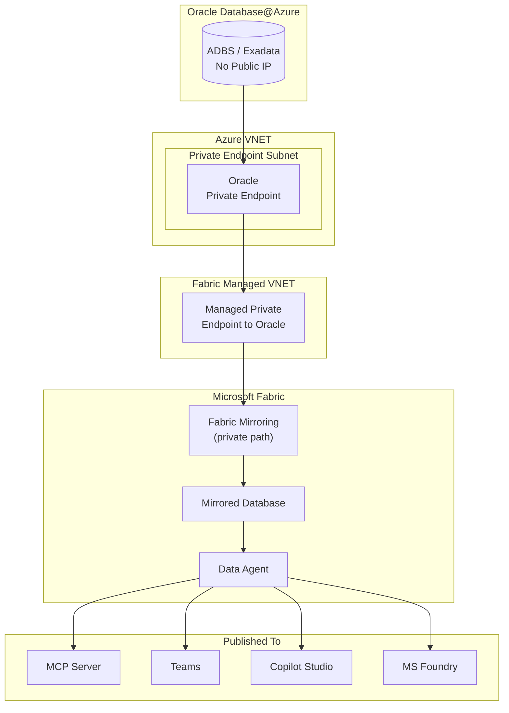
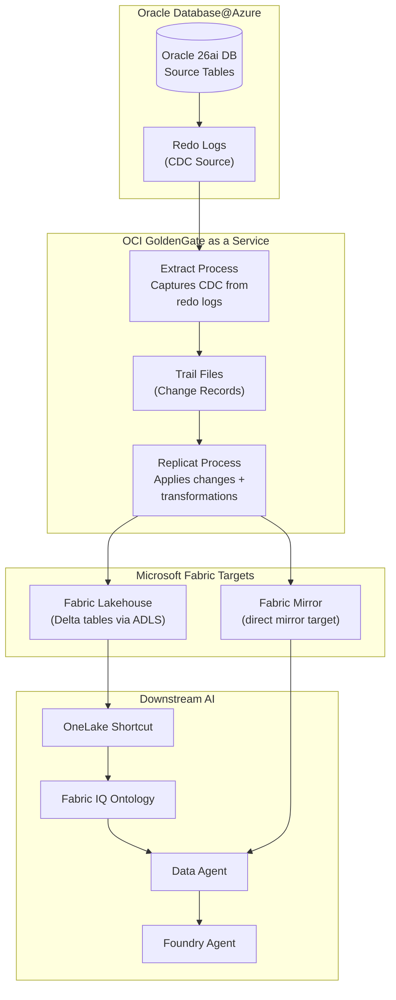
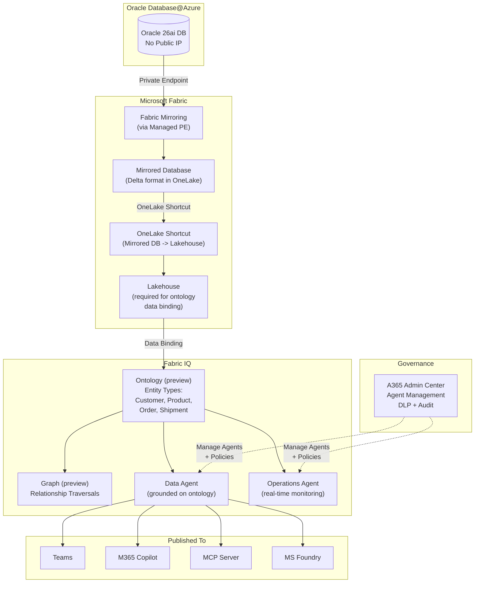

# Blueprints for building AI agents on Fabric Mirrored Database 

## Architecture

Oracle data is mirrored into a **Fabric Mirrored Database** via managed private endpoints. **Data Agents** are built directly on the Mirrored Database as the source -- no additional lakehouse or semantic model required for basic scenarios.

Once published, a Data Agent can be consumed as:
- **MCP Server** -- any MCP-compatible client can connect (VS Code, custom agents)
- **Teams App** -- published directly into Teams for business users
- **Copilot Studio connector** -- native connector to build no-code copilots
- **MS Foundry tool** -- native connector to use Data Agent as a tool inside Foundry agents

##  Prerequisites

- Microsoft Fabric capacity (F2 or above)
- Microsoft Entra ID tenant
- Oracle Database@Azure instance with Private Endpoints configured
- Fabric workspace with Managed VNET enabled (for private mirroring)
- Dedicated read-only Oracle user for mirroring

## Setup Steps

1. **Configure Fabric Managed Private Endpoint** to Oracle DB@Azure:
   - In Fabric workspace settings --' **Managed private endpoints**
   - Create new managed PE pointing to Oracle Private Endpoint
   - Approve the PE connection in Azure

2. **Configure Fabric Mirroring for Oracle:**
   - In Fabric workspace --' **+ New** --' **Mirrored Database**
   - Select Oracle Database as the source
   - Provide Oracle Database@Azure connection via managed private endpoint
   - Credentials: dedicated read-only Oracle user (stored securely in Fabric)
   - Select tables/schemas to mirror (e.g., SH schema)
   - Configure refresh schedule (near-real-time or scheduled)

3. **Create a Fabric Data Agent on Mirrored Database:**
   - In Fabric workspace --' select your Mirrored Database
   - **+ New Data Agent** --' Data Agent uses Mirrored Database as direct source
   - Configure natural language understanding
   - Test with sample queries

4. **Configure Entra ID access:**
   - Assign Fabric workspace roles (Viewer for end users, Contributor for data engineers)
   - Enable Conditional Access policies for MFA enforcement
   - Configure DLP policies if needed

5. **Publish the Data Agent:**

   **Option A -- As MCP Server:**
   - Publish Data Agent as MCP endpoint
   - MCP-compatible clients (VS Code, Foundry agents, custom apps) connect via MCP protocol
   - Access controlled by Entra ID

   **Option B -- To Teams:**
   - Publish Data Agent directly to Teams
   - Business users query mirrored Oracle data in natural language via Teams chat
   - Access controlled by Entra ID security groups

   **Option C -- To Copilot Studio:**
   - In Copilot Studio --' **Tools** --' Add **Fabric Data Agent** via native connector
   - Build copilots grounded on mirrored Oracle analytics data
   - Combine with Oracle connector (Blueprint 1) for live + mirrored data in one copilot

   **Option D -- To MS Foundry:**
   - In Foundry --' Agent --' **+ Add Tool** --' select Fabric Data Agent via native connector
   - Foundry agent uses Data Agent as one of its tools
   - Combine with MCP (Blueprint 2) and ORDS (Blueprint 3) tools for live + mirrored in one agent

## Entra ID Authentication

| Component | Entra ID Integration | Details |
|--|--|--|
| **Fabric Workspace** | Native Entra ID auth | Users authenticate via SSO; workspace roles control access |
| **Data Agent** | Inherits workspace auth | Only users with Fabric Viewer+ role can query |
| **MCP Server publish** | Entra ID token required | MCP clients must present valid Entra ID token |
| **Teams publish** | Teams SSO | Inherits user's Teams/Entra ID identity |
| **Copilot Studio connector** | Entra ID delegated auth | Copilot authenticates on behalf of user |
| **Foundry connector** | Entra ID service auth | Foundry agent's Managed Identity or delegated auth |
| **Oracle mirroring** | Dedicated DB user | Read-only Oracle user; credentials stored in Fabric (not exposed to end users) |

## RBAC Model

| Layer | Role | Who Gets It | What It Controls |
|--|--|--|--|
| **Entra ID** | Security Group: `Fabric-DataAgent-Users` | Analysts, business users | Who can query the Data Agent |
| **Entra ID** | Conditional Access Policy | All users | MFA, device compliance |
| **Fabric Workspace** | Viewer | End users | Read-only access to mirrored data + Data Agent |
| **Fabric Workspace** | Contributor | Data engineers | Create/modify mirroring, Data Agents |
| **Fabric Workspace** | Admin | Platform admin | Manage workspace security, capacity, private endpoints |
| **Copilot Studio** | Maker / User | Citizen devs / End users | Build vs use copilots connected to Data Agent |
| **MS Foundry** | Foundry User / Contributor | End users / Developers | Use vs create Foundry agents with Data Agent tool |
| **Oracle DB** | Dedicated mirroring user | Fabric mirroring connection | `GRANT SELECT ON SH.* TO fabric_mirror_user` -- no DDL/DML |

## Private Networking

### Network Architecture



### Network Controls

| # | Control | Details |
|--|--|--|
| 1 | Oracle Private Endpoint | No public IP on Oracle; all access via PE |
| 2 | Fabric Managed VNET | Fabric uses managed private endpoints for outbound to Oracle |
| 3 | Mirroring over private path | Data replication never touches public internet |
| 4 | No Oracle credentials in Data Agent | Mirrored Database is the source -- Data Agent never connects to Oracle directly |
| 5 | Entra ID for all published surfaces | MCP, Teams, Copilot Studio, Foundry -- all require Entra ID auth |
| 6 | Workspace-level security | Fabric workspace RBAC controls who can query Data Agent |

## Design Considerations

| Consideration | Guidance |
|--|--|
| **Data source** | Data Agent uses Mirrored Database directly as source -- no separate lakehouse required |
| **Latency** | Mirroring introduces latency (minutes to hours); not for real-time transactional Q&A |
| **Data scope** | Mirror only the tables/schemas needed; don't mirror entire databases |
| **Cross-source** | Fabric's strength is joining Oracle data with SQL Server, Azure SQL, Dataverse, etc. |
| **Publishing** | Choose publish target based on audience: Teams for business users, MCP for developers, Foundry for pro-dev agents |
| **Combining with live data** | Use Data Agent (mirrored) alongside MCP/ORDS (live Oracle) in Foundry for hybrid scenarios |
| **Cost** | Fabric CU consumption scales with data volume, mirroring frequency, and query complexity |
| **Security** | Data inherits Fabric workspace security; does NOT inherit Oracle RLS -- apply Fabric-level security separately |

---

## Blueprint 8B: GoldenGate as a Service -- Real-Time CDC to Fabric

### What is OCI GoldenGate

OCI GoldenGate is Oracle's fully managed, cloud-native real-time data replication service. It captures changes from Oracle redo logs (CDC) and delivers them to targets with sub-second latency. For Oracle Database@Azure customers, GoldenGate provides an alternative to Fabric native mirroring when you need real-time CDC, data transformations during replication, or multi-target fan-out.

### Architecture



### Supported Fabric Targets

| Target | How It Works | Best For |
|--|--|--|
| **Fabric Lakehouse** | GoldenGate replicates to Azure Data Lake Storage (ADLS Gen2) in Delta format; Fabric Lakehouse reads via shortcut or direct mount | Full control over Delta tables; combine with Fabric IQ ontology; cross-source joins in Spark |
| **Fabric Mirror** | GoldenGate writes directly to a Fabric Mirror target | Simpler setup; Data Agent can query immediately; mirrors appear as Fabric tables |

### Setup Steps

#### Step 1 -- Provision OCI GoldenGate Deployment

1. **Create an OCI GoldenGate deployment** in the OCI console:
   - Select deployment type: **Oracle** (for relational source) or **Big Data** (for Lakehouse/ADLS target)
   - Choose a compartment and configure networking
   - For Fabric Lakehouse target, use a Big Data deployment type
   - For Fabric Mirror target, use an Oracle deployment type

2. **Configure networking** between GoldenGate and Oracle Database@Azure:
   - GoldenGate deployment must reach Oracle via private networking
   - Use OCI-Azure interconnect or FastConnect/ExpressRoute peering

#### Step 2 -- Create Source Connection (Oracle Database@Azure)

3. **Create a source connection** in GoldenGate:
   - Connection type: Oracle Database
   - Provide Oracle Database@Azure connection details (host, port, service name)
   - Use a dedicated GoldenGate user with required privileges:
     ```sql
     -- Grant privileges for GoldenGate Extract
     GRANT CREATE SESSION TO gg_extract_user;
     GRANT SELECT ANY TABLE TO gg_extract_user;
     GRANT FLASHBACK ANY TABLE TO gg_extract_user;
     GRANT SELECT ON DBA_CLUSTERS TO gg_extract_user;
     EXEC DBMS_GOLDENGATE_AUTH.GRANT_ADMIN_PRIVILEGE('gg_extract_user');
     ```

#### Step 3 -- Create Target Connection (Fabric)

4. **For Fabric Lakehouse target** -- create an ADLS Gen2 connection:
   - Connection type: Azure Data Lake Storage
   - Provide storage account name, container, and access key or SAS token
   - Configure output format: Delta (recommended) or Parquet

5. **For Fabric Mirror target** -- create a Fabric Mirror connection:
   - Follow the Oracle-to-Fabric-Mirror quickstart

#### Step 4 -- Configure Extract (CDC Capture)

6. **Create an Extract process** on the Oracle source:
   - Extract captures changes from Oracle redo logs in real time
   - Configure which schemas/tables to capture:
     ```
     EXTRACT ext_fabric
     USERIDALIAS gg_extract_user
     EXTTRAIL ./dirdat/ea
     TABLE SH.SALES;
     TABLE SH.CUSTOMERS;
     TABLE SH.PRODUCTS;
     TABLE SH.PROMOTIONS;
     ```

#### Step 5 -- Configure Replicat (Apply to Fabric)

7. **Create a Replicat process** to the Fabric target:
   - Replicat applies captured changes to the Fabric Lakehouse or Mirror
   - Configure transformations if needed:
     ```
     REPLICAT rep_fabric
     TARGETDB LIBFILE libggjava.so SET property=dirprm/fabric.props
     MAP SH.SALES, TARGET sales;
     MAP SH.CUSTOMERS, TARGET customers;
     MAP SH.PRODUCTS, TARGET products;
     -- Example transformation: mask email column
     MAP SH.CUSTOMERS, TARGET customers,
       COLMAP (USEDEFAULTS, EMAIL = @STREXT(EMAIL, 1, @STRFIND(EMAIL, '@')));
     ```

#### Step 6 -- Build AI on Replicated Data

8. **Once data lands in Fabric**, build downstream AI using the same approaches as Blueprints 8-10:
   - **Fabric Lakehouse path**: Create OneLake shortcut --> Fabric IQ ontology --> Data Agent
   - **Fabric Mirror path**: Create Data Agent directly on the mirrored data
   - **Foundry path**: Connect Data Agent as a tool in a Foundry agent

### Data Transformation Examples

GoldenGate can transform data during replication -- something Fabric native mirroring cannot do:

| Transformation | Example | Use Case |
|--|--|--|
| **Column filtering** | Exclude PII columns from replication | GDPR compliance -- sensitive columns never leave Oracle |
| **Column mapping** | Rename `CUST_NM` to `customer_name` | Business-friendly names for Fabric IQ ontology |
| **Data masking** | Mask email: `john@acme.com` --> `j***@acme.com` | Analytics on masked data; PII stays in Oracle |
| **Row filtering** | `WHERE REGION = 'APAC'` | Replicate only relevant subsets |
| **Column derivation** | Add a `replicated_at` timestamp column | Track data freshness in Fabric |
| **Table merging** | Merge `SALES_2024` + `SALES_2025` into a single `SALES` target | Consolidate partitioned Oracle tables |

### Monitoring

| Metric | Where to Monitor | Alert On |
|--|--|--|
| **Extract lag** | GoldenGate admin console | Lag > 60 seconds |
| **Replicat lag** | GoldenGate admin console | Lag > 120 seconds |
| **Throughput** | GoldenGate metrics | Drop below expected records/sec |
| **Errors** | GoldenGate logs + OCI monitoring | Any abend or discard |
| **Data freshness in Fabric** | Fabric workspace monitoring | Stale data (no updates in > 5 min) |

### References

- [Replicate data from Oracle to Microsoft Fabric Lakehouse](https://docs.oracle.com/en/cloud/paas/goldengate-service/raipm/)
- [Replicate data from Oracle to Microsoft Fabric Mirror](https://docs.oracle.com/en/cloud/paas/goldengate-service/rarpm/)
- [OCI GoldenGate documentation](https://docs.oracle.com/en/cloud/paas/goldengate-service/)

---

## Blueprint 11: Fabric IQ on Oracle Mirrored Database

### What is Fabric IQ

Fabric IQ (preview) is a Fabric workload for unifying data across OneLake and organizing it according to the language of your business. It consists of:

- **Ontology (preview)** -- defines entity types (e.g., Customer, Product, Order), their properties, relationships, and constraints. This is the enterprise vocabulary layer.
- **Graph (preview)** -- native graph storage for relationship-heavy queries (impact chains, dependencies, shortest paths)
- **Plan (preview)** -- collaborative planning, reporting, and data management on a single platform
- **Data Agent** -- conversational Q&A grounded on ontology-defined business concepts
- **Operations Agent** -- monitors real-time data and recommends governed business actions

### Architecture

Oracle data is mirrored into Fabric, then a **shortcut** is created from the Mirrored Database into a **Lakehouse** (the only supported data source for ontology binding today). Business entity types are defined in the ontology and bound to lakehouse tables. Data Agents and Operations Agents use the ontology for consistent, governed reasoning.



### Setup Steps (End-to-End)

#### Step 1 -- Mirror Oracle Data into Fabric

1. **Configure Fabric Managed Private Endpoint** to Oracle Database@Azure (same as Blueprint 8)
2. **Set up Fabric Mirroring** -- select Oracle tables/schemas to mirror into a Mirrored Database
3. **Configure refresh schedule** -- near-real-time or scheduled sync

#### Step 2 -- Create a Lakehouse Shortcut from Mirrored Database

4. **Create a Lakehouse** in the same Fabric workspace (if one doesn't exist)
5. **Create OneLake shortcuts** from the Mirrored Database tables into the Lakehouse:
   - In the Lakehouse --> **Get data** --> **New shortcut** --> **Microsoft OneLake**
   - Select the Mirrored Database tables (e.g., `SH.CUSTOMERS`, `SH.PRODUCTS`, `SH.SALES`, `SH.PROMOTIONS`)
   - Shortcuts reference the data in place -- no additional copy or ETL

   > **Why a shortcut?** Ontology data binding today supports **Lakehouse tables** as the data source. The shortcut creates a zero-copy reference from the Mirrored Database into the Lakehouse without duplicating data.

#### Step 3 -- Create the Ontology and Define Entity Types

6. **Create an Ontology item** in the Fabric workspace:
   - Fabric workspace --> **+ New** --> **Ontology (preview)**
   - Name it based on your domain (e.g., `Oracle Sales Ontology`)

7. **Define Entity Types** -- these are your business concepts:

   | Entity Type | Description | Source Table (via Shortcut) |
   |---|---|---|
   | **Customer** | End customer who purchases products | `SH.CUSTOMERS` |
   | **Product** | Items available for sale | `SH.PRODUCTS` |
   | **Sale** | A completed sales transaction | `SH.SALES` |
   | **Promotion** | Marketing campaign or discount | `SH.PROMOTIONS` |
   | **Channel** | Sales channel (online, retail, partner) | `SH.CHANNELS` |
   | **Time** | Date dimension for temporal analysis | `SH.TIMES` |

8. **Define Properties** on each entity type -- map them to lakehouse table columns:
   - Customer: `customer_id` (identifier), `name`, `email`, `country`, `segment`
   - Product: `product_id` (identifier), `name`, `category`, `subcategory`, `list_price`
   - Sale: `sale_id` (identifier), `amount`, `quantity`, `date`

9. **Define Relationships** between entity types:
   - `Customer` --[places]--> `Sale`
   - `Sale` --[contains]--> `Product`
   - `Sale` --[uses]--> `Promotion`
   - `Sale` --[through]--> `Channel`
   - `Sale` --[on]--> `Time`

10. **Add Constraints** (optional):
    - `Sale.amount` must be > 0
    - `Customer.email` must match email pattern
    - `Product.list_price` must be >= 0

#### Step 4 -- Bind Ontology to Lakehouse Data

11. **Create data bindings** -- connect each entity type to its lakehouse table:
    - Select the entity type (e.g., Customer)
    - Choose the lakehouse table (e.g., `SH_CUSTOMERS` via the shortcut)
    - Map each property to the corresponding table column
    - Set identity keys (e.g., `customer_id` as primary identifier)
    - Map relationship keys (e.g., `customer_id` in Sales table links to Customer entity)

12. **Refresh the graph model** -- this materializes entity instances and relationship edges from your bound data

#### Step 5 -- Create Agents on the Ontology

13. **Create a Data Agent** grounded on the ontology:
    - In the ontology item --> **Create Data Agent**
    - The Data Agent understands your business entity types and uses ontology terminology when answering questions
    - Example queries the agent can handle:
      - "Which customers had the highest sales last quarter?"
      - "Show me promotions that drove the most revenue by channel"
      - "What products are trending in the APAC region?"

14. **(Optional) Create an Operations Agent** for real-time monitoring:
    - Connect to eventhouse streams or real-time data
    - Define alert rules using ontology-based business logic (e.g., "Alert when daily sales for any product drop below 80% of its 30-day average")

#### Step 6 -- Publish and Govern via A365

15. **Publish the Data Agent** to Teams, M365 Copilot, MCP Server, or MS Foundry (same options as Blueprint 8)
16. **Manage via A365 Admin Center**:
    - Enable/disable agents for the tenant
    - Set publishing policies (who can publish, where agents appear)
    - Configure DLP policies on agent responses
    - Monitor agent usage and query blueprints in audit logs

### Ontology Design Considerations

| Consideration | Guidance |
|---|---|
| **Entity scope** | Start with 3-5 core business entities; expand as adoption grows |
| **Shortcut vs copy** | Always use OneLake shortcuts from Mirrored DB to Lakehouse -- avoids data duplication |
| **Refresh cadence** | Graph model refresh is manual today -- schedule it after mirroring refreshes |
| **Naming conventions** | Use business-friendly names (not Oracle column names) -- e.g., "Customer Name" not "CUST_NM" |
| **Cross-domain** | Define relationships between Oracle entities and other data sources (e.g., Oracle Customers linked to Dataverse Contacts) |
| **NL2Ontology** | The natural language query layer converts user questions into structured ontology queries -- test with representative business questions |
| **Governance** | Version and validate ontology definitions; use Fabric monitoring for ontology health |

---

