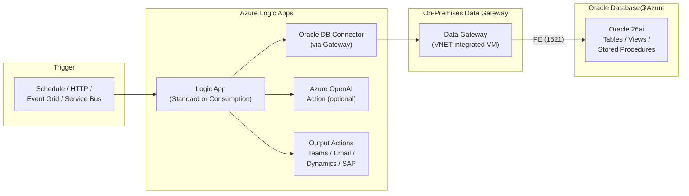
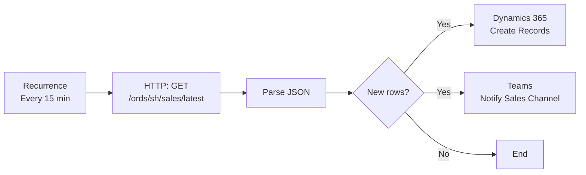
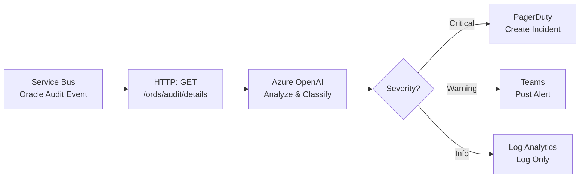
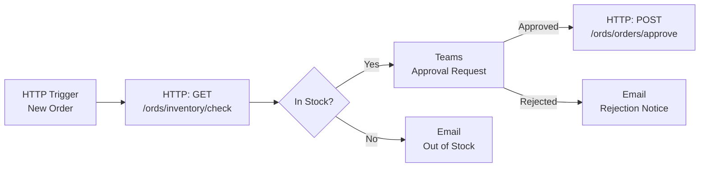
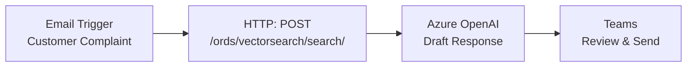

# Pattern 7 â€" Azure Logic Apps + Oracle Database@Azure

## Overview

Azure Logic Apps provides a low-code, event-driven workflow platform with 400+ enterprise connectors. When combined with Oracle Database@Azure, Logic Apps enables automated business processes that read from, write to, and orchestrate Oracle data â€" without writing custom application code.

### When to Use Logic Apps

| Use Case | Example |
|----------|---------|
| **Event-driven automation** | New row in Oracle â†' trigger approval workflow â†' update status |
| **Data integration** | Sync Oracle data to Dynamics 365, SAP, Salesforce, or ServiceNow on a schedule |
| **Business process orchestration** | Order received â†' validate inventory in Oracle â†' create shipping label â†' send notification |
| **Alert & notification** | Oracle Unified Audit detects anomaly â†' Logic App sends Teams/email alert |
| **AI-augmented workflows** | Oracle data â†' Azure OpenAI summarization â†' store result back in Oracle |
| **ETL / data movement** | Extract Oracle data â†' transform â†' load to Blob, Data Lake, or Fabric |
| **Approval workflows** | Pull pending records from Oracle â†' route for approval in Teams â†' update Oracle on decision |

---

## Architecture

### Option A: Oracle DB Connector (On-Premises Data Gateway)

For Oracle Database@Azure instances accessible via the on-premises data gateway:



**Oracle DB Connector capabilities:**
- `Get rows` â€" SELECT from Oracle tables/views with filters
- `Get row` â€" SELECT a single row by key
- `Insert row` â€" INSERT into Oracle tables
- `Update row` â€" UPDATE a row by key
- `Delete row` â€" DELETE a row by key
- `Execute stored procedure` â€" Call PL/SQL procedures with parameters

### Option B: ORDS REST Endpoints (via HTTP Connector â€" Recommended)

For governed, API-first access without a gateway â€" uses the ORDS endpoints already running on the Oracle 26ai instance:

```mermaid
graph LR
    subgraph "Trigger"
        TRIG["Schedule / HTTP /<br/>Event Grid / Service Bus"]
    end

    subgraph "Azure Logic Apps"
        LA["Logic App<br/>(Standard â€" VNET integrated)"]
        HTTP["HTTP Action<br/>+ Entra ID OAuth2"]
        AI["Azure OpenAI<br/>Action (optional)"]
        OUT["Output Actions<br/>Teams / Email /<br/>Dynamics / SAP /<br/>Blob Storage"]
    end

    subgraph "Azure VNET"
        APIM["Azure API Mgmt<br/>OAuth2 + Rate Limit"]
    end

    subgraph "Oracle Database@Azure"
        ORDS["ORDS REST<br/>Endpoints"]
        ODB["Oracle 26ai<br/>Tables / Views /<br/>Vector Search"]
        ORDS -->|"localhost"| ODB
    end

    subgraph "Governance"
        PV["Microsoft Purview<br/>DLP + Classification"]
    end

    subgraph "Observability"
        LA_MON["Log Analytics"]
    end

    TRIG --> LA
    LA --> HTTP
    HTTP -->|"OAuth2 Bearer Token"| APIM
    APIM -->|"Validated"| ORDS
    LA --> AI
    LA --> OUT
    LA -.->|"Diagnostics"| LA_MON
    PV -.->|"Classify"| ODB
```

**Why ORDS via HTTP is recommended:**
- No gateway infrastructure to manage
- ORDS runs natively on Oracle 26ai â€" no separate compute
- APIM enforces OAuth2, rate limiting, and WAF
- Supports vector search endpoints (same as Pattern 2)
- Logic App Standard supports VNET integration for private connectivity

---

## Prerequisites

### Option A (Oracle DB Connector)
- Azure Logic App (Standard or Consumption)
- On-premises data gateway installed on a VNET-integrated VM
- Oracle Database@Azure instance reachable from the gateway VM
- Oracle client libraries on the gateway VM
- Dedicated Oracle DB user for Logic Apps (least privilege)

### Option B (ORDS via HTTP â€" Recommended)
- Azure Logic App Standard (for VNET integration)
- ORDS enabled on Oracle 26ai instance with REST endpoints defined
- Azure API Management with OAuth2 validation (same APIM used by Foundry agents)
- Entra ID App Registration for Logic App to obtain OAuth2 tokens
- Network connectivity: Logic App VNET â†' APIM â†' ORDS on Oracle 26ai

---

## Private Networking

Private networking is critical to ensure all traffic between Logic Apps and Oracle Database@Azure stays within the Azure backbone â€" no data traverses the public internet.

### Network Topology

```mermaid
graph TB
    subgraph "Azure VNET â€" Hub (Enterprise)"
        FW["Azure Firewall<br/>Centralized Egress<br/>FQDN Filtering"]
        NW["Network Watcher<br/>NSG Flow Logs"]
    end

    subgraph "Azure VNET â€" Spoke"
        subgraph "Logic App Subnet<br/>(Delegated: Microsoft.Web/serverFarms)"
            LA["Logic App Standard<br/>VNET-integrated<br/>Outbound only"]
        end
        subgraph "APIM Subnet"
            APIM["Azure API Mgmt<br/>Internal mode<br/>OAuth2 + WAF"]
        end
        subgraph "Gateway Subnet (Option A only)"
            GW["Data Gateway VM<br/>Oracle Client<br/>installed"]
        end
        subgraph "Data Subnet"
            OPE["Oracle PE<br/>port 1521"]
            KVPE["Key Vault PE"]
            AOAIPE["Azure OpenAI PE"]
        end
    end

    subgraph "Oracle Database@Azure"
        ORDS["ORDS (port 8443)<br/>No public endpoint"]
        ODB["Oracle 26ai DB"]
        ORDS --> ODB
    end

    subgraph "Private DNS Zones"
        DNS1["privatelink.oraclecloud.com"]
        DNS2["privatelink.vaultcore.azure.net"]
        DNS3["privatelink.openai.azure.com"]
        DNS4["privatelink.azure-api.net<br/>(if APIM internal)"]
    end

    LA -->|"443"| APIM
    APIM -->|"8443"| ORDS
    GW -->|"1521"| OPE
    OPE --> ODB
    LA -->|"443"| KVPE
    LA -->|"443"| AOAIPE

    LA -->|"Egress"| FW
    NW -.->|"Flow Logs"| NW

    DNS1 -.-> OPE
    DNS2 -.-> KVPE
    DNS3 -.-> AOAIPE
    DNS4 -.-> APIM
```

### Option B: Private Network Path (ORDS via HTTP â€" Recommended)

Every hop in the Logic App â†' Oracle data path is private:

```
Logic App Standard (VNET-integrated, outbound via delegated subnet)
  â†' [NSG: allow 443 to APIM subnet] â†'
Azure API Management (internal mode, VNET-injected)
  â†' [NSG: allow 8443 to Oracle ORDS] â†'
ORDS on Oracle 26ai instance (no public endpoint, port 8443)
  â†' [localhost] â†'
Oracle 26ai Database
```

| # | Control | Details |
|---|---------|---------|
| 1 | **Logic App Standard â€" VNET integration** | Logic App outbound traffic routes through a delegated subnet (`Microsoft.Web/serverFarms`). No public IP on outbound. All calls to APIM, Key Vault, and OpenAI go through the VNET. |
| 2 | **APIM â€" internal VNET mode** | APIM deployed in internal mode within the spoke VNET. No public endpoint. Logic App reaches APIM via private IP within the VNET. |
| 3 | **APIM â†' ORDS â€" private connectivity** | APIM connects to ORDS on the Oracle 26ai instance via VNET Peering or via the Oracle Database@Azure private networking (port 8443). No internet traversal. |
| 4 | **Oracle ORDS â€" no public endpoint** | ORDS listens on port 8443 with public access disabled. Only APIM subnet is allowed inbound via NSG. |
| 5 | **Key Vault Private Endpoint** | Logic App retrieves OAuth2 client secrets or certificates from Key Vault via PE â€" no public access. |
| 6 | **Azure OpenAI Private Endpoint** | If using AI actions in the workflow, OpenAI calls route through PE â€" embedding and completion calls stay private. |
| 7 | **Private DNS Zones** | All Private Endpoints require Azure Private DNS Zones linked to the spoke VNET for name resolution: `privatelink.oraclecloud.com`, `privatelink.vaultcore.azure.net`, `privatelink.openai.azure.com`, `privatelink.azure-api.net`. |
| 8 | **Hub-spoke with Azure Firewall** | For enterprise deployments, all Logic App egress routes through Azure Firewall in the hub VNET via UDR. Firewall performs FQDN filtering and TLS inspection. |
| 9 | **DDoS Protection Standard** | Enabled on the spoke VNET. |
| 10 | **Network Watcher + NSG Flow Logs** | NSG Flow Logs enabled on all subnets for traffic audit and anomaly detection. |

### Option A: Private Network Path (Oracle DB Connector + Gateway)

```
Logic App (Consumption or Standard)
  â†' [Azure backbone] â†'
On-Premises Data Gateway VM (in VNET, no public IP)
  â†' [NSG: allow 1521 to Oracle PE subnet] â†'
Oracle Private Endpoint (port 1521)
  â†' Oracle 26ai Database
```

| # | Control | Details |
|---|---------|---------|
| 1 | **Gateway VM â€" VNET deployed, no public IP** | The on-premises data gateway VM sits inside the spoke VNET with no public IP. Only outbound to Azure Relay (for gateway registration) is allowed. |
| 2 | **Oracle Private Endpoint** | Gateway VM connects to Oracle via PE (port 1521). No public IP on Oracle. |
| 3 | **NSGs on Gateway subnet** | Inbound: deny all (gateway uses outbound Azure Relay). Outbound: allow 1521 to Oracle PE subnet; allow 443 to Azure Relay; deny all else. |
| 4 | **Logic App â†' Gateway** | Logic App Consumption connects to the gateway via the Azure Relay service (managed by Microsoft). Logic App Standard can connect via VNET integration for a fully private path. |
| 5 | **Gateway VM hardening** | Patch via Azure Update Manager; enable Defender for Servers; restrict RDP/SSH to Azure Bastion only. |

### NSG Rules â€" Detailed

#### Logic App Subnet NSGs

| Direction | Priority | Source | Destination | Port | Protocol | Action | Purpose |
|-----------|----------|--------|-------------|------|----------|--------|---------|
| Outbound | 100 | Logic App Subnet | APIM Subnet | 443 | TCP | Allow | Logic App â†' APIM |
| Outbound | 110 | Logic App Subnet | Key Vault PE | 443 | TCP | Allow | Logic App â†' Key Vault |
| Outbound | 120 | Logic App Subnet | OpenAI PE | 443 | TCP | Allow | Logic App â†' Azure OpenAI |
| Outbound | 130 | Logic App Subnet | AzureMonitor | 443 | TCP | Allow | Diagnostics |
| Outbound | 4096 | Logic App Subnet | Internet | Any | Any | Deny | Block all internet egress |

#### APIM Subnet NSGs

| Direction | Priority | Source | Destination | Port | Protocol | Action | Purpose |
|-----------|----------|--------|-------------|------|----------|--------|---------|
| Inbound | 100 | Logic App Subnet | APIM Subnet | 443 | TCP | Allow | Logic App â†' APIM |
| Inbound | 110 | Foundry/Agent IPs | APIM Subnet | 443 | TCP | Allow | Foundry agents (if shared APIM) |
| Inbound | 4096 | Any | APIM Subnet | Any | Any | Deny | Block all other inbound |
| Outbound | 100 | APIM Subnet | Oracle ORDS | 8443 | TCP | Allow | APIM â†' ORDS |
| Outbound | 4096 | APIM Subnet | Internet | Any | Any | Deny | Block all internet egress |

#### Gateway Subnet NSGs (Option A)

| Direction | Priority | Source | Destination | Port | Protocol | Action | Purpose |
|-----------|----------|--------|-------------|------|----------|--------|---------|
| Inbound | 4096 | Any | Gateway Subnet | Any | Any | Deny | No inbound (gateway uses outbound Relay) |
| Outbound | 100 | Gateway Subnet | Oracle PE Subnet | 1521 | TCP | Allow | Gateway â†' Oracle |
| Outbound | 110 | Gateway Subnet | AzureCloud | 443 | TCP | Allow | Gateway â†' Azure Relay |
| Outbound | 4096 | Gateway Subnet | Internet | Any | Any | Deny | Block all internet egress |

---

## Setup Steps â€" Option B (ORDS via HTTP)

### Step 1 â€" Register Logic App in Entra ID

1. **Create an App Registration** for the Logic App (or reuse an existing one):
   - Name: `LogicApp-Oracle-Integration`
   - Add API permission for the ORDS App Registration scope: `ORDS.Read`, `ORDS.Write`
   - Generate a client secret (or use Managed Identity for Logic App Standard)

### Step 2 â€" Configure Logic App with VNET Integration

2. **Create a Logic App Standard** in the same region as Oracle Database@Azure
3. **Enable VNET integration** â€" connect to the same spoke VNET (or peered VNET) that has access to APIM
   - Navigate to Logic App â†' Networking â†' VNET Integration â†' Add VNET
   - Select the delegated subnet (`Microsoft.Web/serverFarms`)
   - Set `WEBSITE_VNET_ROUTE_ALL = 1` to route all outbound traffic through the VNET
4. **Enable Managed Identity** â€" use system-assigned identity for Key Vault and Entra ID token acquisition

### Step 3 â€" Build the Workflow

5. **Add a trigger** â€" choose the appropriate trigger for your use case:

   | Trigger | Use Case |
   |---------|----------|
   | `Recurrence` | Scheduled polling (e.g., every 15 min) |
   | `HTTP Request` | Webhook â€" external systems call the Logic App |
   | `Service Bus` | Event-driven â€" message arrives on a queue/topic |
   | `Event Grid` | Azure resource events (e.g., Blob upload) |
   | `Teams` | Approval request triggers from Teams |

6. **Add an HTTP action** to call ORDS via APIM:

   ```json
   {
     "type": "Http",
     "inputs": {
       "method": "GET",
       "uri": "https://<apim-name>.azure-api.net/ords/sh/sales/summary",
       "authentication": {
         "type": "ActiveDirectoryOAuth",
         "tenant": "<tenant-id>",
         "audience": "<ords-app-registration-client-id>",
         "clientId": "<logic-app-client-id>",
         "secret": "@parameters('ords-client-secret')"
       }
     }
   }
   ```

   For **Managed Identity** (preferred â€" no secrets):
   ```json
   {
     "type": "Http",
     "inputs": {
       "method": "GET",
       "uri": "https://<apim-name>.azure-api.net/ords/sh/sales/summary",
       "authentication": {
         "type": "ManagedServiceIdentity",
         "audience": "<ords-app-registration-client-id>"
       }
     }
   }
   ```

7. **Parse the JSON response** â€" add a `Parse JSON` action with the ORDS response schema
8. **Add downstream actions** â€" Teams notification, email, Dynamics update, Blob write, etc.

### Step 4 â€" Add AI Processing (Optional)

9. **Call Azure OpenAI** to summarize or analyze Oracle data within the workflow:

   ```json
   {
     "type": "Http",
     "inputs": {
       "method": "POST",
       "uri": "https://<openai-resource>.openai.azure.com/openai/deployments/gpt-4.1/chat/completions?api-version=2024-02-01",
       "body": {
         "messages": [
           {"role": "system", "content": "Summarize the following Oracle sales data"},
           {"role": "user", "content": "@{body('Parse_ORDS_Response')}"}
         ]
       },
       "authentication": {
         "type": "ManagedServiceIdentity",
         "audience": "https://cognitiveservices.azure.com"
       }
     }
   }
   ```

### Step 5 â€" Oracle Vector Search from Logic Apps

10. **Call the vector search ORDS endpoint** (same endpoint used by Foundry agents in Pattern 2):

    ```json
    {
      "type": "Http",
      "inputs": {
        "method": "POST",
        "uri": "https://<apim-name>.azure-api.net/ords/clinical_app/vectorsearch/search/",
        "body": {
          "p_query": "severe breathing complications",
          "p_top_k": 5
        },
        "authentication": {
          "type": "ManagedServiceIdentity",
          "audience": "<ords-app-registration-client-id>"
        }
      }
    }
    ```

    This enables Logic Apps to perform semantic search over Oracle data â€" useful for intelligent routing, alert triage, or content matching workflows.

---

## Common Workflow Patterns

### Pattern A: Scheduled Oracle Data Sync



### Pattern B: AI-Augmented Alert Pipeline



### Pattern C: Approval Workflow with Oracle Write-Back



### Pattern D: Vector Search Triage



---

## RBAC & Security

| Layer | Control | Details |
|-------|---------|---------|
| **Entra ID** | App Registration: `LogicApp-Oracle-Integration` | OAuth2 client credentials for ORDS access via APIM |
| **Entra ID** | Managed Identity (preferred) | Logic App Standard system-assigned identity â€" no secrets stored |
| **APIM** | OAuth2 validation | Same APIM policies as Pattern 2; validates Logic App token before forwarding to ORDS |
| **APIM** | Rate limiting | Per-client throttling; prevents Logic App from overwhelming ORDS |
| **Oracle DB** | Dedicated Logic App user | `logic_app_user` with specific `SELECT`/`INSERT`/`UPDATE` grants per workflow |
| **Oracle DB** | VPD row-level security | Restrict which rows the Logic App user can access |
| **Oracle DB** | Data Redaction | Mask PII columns in ORDS responses consumed by Logic Apps |
| **Logic App** | Parameters & Key Vault | Store secrets (client secrets, API keys) in Key Vault; reference via `@parameters()` |
| **Purview** | DLP + Classification | Same Purview governance as Pattern 2 applies to ORDS endpoints consumed by Logic Apps |

---

## Combining Logic Apps with Other Patterns

Logic Apps works best when combined with other patterns:

| Combination | How It Works |
|-------------|--------------|
| **Pattern 7 + Pattern 2 (Foundry)** | Logic App triggers a Foundry agent run via API when an Oracle event occurs; agent performs complex reasoning and writes results back via ORDS |
| **Pattern 7 + Pattern 1 (MCP)** | Logic App orchestrates multi-step workflows that include MCP tool calls for ad-hoc Oracle queries |
| **Pattern 7 + Pattern 1 (Copilot Studio)** | Logic App performs backend Oracle operations; Copilot Studio handles the user-facing conversational interface |
| **Pattern 7 + Pattern 6 (Power Apps)** | Power App triggers a Logic App flow for complex Oracle operations that exceed Power Automate capabilities |

---

## Monitoring & Cost

| Control | Details |
|---------|---------|
| **Run history** | Logic Apps provides built-in run history with input/output for every action â€" useful for debugging ORDS calls |
| **Log Analytics** | Send Logic App diagnostics to the same Log Analytics workspace used by Foundry/MCP |
| **Alerts** | Alert on failed runs, high latency ORDS calls, or throttled APIM requests |
| **Cost model** | Consumption: per-action billing; Standard: fixed App Service Plan + per-execution |
| **Cost optimization** | Use batching for bulk Oracle operations; avoid polling â€" use Service Bus/Event Grid triggers instead |

---

## Option A vs Option B Comparison

| Aspect | Option A: Oracle DB Connector | Option B: ORDS via HTTP |
|--------|-------------------------------|-------------------------|
| **Setup effort** | Medium â€" requires gateway VM | Low â€" uses existing ORDS + APIM |
| **Infrastructure** | Gateway VM to manage and patch | No additional infrastructure |
| **Operations** | `GET/INSERT/UPDATE/DELETE rows` | Any REST endpoint you define in ORDS |
| **Vector search** | ❌ Not supported | âœ... Same ORDS vector endpoints as Pattern 2 |
| **AI integration** | Possible but separate from data path | âœ... Seamless â€" ORDS response â†' OpenAI in same flow |
| **Security** | Gateway auth + Oracle credentials | Entra ID OAuth2 + APIM + Managed Identity |
| **Private networking** | Gateway on VNET + Oracle PE | Logic App VNET integration + APIM internal + ORDS private |
| **Recommended for** | Legacy connectors, simple CRUD | Enterprise, governed, AI-augmented workflows |
