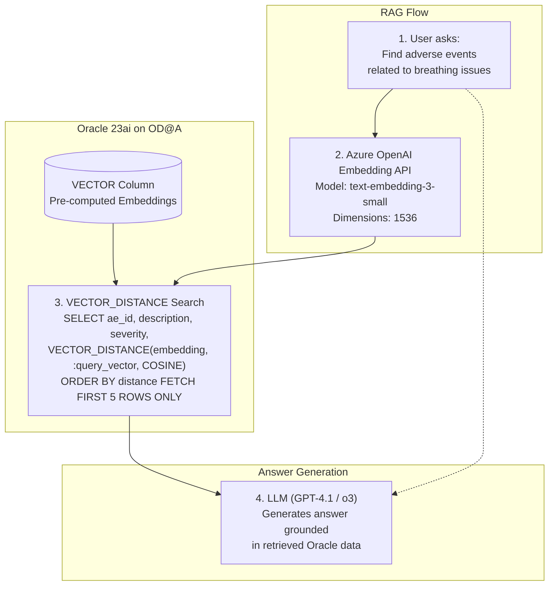

# 14. Path 6 — Oracle 23ai Vector Search + Azure OpenAI RAG

## 14.1 Overview

Oracle Database 23ai introduces native **VECTOR** data type and **VECTOR_DISTANCE** function, enabling semantic similarity search directly inside the database. Combined with **Azure OpenAI embeddings**, this creates a powerful RAG (Retrieval-Augmented Generation) pattern without a separate vector database.

## 14.2 Architecture



## 14.3 Prerequisites

- Oracle Database 23ai on OD@A (ADBS or Exadata with 23ai)
- Azure OpenAI resource with `text-embedding-3-small` or `text-embedding-3-large` deployed
- Oracle REST Data Services (ORDS) configured for the vector search schema

## 14.4 Implementation Steps

### Step 1: Create the Vector Table

```sql
-- Create table with native VECTOR column
CREATE TABLE clinical_app.adverse_events (
    ae_id         NUMBER GENERATED ALWAYS AS IDENTITY PRIMARY KEY,
    enrollment_id NUMBER,
    event_date    DATE,
    severity      VARCHAR2(20),
    description   CLOB,
    embedding     VECTOR(1536, FLOAT64)  -- 1536 dimensions for text-embedding-3-small
);
```

### Step 2: Generate and Store Embeddings

```sql
-- PL/SQL procedure to generate embeddings via Azure OpenAI
CREATE OR REPLACE PROCEDURE generate_embedding(
    p_ae_id IN NUMBER
) IS
    v_description CLOB;
    v_embedding   VECTOR(1536, FLOAT64);
    v_response    CLOB;
BEGIN
    SELECT description INTO v_description
    FROM clinical_app.adverse_events
    WHERE ae_id = p_ae_id;

    -- Call Azure OpenAI endpoint using UTL_HTTP or DBMS_CLOUD
    v_response := DBMS_CLOUD.send_request(
        credential_name => 'AZURE_OPENAI_CRED',
        uri => 'https://<your-resource>.openai.azure.com/openai/deployments/'
               || 'text-embedding-3-small/embeddings?api-version=2024-02-01',
        method => 'POST',
        body => JSON_OBJECT('input' VALUE v_description)
    );

    -- Parse embedding from response and update table
    UPDATE clinical_app.adverse_events
    SET embedding = JSON_VALUE(v_response, '$.data[0].embedding'
                              RETURNING VECTOR(1536, FLOAT64))
    WHERE ae_id = p_ae_id;

    COMMIT;
END;
/
```

### Step 3: Create Vector Index

```sql
-- Create vector index for fast similarity search
CREATE VECTOR INDEX idx_ae_embedding
ON clinical_app.adverse_events(embedding)
ORGANIZATION NEIGHBOR PARTITIONS
DISTANCE COSINE
WITH TARGET ACCURACY 95;
```

### Step 4: Create ORDS Endpoint for Vector Search

```sql
-- ORDS REST endpoint for semantic search
BEGIN
    ORDS.DEFINE_MODULE(
        p_module_name => 'vectorsearch',
        p_base_path   => '/vectorsearch/',
        p_items_per_page => 5
    );

    ORDS.DEFINE_TEMPLATE(
        p_module_name  => 'vectorsearch',
        p_pattern      => 'search_adverse_event/'
    );

    ORDS.DEFINE_HANDLER(
        p_module_name  => 'vectorsearch',
        p_pattern      => 'search_adverse_event/',
        p_method       => 'POST',
        p_source_type  => ORDS.source_type_plsql,
        p_source       => '
        DECLARE
            v_query_vector VECTOR(1536, FLOAT64);
        BEGIN
            -- Generate embedding for the search query
            v_query_vector := generate_query_embedding(:p_query);

            -- Return top 5 matches
            OPEN :result FOR
                SELECT ae_id, description, severity, event_date,
                       VECTOR_DISTANCE(embedding, v_query_vector, COSINE) AS distance
                FROM clinical_app.adverse_events
                ORDER BY distance
                FETCH FIRST 5 ROWS ONLY;
        END;'
    );
    COMMIT;
END;
/
```

### Step 5: Integrate with AI Agent

Register the ORDS vector search endpoint as a tool in Microsoft Foundry:

```json
{
  "type": "function",
  "function": {
    "name": "search_adverse_events",
    "description": "Semantic vector search for clinical adverse events using AI embeddings",
    "parameters": {
      "type": "object",
      "properties": {
        "p_query": {
          "type": "string",
          "description": "Natural language query (e.g., 'severe breathing problems')"
        }
      },
      "required": ["p_query"]
    }
  }
}
```

## 14.5 Design Considerations

| Consideration | Guidance |
|--------------|----------|
| **Embedding model** | `text-embedding-3-small` (1536d) for cost efficiency; `text-embedding-3-large` (3072d) for higher accuracy |
| **Vector index** | Use `ORGANIZATION NEIGHBOR PARTITIONS` for large tables (>100K rows) |
| **Distance metric** | `COSINE` for normalized embeddings; `DOT_PRODUCT` for unnormalized |
| **Embedding refresh** | Batch-update embeddings when source data changes; use triggers or scheduled jobs |
| **Hybrid search** | Combine vector distance with traditional SQL filters for higher precision |
| **Cost** | Azure OpenAI embedding calls are billed per token; batch for efficiency |

## 14.6 Hybrid Search Example (Vector + SQL Filters)

```sql
-- Combine semantic search with traditional filters
SELECT ae_id, description, severity, event_date,
       VECTOR_DISTANCE(embedding, :query_vector, COSINE) AS distance
FROM clinical_app.adverse_events
WHERE severity IN ('SEVERE', 'LIFE_THREATENING')
  AND event_date >= DATE '2025-01-01'
ORDER BY distance
FETCH FIRST 10 ROWS ONLY;
```
