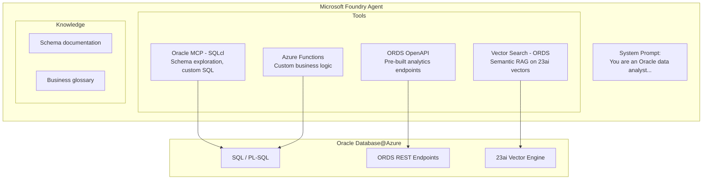
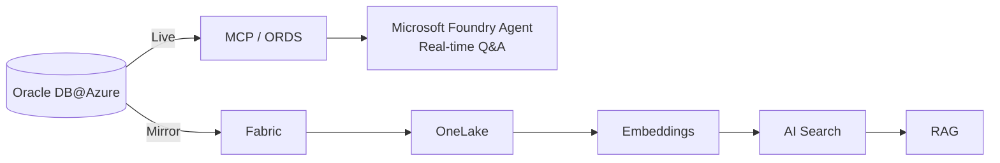

# 15. Combined Patterns — Multi-Path Architectures

Real-world deployments often combine multiple paths. Here are the most common patterns:

## 15.1 Pattern: Microsoft Foundry Agent + MCP + Vector Search (Full Agentic RAG)

**When to use:** Most comprehensive pattern for teams that need SQL access, pre-built analytics, AND semantic search.

## 15.2 Pattern: Copilot Studio (Business) + Microsoft Foundry (Technical)

Deploy separate experiences for different audiences:

| Audience | Tool | Data Access |
|----------|------|-------------|
| Business users | Copilot Studio | Gateway → Oracle (simple queries) |
| Data analysts | Fabric Data Agent | Mirrored Oracle data in OneLake |
| Developers | Microsoft Foundry Agent + MCP | Full SQL + vector search |
| DBAs | VS Code + MCP | Schema management, automation |

## 15.3 Pattern: ETL + RAG Hybrid

**When to use:** Some questions need real-time data; others benefit from pre-computed embeddings on historical data.
