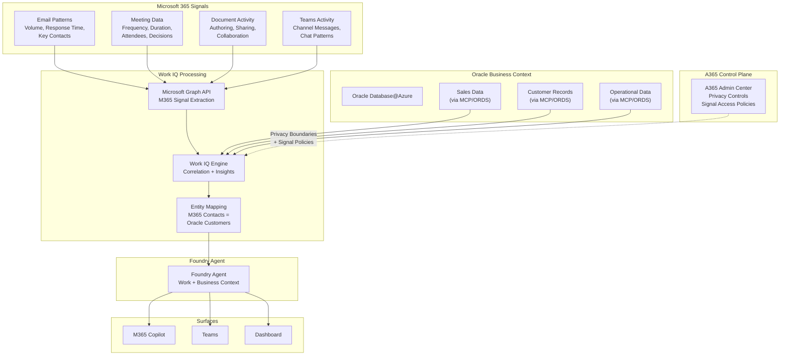
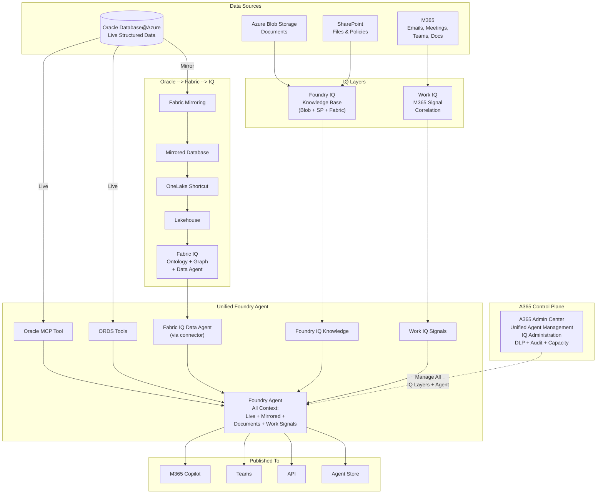

# AI Enrichment -- Work IQ, Unified IQ, and A365 Control Plane

##  Work IQ -- M365 Productivity Signals + Oracle Business Data

### What is Work IQ

Work IQ connects Microsoft 365 productivity signals (emails, meetings, documents, Teams activity, calendar patterns) with Oracle business data to surface organizational intelligence. It bridges *how teams work* with *what the business data shows*.

### Architecture



### How Work IQ Connects M365 Signals to Oracle Data

Work IQ analyzes M365 Graph signals and correlates them with Oracle business data:

| M365 Signal | Oracle Data | Combined Insight |
|---|---|---|
| Email volume with customer contacts | Oracle CRM: deal stage, revenue | "Accounts with >50 emails/month are 2x more likely to close" |
| Meeting frequency per project | Oracle: project timeline, budget | "Projects with weekly Oracle data review meetings deliver 30% faster" |
| Teams channel activity | Oracle: support ticket data | "Teams channels linked to high-priority tickets get 40% faster resolution" |
| Document collaboration patterns | Oracle: product development timeline | "Products with cross-team doc collaboration launch 3 weeks earlier" |
| Calendar blocked time | Oracle: quarterly sales targets | "Reps with >60% calendar utilization miss target by 15%" |

### Setup Steps (End-to-End)

#### Step 1 -- Prerequisites

Work IQ uses the Microsoft 365 Copilot Chat API as its backend. Before enabling:

- **Required licenses**: Microsoft 365 Copilot license for each user + M365 base license (E3, E5, Business Premium)
- **Required admin role**: Global Administrator, Privileged Role Administrator, Cloud Application Administrator, or Application Administrator
- **Required access**: Microsoft Entra admin center (https://entra.microsoft.com) + Microsoft 365 admin center (https://admin.microsoft.com)

#### Step 2 -- Verify and Assign Copilot Licenses

1. Sign in to M365 admin center --> **Billing** --> **Licenses**
2. Verify **Microsoft 365 Copilot** is available with sufficient licenses
3. Navigate to **Users** --> **Active users** --> select users --> **Manage product licenses** --> assign Copilot license
4. Wait up to 24 hours for Copilot features to propagate

#### Step 3 -- Configure Copilot in Your Tenant

5. **Enable MFA**:
   - Microsoft Entra admin center --> **Protection** --> **Conditional Access**
   - Ensure MFA is enabled for all users

6. **Enable audit logging**:
   - Microsoft Purview portal (https://purview.microsoft.com)
   - Enable unified audit logging with appropriate retention policies

7. **Configure update channels**:
   - M365 admin center --> **Settings** --> **Org settings** --> **Office installation options**
   - Use **Current Channel** (recommended) or **Monthly Enterprise Channel**
   - Note: Semi-Annual Enterprise Channel is NOT supported for Copilot

8. **Configure Copilot settings**:
   - M365 admin center --> **Copilot**
   - Review data security and compliance controls
   - Configure plugin and extension permissions

#### Step 4 -- Grant Admin Consent for Work IQ

**Quick method (recommended):**

9. Open this URL in your browser (replace `{your-tenant-id}` with your tenant ID or domain):
   ```
   https://login.microsoftonline.com/{your-tenant-id}/adminconsent?client_id=ba081686-5d24-4bc6-a0d6-d034ecffed87
   ```
10. Sign in with your admin account and click **Accept**

**If the Quick Start URL fails** (AADSTS650052 / Access Denied):

11. Run the enablement script to provision missing service principals:
    ```powershell
    # Prerequisites: Install-Module Microsoft.Graph -Scope CurrentUser
    .\scripts\Enable-WorkIQToolsForTenant.ps1
    ```
    This script provisions all MCP Server service principals (Work IQ Tools, Mail, Calendar, Teams, OneDrive, SharePoint, Word, Admin, Me, M365 Copilot) and grants admin consent.

**Alternative -- via Entra Admin Center:**

12. Go to Microsoft Entra admin center --> **Identity** --> **Applications** --> **Enterprise applications**
13. Find **Work IQ CLI** in the list
14. Select **Permissions** under Security
15. Click **Grant admin consent for [Your Organization]** --> **Accept**

**Alternative -- via PowerShell:**

```powershell
Install-Module Microsoft.Graph -Scope CurrentUser
Connect-MgGraph -Scopes "Application.ReadWrite.All", "DelegatedPermissionGrant.ReadWrite.All"

$workIqApp = Get-MgServicePrincipal -Filter "displayName eq 'Work IQ CLI'"
$graphSp = Get-MgServicePrincipal -Filter "displayName eq 'Microsoft Graph'"

$requiredScopes = "Sites.Read.All Mail.Read People.Read.All OnlineMeetingTranscript.Read.All Chat.Read ChannelMessage.Read.All ExternalItem.Read.All"

$params = @{
    ClientId    = $workIqApp.Id
    ConsentType = "AllPrincipals"
    ResourceId  = $graphSp.Id
    Scope       = $requiredScopes
}
New-MgOauth2PermissionGrant -BodyParameter $params
```

#### Step 5 -- Required API Permissions (Reference)

Work IQ requires these delegated permissions (all must be admin-consented):

| Permission | What It Accesses |
|---|---|
| Sites.Read.All | Read items in all site collections |
| Mail.Read | Read user mail |
| People.Read.All | Read all users' relevant people lists |
| OnlineMeetingTranscript.Read.All | Read all transcripts of online meetings |
| Chat.Read | Read user chat messages |
| ChannelMessage.Read.All | Read all channel messages |
| ExternalItem.Read.All | Read external items |

#### Step 6 -- Configure User Access

16. **Verify application access**: Entra admin center --> **Enterprise applications** --> **Work IQ CLI** --> **Users and groups** (all users with Copilot licenses have access by default)

17. **Restrict access (optional)**: In the Work IQ CLI enterprise app --> **Properties** --> set **Assignment required?** to **Yes** --> then add specific users/groups under **Users and groups**

18. **Configure Conditional Access (recommended)**:
    - Entra admin center --> **Protection** --> **Conditional Access** --> new policy
    - Target: Work IQ application
    - Grant: Require MFA, compliant device, or other controls

#### Step 7 -- Connect Oracle Business Data Context

19. **Create a Foundry Agent** that bridges Work IQ + Oracle:
    - Add Oracle MCP Server as a tool (for structured Oracle queries)
    - Add ORDS endpoints as OpenAPI tools (for governed analytics)
    - Enable Work IQ as a signal source

20. **Map business entities** between M365 and Oracle:

    | M365 Entity | Oracle Entity | Mapping Key |
    |---|---|---|
    | M365 Contacts (email addresses) | Oracle `CUSTOMERS` table | Email address match |
    | M365 Projects (Planner/Teams) | Oracle `PROJECTS` table | Project code tag in Teams channel name |
    | M365 Users (department) | Oracle `EMPLOYEES` table | Employee ID or UPN |
    | M365 Teams channels | Oracle `SUPPORT_CASES` | Channel naming convention (e.g., `case-12345`) |

### Troubleshooting

| Issue | Cause | Fix |
|---|---|---|
| "Access denied" / AADSTS error on consent URL | Work IQ Tools service principal not provisioned | Run `Enable-WorkIQToolsForTenant.ps1` |
| Work IQ not visible in Enterprise Applications | Service principal not yet provisioned | Run `Enable-WorkIQToolsForTenant.ps1` |
| "Admin approval required" prompt | Admin consent not granted | Use the Quick Start URL or Entra admin center method |
| "Insufficient permissions" error | Missing API permissions | Verify all 7 required permissions are consented |
| Users can't sign in | Conditional Access blocking | Review Conditional Access policies |
| "License required" error | User lacks Copilot license | Assign Microsoft 365 Copilot license |
| Features not appearing | License propagation delay | Wait up to 24 hours after license assignment |

### Privacy and Security Considerations

| Control | Details |
|---|---|
| **Data accessed** | Work IQ accesses email content, meeting transcripts, Teams messages, SharePoint/OneDrive documents, and contact information via delegated Graph API permissions |
| **Delegated permissions** | All access runs under the signed-in user's identity -- Work IQ can only see what the user can already see |
| **Assignment control** | Restrict access by setting **Assignment required = Yes** on the Work IQ CLI enterprise app and adding specific users/groups |
| **Conditional Access** | Apply MFA, compliant device, and location-based policies specifically to the Work IQ application |
| **DLP enforcement** | Ensure M365 DLP policies are in place; configure sensitivity labels for classified content |
| **Audit logging** | Enable unified audit logging in Microsoft Purview; monitor Work IQ activity via Entra sign-in logs |
| **Compliance** | Work IQ respects your organization's existing access controls; data is subject to existing compliance policies |
| **Regular review** | Periodically audit who has access; review consent grants in Enterprise applications |
| **Copilot Chat API** | Work IQ uses the M365 Copilot Chat API (currently in beta) -- review Microsoft's terms for production use |

---

##  Unified IQ -- All Layers Combined

### Architecture

Unified IQ combines all three IQ layers (Fabric IQ + Foundry IQ + Work IQ) into a single Foundry agent with complete organizational intelligence. The agent can reason across structured Oracle data, mirrored analytics, unstructured documents, and M365 work signals.



### What the Unified Agent Can Answer

| Question Type | IQ Layer Used | Example |
|---|---|---|
| Live Oracle data | MCP/ORDS (Pattern 2/3) | "What were Q1 sales by product category?" |
| Mirrored analytics + ontology | Fabric IQ (Pattern 11) | "How do Customer segments correlate with Promotion effectiveness?" |
| Document knowledge | Foundry IQ (Pattern 12) | "What does our compliance policy say about data retention?" |
| Work signals + business data | Work IQ (Pattern 13) | "Which sales reps have the most customer meetings but lowest close rates?" |
| Cross-layer reasoning | All layers | "Our APAC team's meeting frequency dropped 30% last month -- how did that affect Q1 sales in that region, and does our SOP require escalation when sales dip beyond 20%?" |

---

## A365 Control Plane -- Managing All Patterns

Microsoft 365 Admin Center (A365) provides a unified control plane for managing agents, IQ services, and governance across all patterns.

### A365 Management Capabilities

| Capability | What It Controls | Applicable Patterns |
|---|---|---|
| **Agent Management** | Enable/disable agents for the tenant; set who can create and publish agents | All (1-13) |
| **Copilot Controls** | Manage Copilot features, data access, grounding sources; control Copilot availability | 1, 8, 10, 11, 12, 13 |
| **Foundry Administration** | Manage Foundry projects, model deployments, tool registrations | 2, 3, 4, 9, 11, 13 |
| **IQ Administration** | Enable Fabric IQ / Foundry IQ / Work IQ; set processing budgets; monitor pipeline health | 10, 11, 12, 13 |
| **DLP Policies** | Prevent sensitive data from appearing in agent responses; block PII/PHI patterns | All (1-13) |
| **Sensitivity Labels** | Apply and enforce MIP labels on agent responses and knowledge bases | All (1-13) |
| **Audit Logs** | Centralized audit of agent usage, queries, tool calls, and data access | All (1-13) |
| **Conditional Access** | MFA, device compliance, location restrictions for agent access | All (1-13) |
| **Capacity Management** | Fabric CU allocation, Foundry compute limits, OpenAI token budgets | 2-13 |
| **Publishing Policies** | Control where agents can be published (Teams, M365 Copilot, Agent Store, API) | All (1-13) |
| **Privacy Controls** | Set Work IQ signal boundaries, minimum aggregation group size, opt-out policies | 12, 13 |

### A365 Setup for Agent Governance

1. **M365 Admin Center** --> **Billing** --> **Licenses**:
   - Verify Microsoft 365 Copilot licenses are available and assigned to users
   - Copilot license is required for Work IQ access

2. **M365 Admin Center** --> **Copilot**:
   - Review data security and compliance controls
   - Configure plugin and extension permissions
   - Set update channel to Current Channel or Monthly Enterprise Channel (Semi-Annual NOT supported)

3. **M365 Admin Center** --> **Settings** --> **Org settings**:
   - Configure Copilot & AI settings
   - Enable Foundry agent publishing
   - Set default DLP policies for all agent responses

4. **Microsoft Entra Admin Center** --> **Identity** --> **Applications** --> **Enterprise applications**:
   - Grant admin consent for Work IQ CLI (see Work IQ setup steps above)
   - Configure user assignment and Conditional Access policies
   - Review consented permissions periodically

5. **Microsoft Entra Admin Center** --> **Protection** --> **Conditional Access**:
   - Create policies targeting Work IQ and Foundry agent applications
   - Require MFA, compliant devices, and named locations

6. **Fabric Admin Portal** --> **Tenant settings**:
   - Enable Fabric IQ workload
   - Enable Ontology (preview) and Graph (preview) settings
   - Set Fabric capacity budgets for IQ workloads

7. **Microsoft Purview portal** (https://purview.microsoft.com):
   - Enable unified audit logging with retention policies
   - Configure DLP policies that apply to all agent responses
   - Set auto-labeling policies for documents ingested by Foundry IQ
   - Enable audit log forwarding to Log Analytics

### Additional Resources

- [Work IQ Admin Instructions](https://github.com/microsoft/work-iq/blob/main/ADMIN-INSTRUCTIONS.md)
- [Work IQ README and Installation Guide](https://github.com/microsoft/work-iq-mcp/blob/main/README.md)
- [Microsoft 365 Copilot Documentation](https://learn.microsoft.com/microsoft-365-copilot/)
- [Microsoft Entra Admin Consent Documentation](https://learn.microsoft.com/entra/identity/enterprise-apps/grant-admin-consent)
- [Microsoft Graph Permissions Reference](https://learn.microsoft.com/graph/permissions-reference)
