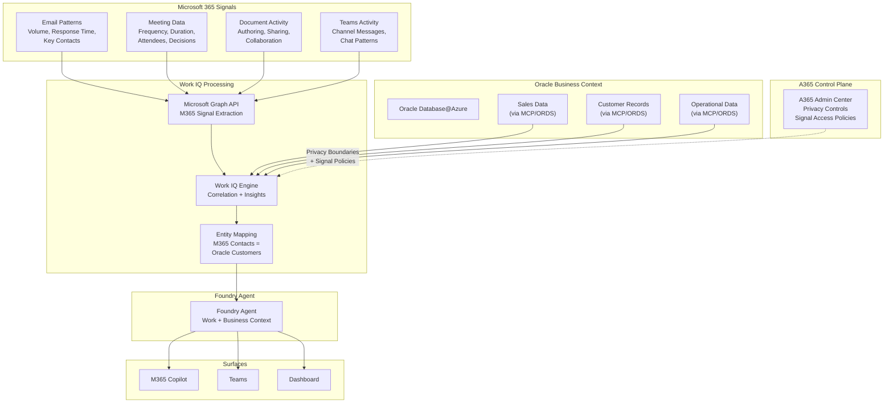
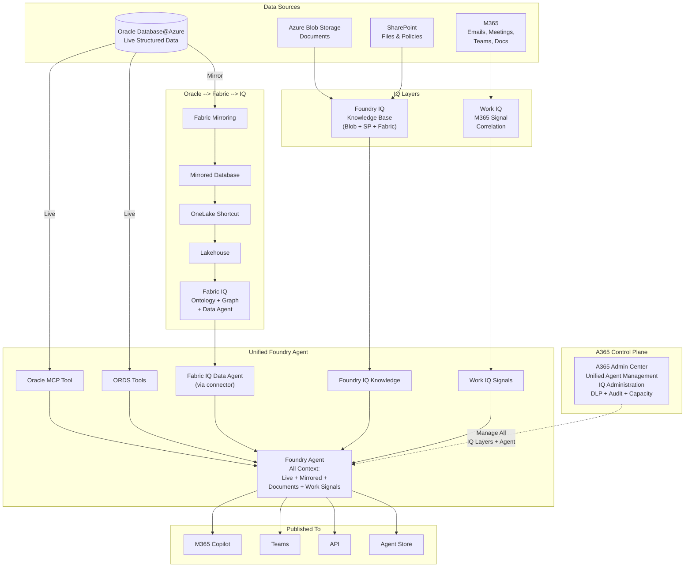

# AI Enrichment -- Work IQ, Unified IQ, and A365 Control Plane

## Pattern 12: Work IQ -- M365 Productivity Signals + Oracle Business Data

### What is Work IQ

Work IQ connects Microsoft 365 productivity signals (emails, meetings, documents, Teams activity, calendar patterns) with Oracle business data to surface organizational intelligence. It bridges *how teams work* with *what the business data shows*.

### Architecture

### How Work IQ Connects M365 Signals to Oracle Data

Work IQ analyzes M365 Graph signals and correlates them with Oracle business data:

| M365 Signal | Oracle Data | Combined Insight |
|---|---|---|
| Email volume with customer contacts | Oracle CRM: deal stage, revenue | "Accounts with >50 emails/month are 2x more likely to close" |
| Meeting frequency per project | Oracle: project timeline, budget | "Projects with weekly Oracle data review meetings deliver 30% faster" |
| Teams channel activity | Oracle: support ticket data | "Teams channels linked to high-priority tickets get 40% faster resolution" |
| Document collaboration patterns | Oracle: product development timeline | "Products with cross-team doc collaboration launch 3 weeks earlier" |
| Calendar blocked time | Oracle: quarterly sales targets | "Reps with >60% calendar utilization miss target by 15%" |

### Setup Steps (End-to-End)

#### Step 1 -- Enable Work IQ

1. **Enable Work IQ** in Microsoft 365 Admin Center:
   - M365 Admin --> Settings --> Org settings --> Work IQ
   - Consent to Microsoft Graph data access for insights
   - Set privacy controls: minimum group size (default 5), exclude specific departments if needed

#### Step 2 -- Configure M365 Graph Data Access

2. **Define which M365 signals are analyzed**:
   - Email metadata (NOT content): sender, recipient, timestamp, response time
   - Meeting metadata: organizer, attendees, duration, recurrence
   - Document metadata: author, editors, sharing scope, last modified
   - Teams: channel activity, message counts (NOT message content)

3. **Set privacy boundaries**:
   - Individual-level data aggregated to team/department level
   - No email/message content -- only metadata patterns
   - Opt-out available for specific users or departments

#### Step 3 -- Connect Oracle Business Data Context

4. **Create a Foundry Agent** that bridges Work IQ + Oracle:
   - Add Oracle MCP Server as a tool (for structured Oracle queries)
   - Add ORDS endpoints as OpenAPI tools (for governed analytics)
   - Enable Work IQ as a signal source

5. **Map business entities** between M365 and Oracle:

   | M365 Entity | Oracle Entity | Mapping Key |
   |---|---|---|
   | M365 Contacts (email addresses) | Oracle `CUSTOMERS` table | Email address match |
   | M365 Projects (Planner/Teams) | Oracle `PROJECTS` table | Project code tag in Teams channel name |
   | M365 Users (department) | Oracle `EMPLOYEES` table | Employee ID or UPN |
   | M365 Teams channels | Oracle `SUPPORT_CASES` | Channel naming convention (e.g., `case-12345`) |

#### Step 4 -- Configure Insights and Govern via A365

6. **Define insight categories**:
   - Sales effectiveness: email/meeting patterns vs Oracle revenue data
   - Operational efficiency: collaboration patterns vs Oracle operational metrics
   - Customer engagement: contact frequency vs Oracle CRM stages

7. **Manage via A365 Admin Center**:
   - Control which M365 signals are analyzed (email, meetings, docs, Teams)
   - Set privacy boundaries per department/region
   - Monitor Work IQ data access in audit logs
   - Enable/disable Work IQ insights for specific agent deployments
   - Set DLP policies on combined work + business insights

### Privacy and Compliance Considerations

| Control | Details |
|---|---|
| **No content access** | Work IQ analyzes metadata patterns only -- never reads email body, message content, or document text |
| **Minimum aggregation** | Insights are aggregated at team level (minimum group size: 5) to prevent individual identification |
| **Opt-out** | Individual users or departments can opt out via M365 Admin Center |
| **GDPR compliance** | Data stays within the tenant's M365 region; subject to M365 DPA |
| **Purview integration** | Combined insights inherit Purview sensitivity labels from both M365 and Oracle data |
| **Audit trail** | All Work IQ signal access logged in A365 audit logs |

---

## Pattern 13: Unified IQ -- All Layers Combined

### Architecture

Unified IQ combines all three IQ layers (Fabric IQ + Foundry IQ + Work IQ) into a single Foundry agent with complete organizational intelligence. The agent can reason across structured Oracle data, mirrored analytics, unstructured documents, and M365 work signals.

### What the Unified Agent Can Answer

| Question Type | IQ Layer Used | Example |
|---|---|---|
| Live Oracle data | MCP/ORDS (Pattern 2/3) | "What were Q1 sales by product category?" |
| Mirrored analytics + ontology | Fabric IQ (Pattern 10) | "How do Customer segments correlate with Promotion effectiveness?" |
| Document knowledge | Foundry IQ (Pattern 11) | "What does our compliance policy say about data retention?" |
| Work signals + business data | Work IQ (Pattern 12) | "Which sales reps have the most customer meetings but lowest close rates?" |
| Cross-layer reasoning | All layers | "Our APAC team's meeting frequency dropped 30% last month -- how did that affect Q1 sales in that region, and does our SOP require escalation when sales dip beyond 20%?" |

---

## A365 Control Plane -- Managing All Patterns

Microsoft 365 Admin Center (A365) provides a unified control plane for managing agents, IQ services, and governance across all patterns.

### A365 Management Capabilities

| Capability | What It Controls | Applicable Patterns |
|---|---|---|
| **Agent Management** | Enable/disable agents for the tenant; set who can create and publish agents | All (1-13) |
| **Copilot Controls** | Manage Copilot features, data access, grounding sources; control Copilot availability | 1, 8, 10, 11, 12, 13 |
| **Foundry Administration** | Manage Foundry projects, model deployments, tool registrations | 2, 3, 4, 9, 11, 13 |
| **IQ Administration** | Enable Fabric IQ / Foundry IQ / Work IQ; set processing budgets; monitor pipeline health | 10, 11, 12, 13 |
| **DLP Policies** | Prevent sensitive data from appearing in agent responses; block PII/PHI patterns | All (1-13) |
| **Sensitivity Labels** | Apply and enforce MIP labels on agent responses and knowledge bases | All (1-13) |
| **Audit Logs** | Centralized audit of agent usage, queries, tool calls, and data access | All (1-13) |
| **Conditional Access** | MFA, device compliance, location restrictions for agent access | All (1-13) |
| **Capacity Management** | Fabric CU allocation, Foundry compute limits, OpenAI token budgets | 2-13 |
| **Publishing Policies** | Control where agents can be published (Teams, M365 Copilot, Agent Store, API) | All (1-13) |
| **Privacy Controls** | Set Work IQ signal boundaries, minimum aggregation group size, opt-out policies | 12, 13 |

### A365 Setup for Agent Governance

1. **M365 Admin Center** --> **Settings** --> **Copilot & AI**:
   - Enable Foundry agent publishing
   - Set default DLP policies for all agent responses
   - Configure audit log retention

2. **M365 Admin Center** --> **Settings** --> **Org settings** --> **Work IQ**:
   - Enable/disable Work IQ signal analysis
   - Set privacy boundaries
   - Configure opt-out policies

3. **Fabric Admin Portal** --> **Tenant settings**:
   - Enable Fabric IQ workload
   - Enable Ontology (preview) and Graph (preview) settings
   - Set Fabric capacity budgets for IQ workloads

4. **Purview Compliance Center**:
   - Configure DLP policies that apply to all agent responses
   - Set auto-labeling policies for documents ingested by Foundry IQ
   - Enable audit log forwarding to Log Analytics
