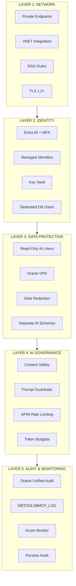

# Security & Governance Guardrails

## Security Architecture

The security model is organized into five defense-in-depth layers. Each layer builds on the previous one -- all five must be in place for a production deployment.

### Layer Summary

| Layer | What It Protects | Key Controls |
|--|--|--|
| **1. Network** | Data in transit; attack surface | Private Endpoints (no public IP), VNET integration, NSG rules, TLS 1.2+ |
| **2. Identity** | Who/what can access | Entra ID + MFA, Managed Identities (no secrets), Key Vault, dedicated DB users per agent |
| **3. Data Protection** | What data is exposed | Read-only Oracle users, VPD row-level security, Data Redaction for PII, separate AI schemas |
| **4. AI Governance** | Agent behavior | Azure AI Content Safety, system prompt guardrails (no DDL/DML), APIM rate limiting, token budgets |
| **5. Audit** | Visibility and compliance | Oracle Unified Audit, DBTOOLS$MCP_LOG, Azure Monitor + Log Analytics, Purview audit trail |

## Security Checklist

| # | Control | Required | Notes |
|--|--|--|--|
| 1 | Dedicated read-only Oracle user per agent | Yes | Never use ADMIN/SYS |
| 2 | Private Endpoints for Oracle Database@Azure | Yes | No public IP |
| 3 | Entra ID auth for Azure services | Yes | Managed identities preferred |
| 4 | Key Vault for Oracle credentials | Yes | No plaintext secrets |
| 5 | System prompt restricts DDL/DML | Yes | Agent can only read by default |
| 6 | Column masking for PII | Recommended | Data Redaction for sensitive columns |
| 7 | MCP audit logging enabled | Yes | Check `DBTOOLS$MCP_LOG` |
| 8 | Rate limiting via APIM | Recommended | Prevents runaway agent queries |
| 9 | Azure AI Content Safety | Recommended | Filters harmful inputs/outputs |
| 10 | Network segmentation (NSGs) | Yes | Agent services in separate subnet |
| 11 | Encryption at rest and in transit | Yes | TLS 1.2+ for all connections; Oracle TDE |

## Key Principle

> **MCP does not bypass Oracle security -- it operates inside it.** Every SQL statement executed via MCP runs under the connected Oracle user's privileges, subject to Oracle's standard authentication, authorization, auditing, and VPD policies.
