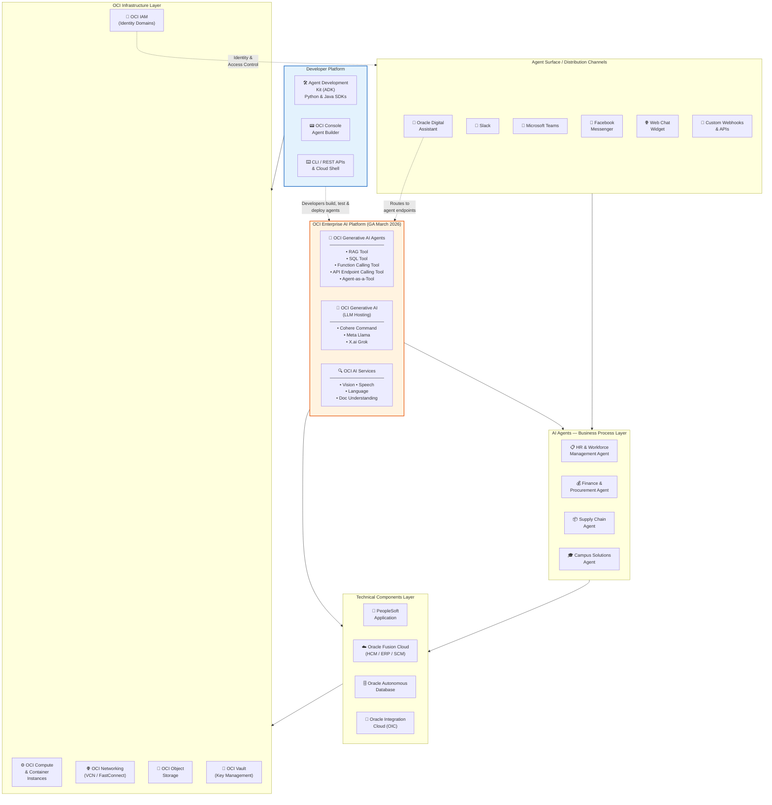
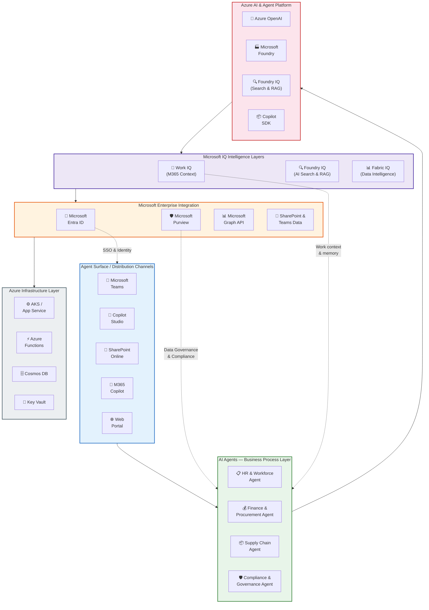
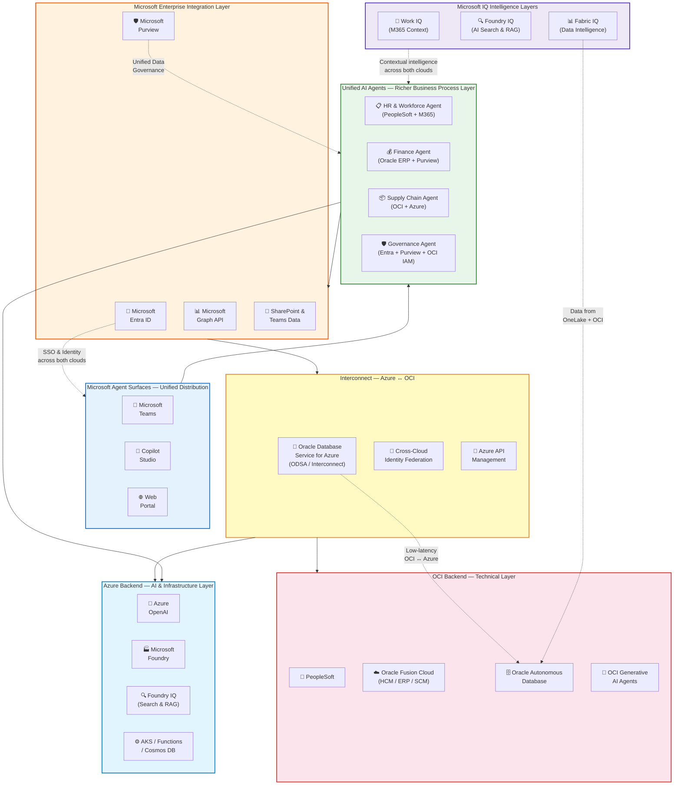

# OCI & Azure AI Agent Architecture — 3 Design Views

> **Purpose:** Illustrate how OCI and Azure AI agent stacks work independently and how combining them delivers a richer, deeply integrated agent experience for enterprise customers.
>
> **Audience:** Engineering leadership, cross-cloud strategy teams.
>
> **Date:** April 2, 2026

---

## Design 1: OCI Agent Stack (Standalone)

### Context

This design shows how an Oracle Cloud Infrastructure (OCI) customer builds and consumes AI agents entirely within the Oracle ecosystem. Agents are created using **OCI Enterprise AI** (which went GA March 2026), which provides a fully managed platform combining LLMs, RAG, SQL, function calling, API endpoint calling, and multi-agent orchestration (Agent-as-a-Tool).

**Key narrative points:**

- **Oracle Digital Assistant** is the primary distribution layer, routing agents to channels like Slack, Microsoft Teams, Facebook Messenger, web chat widgets, and custom webhooks.
- Agents sit on top of Oracle's enterprise application stack — **PeopleSoft**, **Oracle Fusion Cloud (HCM/ERP/SCM)**, and **Oracle Autonomous Database** — connected via **Oracle Integration Cloud (OIC)**.
- Developers build agents using the **Agent Development Kit (ADK)** with Python & Java SDKs, the OCI Console Agent Builder, or CLI/REST APIs.
- The infrastructure layer provides compute, networking (VCN/FastConnect), object storage, IAM with Identity Domains, and Vault for key management.
- OCI Generative AI hosts leading models including **Cohere Command A**, **Meta Llama**, and **X.ai Grok** (added January 2026).

**Strengths of this stack:**
- Deep, native integration with Oracle enterprise applications (PeopleSoft, Fusion Cloud)
- 5 tool types for diverse agent capabilities (RAG, SQL, Function Calling, API Endpoint, Agent-as-a-Tool)
- Sovereign AI options for data hosting and processing
- Zero data retention endpoints for sensitive workloads

### Flowchart

## Design 2: Azure Agent Stack (Standalone)

### Context

This design shows how an Azure-native customer builds and consumes AI agents within the Microsoft ecosystem. The Azure stack is **richer in enterprise collaboration and governance surfaces** — with Teams, Copilot Studio, SharePoint, M365 Copilot, and Purview — making it the stronger platform for agent distribution and data governance.

**Key narrative points:**

- **Agent surfaces are significantly broader** than OCI: Microsoft Teams, Copilot Studio, SharePoint Online, M365 Copilot, and web portals provide native, first-class agent distribution with billions of daily active users.
- **Azure OpenAI** and **Microsoft Foundry** provide the AI backbone, with **Foundry IQ** enabling hybrid/vector retrieval (RAG) and **Copilot SDK** for custom agent development.
- **Microsoft Entra ID** provides enterprise-grade identity and SSO across all surfaces — a critical differentiator for agent security.
- **Microsoft Purview** delivers unified data governance, compliance, and audit — ensuring agents operate within regulatory boundaries.
- **Microsoft Graph API** connects agents to the full M365 data fabric: emails, calendars, files, Teams chats, organizational hierarchy, and more.
- Azure infrastructure (AKS, Functions, Cosmos DB, Key Vault) provides the compute and data layer.
- **Microsoft's "IQ" intelligence layers** — Work IQ, Foundry IQ, and Fabric IQ — provide a unique, deeply contextual foundation that no other cloud platform offers (see [IQ Intelligence Layers](#microsofts-iq-intelligence-layers) below).

**Strengths of this stack:**
- Deepest enterprise collaboration integration (Teams, SharePoint, M365)
- Unified identity (Entra ID) and governance (Purview) across all agent interactions
- Microsoft Graph provides unparalleled access to organizational data
- Copilot Studio enables low-code/no-code agent creation for business users
- Three-tier IQ intelligence (Work IQ + Foundry IQ + Fabric IQ) makes agents contextually aware across work, AI, and data layers

### Flowchart

---

## Microsoft's "IQ" Intelligence Layers

Microsoft's AI strategy is underpinned by three complementary "IQ" intelligence layers that give agents deep contextual awareness. These are a **key differentiator** in the combined OCI + Azure architecture.

### Work IQ
**The intelligence layer behind Microsoft 365 Copilot and agents.**

Work IQ is what makes Copilot understand *you*, your job, and your company. It has three components:

1. **Work Data** — All the rich knowledge in your emails, files, meetings, and chats — codifying how work gets done.
2. **Memory** — Your style, preferences, habits, and workflows. It understands not just your org chart but your *work chart* — the relationships and patterns unique to you.
3. **Inference** — Combines data and memory to make valuable connections, unlock insights, and predict the next best action — going far beyond what connectors can do.

Work IQ is woven into the M365 apps (Word, Outlook, Teams), creating an AI-powered feedback loop that continuously learns. With **Work IQ for custom agents**, developers can tap into this intelligence layer via Copilot Studio or API to build agents tuned for unique workflows — with secure grounding that respects permissions, sensitivity labels, and compliance controls.

**Why it matters for this architecture:** When OCI agents are surfaced through Teams and Copilot Studio, Work IQ gives them awareness of the user's work context, relationships, and preferences — something OCI's standalone stack cannot provide.

### Foundry IQ
**The search and retrieval intelligence layer within Microsoft Foundry.**

Foundry IQ (formerly Azure AI Search) provides enterprise-grade search and retrieval capabilities that power RAG (Retrieval-Augmented Generation) for agents:

- **Vector search** — Semantic similarity search using embeddings
- **Hybrid search** — Combines keyword and vector search for best results
- **Semantic ranking** — AI-powered re-ranking for relevance
- **Integrated with Foundry Models and MCP tools** — Agents built in Copilot Studio get direct access to Foundry IQ for grounding

**Why it matters for this architecture:** Foundry IQ enables agents to retrieve and reason over enterprise knowledge bases, Oracle ERP documents, PeopleSoft records, and any data indexed from OCI backends — providing intelligent search across both clouds.

### Fabric IQ
**The data intelligence layer within Microsoft Fabric.**

Fabric IQ brings AI-powered intelligence to the Microsoft Fabric data platform, enabling agents to reason over the entire data estate:

- **OneLake** — Unified data lake that consolidates data from all sources, including Oracle databases via the Interconnect
- **AI-powered data analysis** — Natural language queries over data warehouses, lakehouses, and real-time streams
- **Data governance integration** — Sensitivity labels from Microsoft Purview flow through Fabric IQ, ensuring agents respect data classification
- **Real-time intelligence** — Stream analytics and event-driven data processing for time-sensitive agent workflows

**Why it matters for this architecture:** In the combined OCI + Azure stack, Fabric IQ enables agents to query and analyze data from Oracle Autonomous Database (via ODSA/Interconnect) alongside Azure-native data in OneLake — providing a unified analytical intelligence layer across both clouds.

### The IQ Advantage: Three Layers Working Together

| IQ Layer | Domain | What It Knows | Feeds Into |
|---|---|---|---|
| **Work IQ** | Productivity & collaboration | Your emails, meetings, chats, files, preferences, relationships | M365 Copilot, Copilot Studio agents, custom agents |
| **Foundry IQ** | AI & search | Enterprise knowledge bases, documents, indexed data, embeddings | Microsoft Foundry agents, RAG pipelines, Copilot Studio |
| **Fabric IQ** | Data & analytics | Data warehouses, lakehouses, real-time streams, cross-cloud data | Business intelligence, analytical agents, data-driven workflows |

> **The combined IQ story:** When all three layers work together, agents have full contextual awareness — they understand the user's work patterns (Work IQ), can search and retrieve relevant enterprise knowledge (Foundry IQ), and can analyze structured data across both OCI and Azure (Fabric IQ). This is unique to the Microsoft ecosystem and is the strongest argument for why agents in the combined stack are richer.

---

## Design 3: Combined OCI + Azure Integrated Stack

### Context

This is the **key strategic design** — it demonstrates how combining OCI and Azure creates a **richer agent experience than either stack alone**. This is the architecture to present to leadership (Jetson) to advocate for cross-cloud prioritization.

**The core argument:**
> OCI agents running on PeopleSoft, Fusion Cloud, and Oracle databases become dramatically more capable when they gain access to Azure's enterprise ecosystem — Teams for distribution, Entra ID for unified identity, Purview for governance, Graph API for organizational data, Azure OpenAI/Microsoft Foundry for frontier AI capabilities, and the IQ intelligence layers (Work IQ, Foundry IQ, Fabric IQ) for deep contextual awareness. The combined stack is greater than the sum of its parts.

**Key narrative points:**

- **Unified agent surfaces via Microsoft Teams & Copilot Studio** — agents backed by OCI data and Oracle applications are now accessible where enterprise users already work. This is a much richer distribution model than OCI's standalone channels.
- **Cross-cloud identity federation** — Microsoft Entra ID provides SSO across both Azure and OCI, meaning users authenticate once and agents can securely access resources on both clouds.
- **The Interconnect layer (ODSA/IQ)** — Oracle Database Service for Azure enables low-latency, high-bandwidth connectivity between Azure and OCI. Agents can query Oracle Autonomous Database from Azure-hosted services without internet hops.
- **Azure API Management** acts as the unified API gateway, providing rate limiting, security policies, and observability for all agent-to-backend communication across both clouds.
- **Microsoft Purview provides unified data governance** across both stacks — ensuring that agents consuming Oracle ERP data through Azure surfaces comply with the same governance and audit policies.
- **Hybrid agents span both clouds** — an HR agent can pull PeopleSoft employee data from OCI while enriching it with M365 calendar, Teams activity, and SharePoint documents from Azure. A Finance agent can combine Oracle ERP transactions with Purview compliance checks.
- **Azure OpenAI and Microsoft Foundry power OCI business processes** — PeopleSoft and Fusion Cloud agents gain access to GPT-4o, embeddings, and Foundry IQ for capabilities that OCI's native LLM roster may not cover.
- **The IQ intelligence layers amplify OCI agents** — Work IQ gives OCI-backed agents awareness of user context and work patterns; Foundry IQ enables intelligent search across Oracle and Azure data; Fabric IQ connects agents to the unified data estate in OneLake (including Oracle data via Interconnect).

**Why this matters for prioritization:**
- OCI customers using this combined architecture get **enterprise-grade distribution** (Teams, Copilot Studio), **enterprise-grade governance** (Purview, Entra), **enterprise-grade AI** (Azure OpenAI, Microsoft Foundry), and **enterprise-grade intelligence** (Work IQ, Foundry IQ, Fabric IQ) — none of which are as deeply integrated in the OCI-only stack.
- This is the story to present to Jetson: the deeply integrated cross-cloud agent is a competitive differentiator that neither Oracle nor Microsoft can deliver alone.

### Flowchart

---

## Summary Comparison

| Dimension | Design 1: OCI Standalone | Design 2: Azure Standalone | Design 3: Combined |
|---|---|---|---|
| **Agent Surfaces** | Oracle Digital Assistant, Slack, Teams, Messenger, Web Chat, Webhooks | Teams, Copilot Studio, SharePoint, M365 Copilot, Portal | Teams, Copilot Studio, Portal (unified Microsoft surfaces) |
| **AI Platform** | OCI Generative AI Agents (RAG, SQL, Function Calling, API Endpoint, Agent-as-a-Tool) | Azure OpenAI, Microsoft Foundry, Foundry IQ, Copilot SDK | Both — Azure OpenAI + OCI Generative AI Agents |
| **IQ Layers** | N/A | Work IQ, Foundry IQ, Fabric IQ | All three — cross-cloud contextual intelligence |
| **Enterprise Apps** | PeopleSoft, Oracle Fusion Cloud, Oracle Autonomous DB | SharePoint, Teams, M365 data via Graph | Both — PeopleSoft + Fusion Cloud + SharePoint + Teams |
| **Identity** | OCI IAM (Identity Domains) | Microsoft Entra ID | Cross-cloud federation (Entra + OCI IAM) |
| **Governance** | OCI policies & audit | Microsoft Purview | Unified Purview governance across both clouds |
| **Interconnect** | N/A | N/A | ODSA / IQ link, Azure API Management, identity federation |
| **Key Advantage** | Deep Oracle app integration, sovereign AI | Rich collaboration surfaces, IQ intelligence, unified governance | Greater than the sum of parts — richest agent experience with full IQ stack |
